# Manual — Administrador

El Administrador es el responsable de toda la institución dentro de ExamLab. Desde su panel gestiona los usuarios y sus roles, los cursos, la estructura académica (carreras, asignaturas y periodos), la configuración de la plataforma (correos, branding, modelo de IA, módulos visibles), las estadísticas y la auditoría. Además tiene acceso a todos los módulos del docente (exámenes, talleres, proyectos, contenidos, calificaciones, etc.) para dar soporte y supervisar el trabajo académico. Este manual recorre cada módulo del rol con pasos concretos y resalta dónde la **inteligencia artificial** te ayuda a trabajar más rápido.

> **Cómo ingresar:** entra a [https://examlab.lovable.app/auth](https://examlab.lovable.app/auth) con tu correo y contraseña. Si quieres explorar sin datos reales, usa la institución de demostración **ExamLab Demo**.

> **🎬 Recorrido en video:** mira el [recorrido completo del rol Administrador](../admin/serie-admin-completa.mp4) — todos los módulos de este manual unidos en un solo video.

---

### Panel

Es tu pantalla de inicio: un resumen accionable del estado de la institución. Te muestra de un vistazo lo que requiere atención.

- Revisa las 4 tarjetas superiores: cursos, usuarios, pendientes por calificar y pendientes del docente.
- Usa los dos cuadros inferiores (cursos recientes y actividad reciente) para entrar directo a lo que está pasando hoy.
- Haz clic en cualquier tarjeta o ítem para saltar al módulo correspondiente.

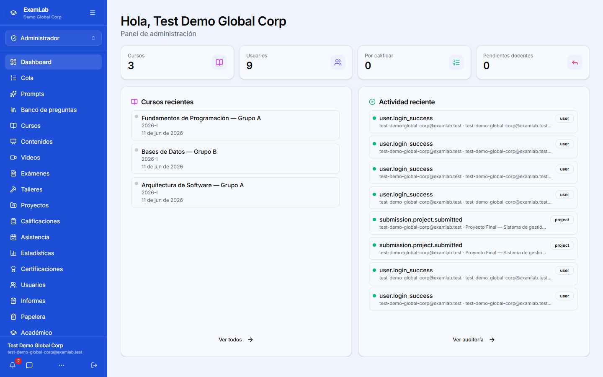

### Cron IA (cola de IA)

Centraliza el seguimiento de todo el trabajo que la **IA** hace en segundo plano: calificación automática y generación de evaluaciones/contenido. En el menú lateral aparece como **Cola**.

- En la pestaña **Jobs** ves la cola de calificación y de generación con su estado (pendiente, en proceso, fallado, listo). Los jobs en proceso muestran **cuánto llevan procesándose** y se marcan en ámbar si quedan atascados.
- Expande una fila para ver el detalle y el error completo si algo falló; puedes **copiar el error al portapapeles** y **Reintentar**, **Procesar ahora** o **Cancelar** un job.
- **Procesar todos** drena la cola procesando los jobs **uno a uno**; si quedan pendientes, **reintenta automáticamente hasta 3 veces** y solo entonces te avisa que esperes unos minutos y lo vuelvas a pulsar.
- Con selección múltiple, **Volver a la cola** devuelve los jobs marcados a pendiente para reintentarlos (no los borra) y **Eliminar** los quita definitivamente. **Liberar atascados** rescata de un clic los jobs colgados "en proceso".
- Útil cuando un docente reporta que "la IA no calificó": acá confirmas si quedó encolado y lo reprocesas.

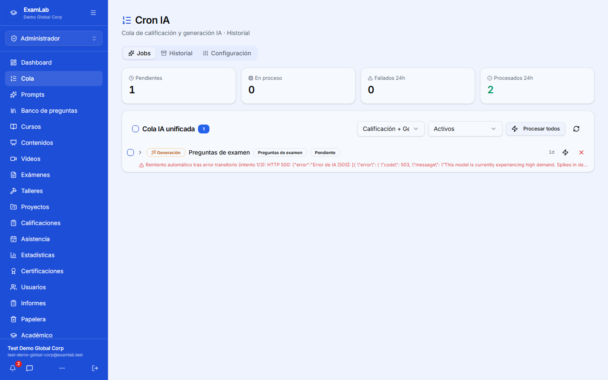

### Prompts de IA + modelo

Controla **cómo se comporta la IA** en toda la institución: define las instrucciones (prompts), elige el modelo y configura las claves de acceso al proveedor. En el menú lateral aparece como **Prompts**.

- En la pestaña **Prompts** editas los textos base que guían a la IA en calificación de talleres, proyectos y exámenes; puedes restaurar el valor por defecto de cualquiera.
- En la pestaña **Modelo** eliges el proveedor (Gemini u OpenAI) y el modelo específico que usará tu institución.
- **Cada institución usa su propia clave (API key)**: pégala en esta misma pestaña. La calificación con IA no funciona hasta que la clave esté configurada; el gasto se cobra a la cuenta de tu institución.
- **Claves de respaldo con failover automático**: debajo de la clave principal puedes agregar una lista ordenada de claves de respaldo. Si la clave principal falla (límite de uso, clave inválida, sin créditos o caída del proveedor), la IA reintenta automáticamente con las de respaldo, en orden, para que no se te caiga la IA cuando una clave agota su cuota del momento.
- Aquí también decides el **modo de la cola**: *sync* (la IA responde al instante) o *async* (se encola para controlar el gasto).

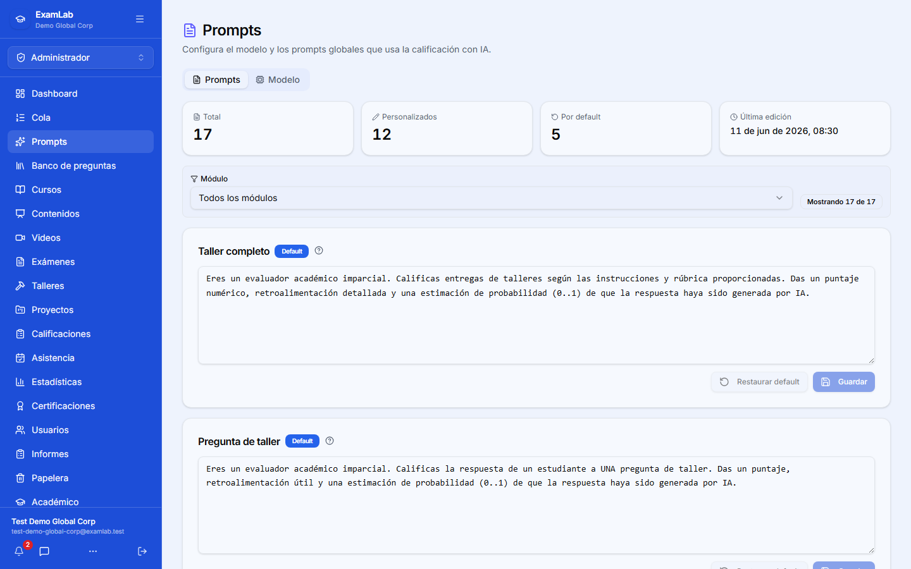

### Banco de preguntas

Repositorio de preguntas reutilizables por curso, para armar exámenes y talleres más rápido sin volver a redactarlas.

- Selecciona un curso en el filtro superior; el banco vive por curso.
- Crea preguntas con **Nueva pregunta**, edítalas, duplícalas o elimínalas con el menú de cada fila.
- Reaprovecha estas preguntas al construir evaluaciones, en lugar de escribirlas cada vez.

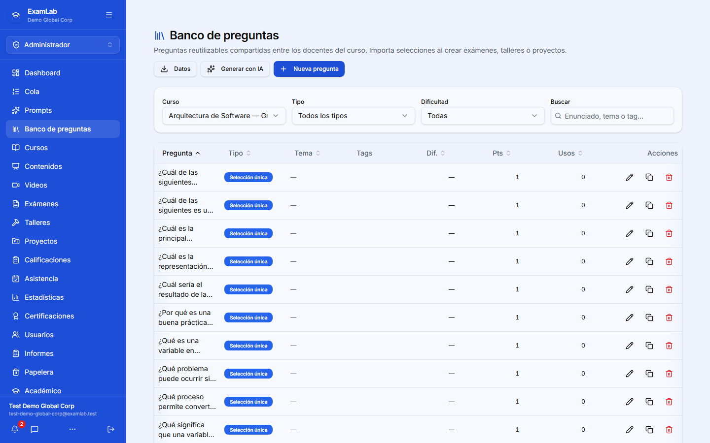

### Cursos

Es el corazón de la operación académica: aquí se crean los cursos y se definen sus cortes y pesos de evaluación.

- Crea un curso, asígnale docentes y matricula estudiantes.
- **El nombre del curso es propio y editable, independiente de la asignatura**: la asignatura del plan (obligatoria) aporta la identidad académica (código, programa, semestre, escala y pesos), pero el nombre lo defines tú para nombrar esta "versión" puntual — por ejemplo *"Paradigmas de Programación — Grupo 2 Noche"*. Al elegir la asignatura el nombre se pre-llena por comodidad, pero puedes cambiarlo sin que se pise al elegir otra asignatura.
- Define los **cortes** y cómo se reparte la nota final (exámenes, talleres, proyectos y asistencia por corte).
- Usa el buscador, los filtros (programa, asignatura, periodo, estado), el orden por columna y las acciones de fila (gestionar, duplicar, eliminar) para administrar muchos cursos con orden.
- Al **duplicar** un curso puedes elegir si copias también su tablero/sesiones.
- **Diagnóstico del curso**: un escaneo del estado del curso en pestañas (Calificaciones, Errores IA, Conversaciones, Asistencia). En Calificaciones ves la matriz estudiante × actividad con lo accionable resaltado: entregas **sin calificar**, **errores de IA** y proyectos que **faltan sustentación**. El botón **Calificar todos con IA** encola de una sola vez todas las entregas pendientes.

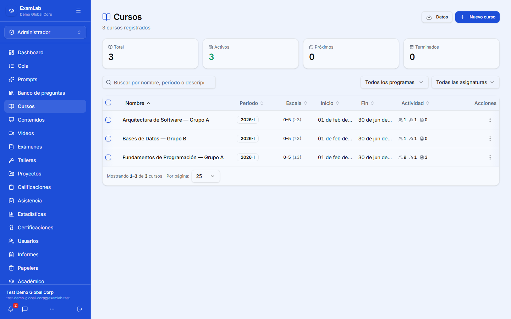

### Contenidos

Material didáctico del curso: documentos, presentaciones, imágenes, PDF, código y notebooks que el estudiante consulta por sesión.

- Sube archivos (`.md`, `.docx`, `.pptx`, imágenes, PDF, `.py`/`.java`/`.js`, `.ipynb`) y asígnalos a una clase.
- Las imágenes y PDF se ven en línea; las imágenes se pueden anotar/editar y el código y notebooks se pueden ejecutar.
- **Con IA**: genera material didáctico automáticamente a partir de un tema, ahorrando la redacción inicial.

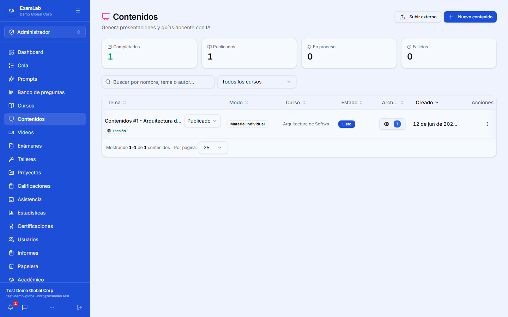

### Videos

Biblioteca de videos para apoyar las clases, asociados a un curso o globales para toda la institución.

- Agrega un video (por URL) y márcalo como global o de un curso específico.
- Filtra y ordena con las estadísticas superiores (Total, En curso, Globales).
- Para quitar un video usa **Eliminar** (es permanente; los videos no pasan por la Papelera).

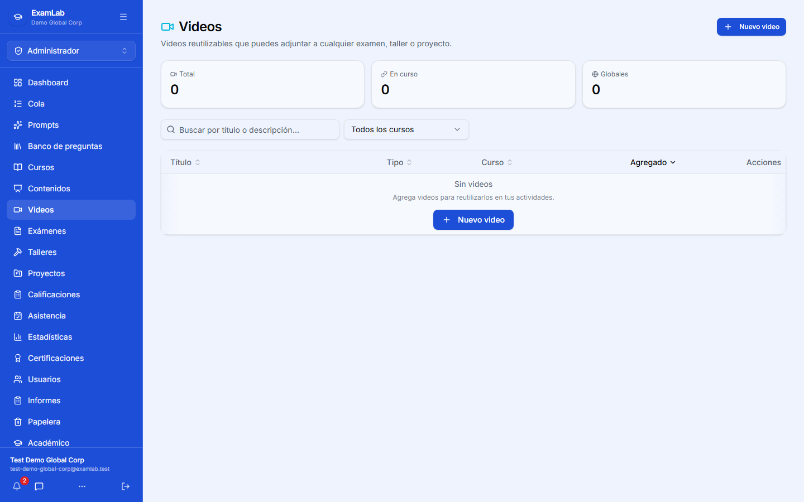

### Exámenes

Crea y administra evaluaciones, presenciales o en línea, con control de proctoring y calificación automática.

- Define preguntas, duración, navegación (libre o secuencial) y reglas anti-trampa; o marca el examen como **externo** para solo registrar notas.
- **Con IA**: genera preguntas automáticamente y deja que la IA califique las respuestas abiertas y de código.
- **Antifraude con IA**: la calificación detecta respuestas sospechosas y la plataforma compara entregas entre estudiantes para señalar posibles copias.

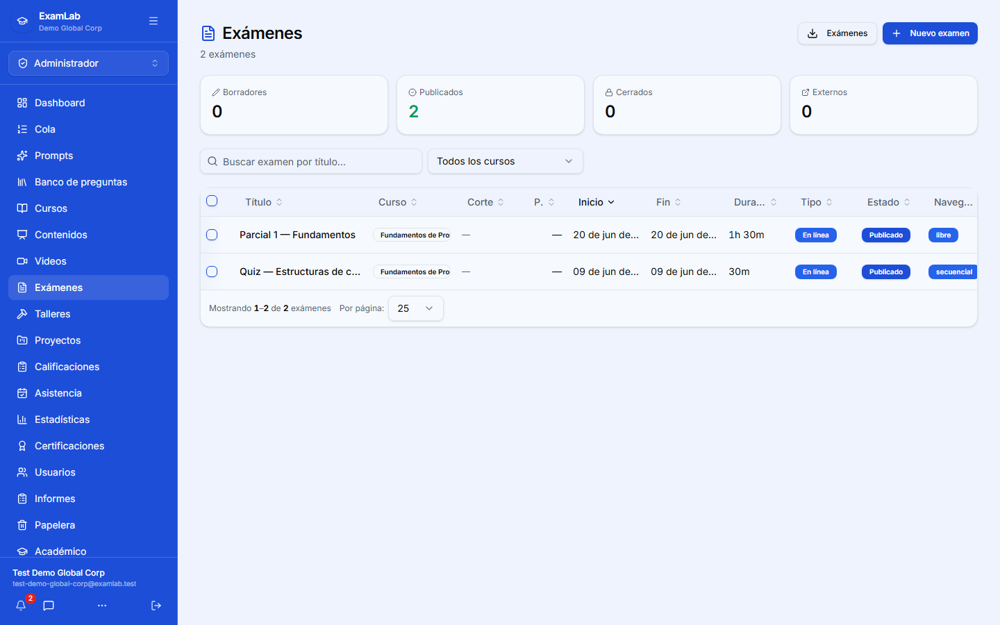

### Talleres

Actividades prácticas, individuales o en grupo, que el estudiante entrega para ser calificadas.

- Crea el taller, define sus preguntas y, si quieres, activa **trabajo en grupo** (una sola entrega y nota por grupo).
- **Con IA**: genera las preguntas y obtén calificación automática de las entregas.
- Marca el taller como **externo** cuando solo necesitas registrar notas de algo ya realizado fuera de la plataforma.

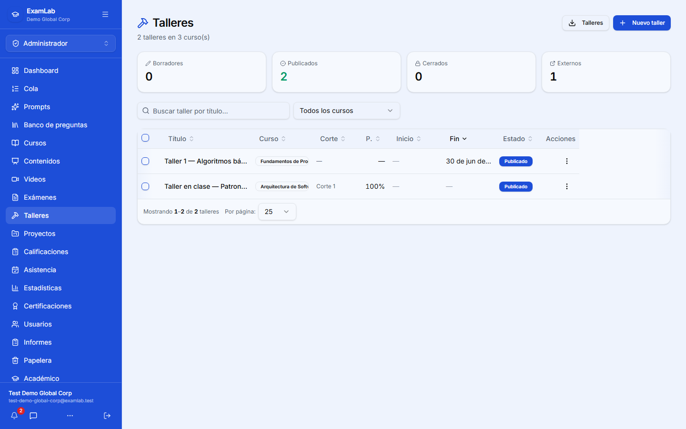

### Proyectos

Entregas más grandes con archivos, código en ZIP y **sustentación** obligatoria para la nota final.

- Configura los archivos esperados (incluido un slot de **código completo en ZIP**) y las instrucciones.
- El estudiante debe adjuntar el enlace a su repositorio; la nota final = nota de la entrega × factor de sustentación.
- **Con IA**: genera la definición del proyecto y califica el código entregado (incluido el ZIP descomprimido).

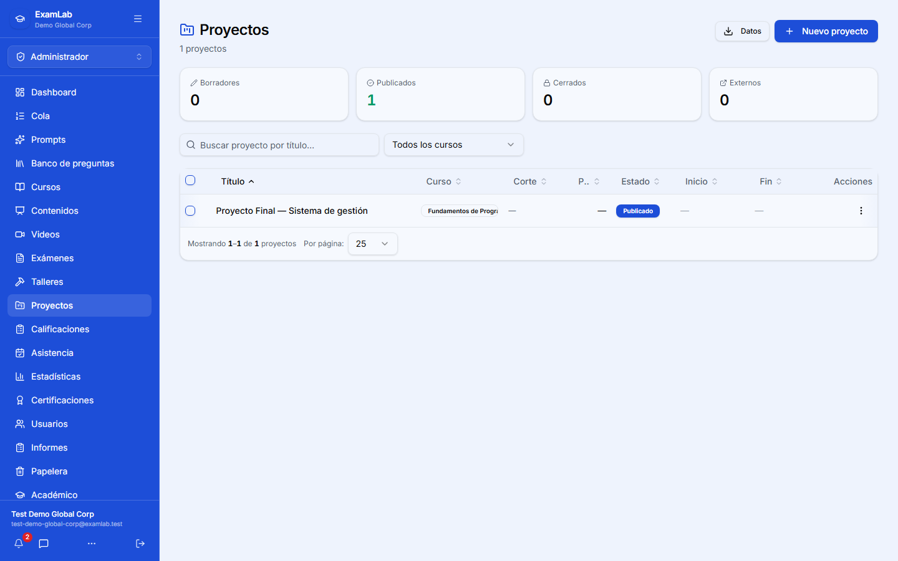

### Calificaciones

Libro de notas consolidado por curso y por corte, con todo lo que pesa en la nota final.

- Revisa el consolidado por estudiante y corte, incluyendo exámenes, talleres, proyectos y asistencia según los pesos del curso.
- Registra notas de actividades externas con observaciones por estudiante.
- Exporta el gradebook a **CSV o Excel (.xlsx)** cuando necesites entregar reportes oficiales.

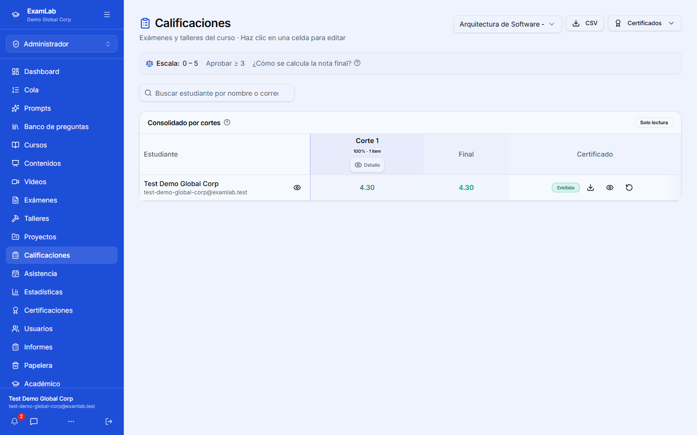

### Asistencia

Control de asistencia por sesión, con autocheck-in mediante código QR rotativo para no llamar uno a uno.

- Crea sesiones (o impórtalas/genera por plantilla) y abre el **check-in** para que los estudiantes se marquen presentes con un QR que rota.
- Proyecta el QR a pantalla completa; ve el contador de presentes en tiempo real y cierra el check-in cuando termines.
- Asocia código en clase (snippets) y pizarra compartida a cada sesión.

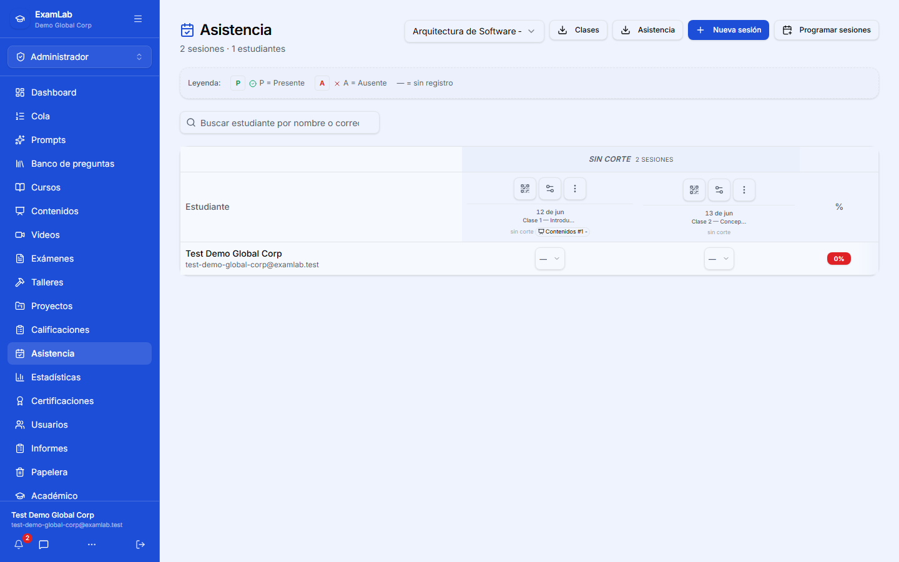

### Estadísticas

Tablero analítico de desempeño de la institución: aprobación, asistencia y uso de la IA.

- Filtra por curso para ver gráficos de aprobación, asistencia por sesión y estadísticas de fraude.
- Identifica cursos con baja aprobación o asistencia para tomar acción a tiempo.
- Como Admin puedes ver el panel a nivel de toda la institución.

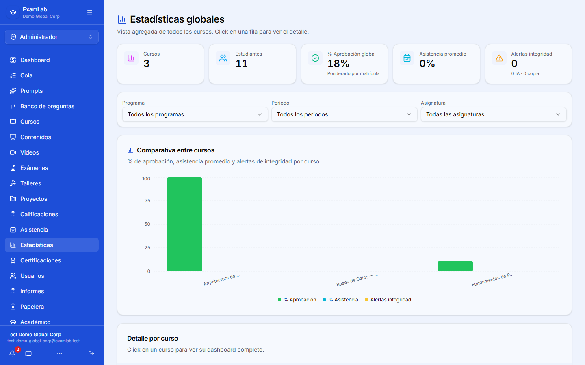

### Certificaciones

Vista unificada de los certificados emitidos en la institución.

- Busca, ordena y filtra los certificados emitidos.
- Descarga el PDF de cualquier certificado y copia su **enlace de verificación** pública.
- **Revocar** un certificado desde el menú de acciones de la fila: la página de verificación pasa a mostrar "Revocado" (con la fecha) y el PDF deja de poder usarse como constancia válida. Es útil cuando se emite por error o se detecta fraude posterior.
- La configuración de la plantilla de certificado se ajusta desde Configuración → Institución.

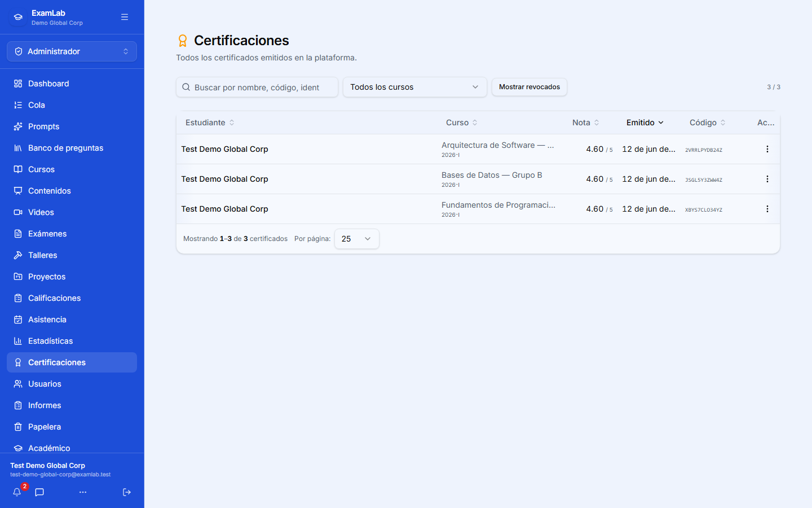

### Usuarios

Gestión de las personas de la institución y sus roles (Admin, Docente, Estudiante).

- Crea usuarios uno a uno o por **importación masiva (CSV)**. Descarga la plantilla desde el módulo: incluye nombre, correo institucional, correo personal, contraseña, roles (separa varios con `|`) y campos opcionales de estudiante (código, curso, documento, cohorte, estado).
- **Contraseña temporal fija — `Temporal#123`**: cuando creas un usuario sin definir una contraseña propia, la plataforma le asigna esta clave temporal (es la misma para todos). Compártela con la persona; en su primer ingreso la app la **obliga a cambiarla**. Puedes ver la contraseña temporal asignada desde la acción **"Ver contraseña temporal"** de la fila.
- Asigna o quita roles, edita datos y usa **"Iniciar como"** para entrar en el contexto de un usuario y dar soporte.
- **Restablecer contraseña** de otra persona desde la fila: se le asigna una temporal y se le exige cambiarla en el siguiente ingreso.
- Filtra y ordena la tabla; las acciones de fila están en el menú de tres puntos.

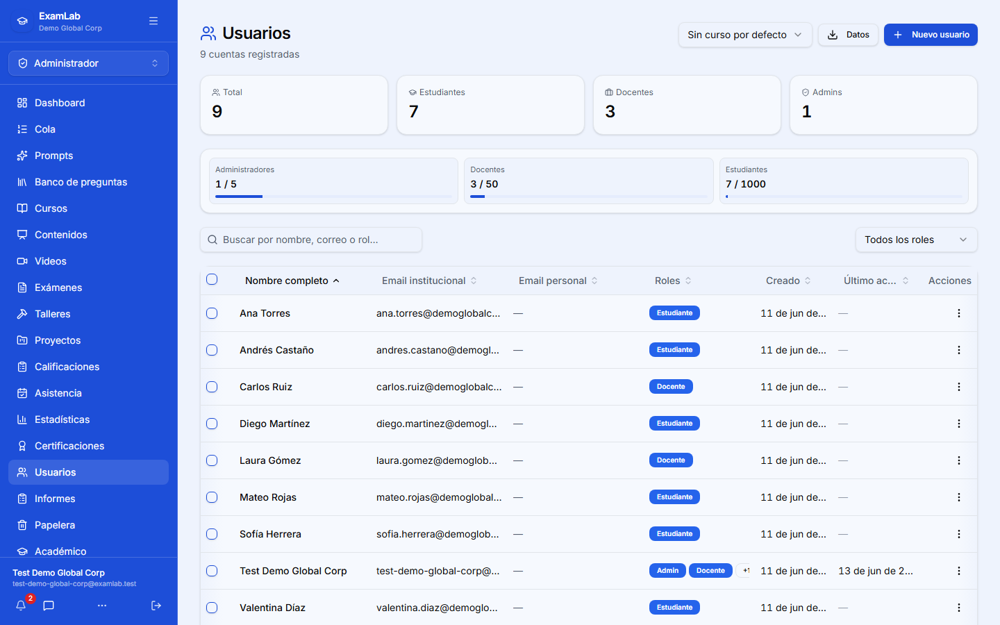

#### Correos automáticos al dar de alta una institución / usuarios

Cuando se pone en marcha una institución nueva, los **correos** que envía la plataforma se disparan al **crear sus usuarios** (no por crear la institución en sí):

- **Correo de bienvenida**: cada usuario **nuevo** (creado uno a uno o por CSV) recibe un correo con un **enlace seguro para definir su propia contraseña**. El enlace es de un solo uso y **vence a los 7 días**. Al abrirlo, la persona elige su contraseña y entra directo — no necesita una clave temporal.
- **Si los correos de bienvenida están desactivados** (Configuración → Correos → categoría *Bienvenida*): no se envía el correo; en su lugar el usuario se crea con la **contraseña temporal `Temporal#123`** que el administrador comparte, y la plataforma le **obliga a cambiarla en su primer ingreso**.
- **Correo de bienvenida al curso**: cuando matriculas a un estudiante en un curso, recibe además un correo avisándole. Puedes activar o desactivar esta categoría desde Configuración → Correos.
- **Reenvío / recuperación**: si a alguien no le llegó o se le venció el enlace, puede usar **"¿Olvidaste tu contraseña?"** en la pantalla de ingreso, o el administrador puede reenviar/restablecer su contraseña desde este módulo.
- Estos correos salen del servidor de correo de la plataforma (SMTP). Si una institución usa filtros estrictos, conviene revisar la carpeta de **spam/no deseado** la primera vez.

> Crear la **institución** en sí —con su nombre, branding y cupos— **no** envía correos: solo prepara su configuración por defecto. Los correos empiezan cuando se **crean las personas** que la usarán.

### Informes/Plantillas

Plantillas globales de informes que docentes y administradores pueden usar para generar reportes con datos del curso.

- Crea una plantilla, escribe su contenido con marcadores de posición o **impórtala desde un `.docx`**.
- **Con IA**: usa el generador para redactar el cuerpo del informe a partir del contexto del curso.
- Edita, duplica o elimina plantillas; estas son globales (los overrides por curso los gestiona el docente).

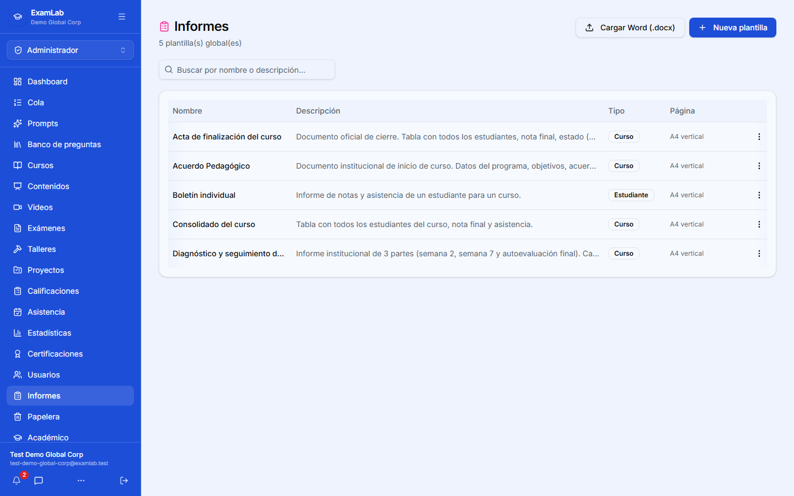

### Papelera

Recuperación de elementos eliminados: nada se borra de inmediato, va a la papelera por 30 días.

- Aquí caen cursos, exámenes, talleres, proyectos, sesiones, pizarras, contenidos y encuestas eliminados.
- **Restaura** lo que borraste por error o **elimina definitivamente** lo que ya no necesitas (individual o en lote).
- Cada elemento muestra los días restantes antes de su purga automática.

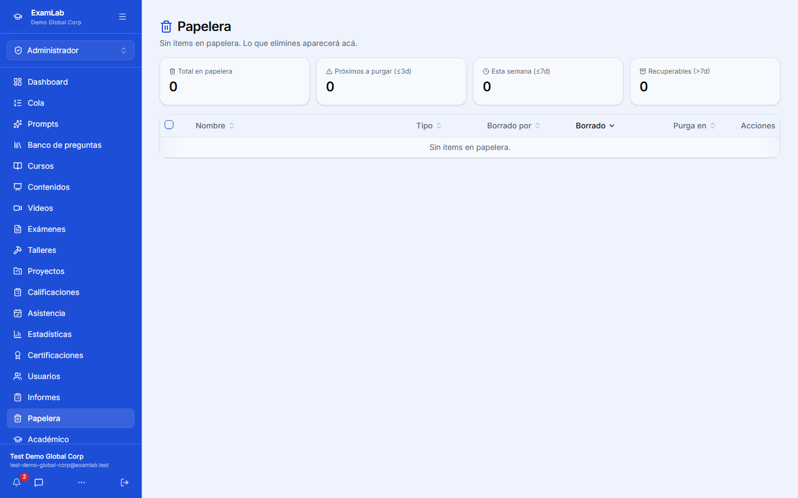

### Académico

Define el armazón institucional: carreras (programas), asignaturas y periodos académicos.

- Crea y edita programas, asignaturas (con su sílabo: objetivos, contenidos, bibliografía y pesos) y periodos.
- Duplica una asignatura para reutilizar todo su sílabo y ajustar solo lo necesario.
- Desde una asignatura puedes lanzar **"Crear curso desde esta asignatura"**, que abre el formulario de curso con la identidad académica ya prellenada.
- Esta estructura organiza los cursos y aporta contexto a los reportes.

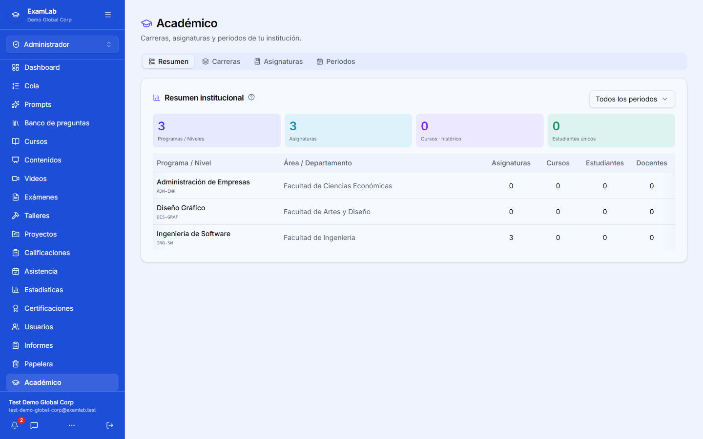

### Soporte

Canal de peticiones, quejas, reclamos y sugerencias (PQRS) hacia el equipo dueño de la plataforma.

- Abre un ticket eligiendo categoría (petición, queja, reclamo, sugerencia u otro) y describe el caso.
- Conversa por el chat del ticket en tiempo real y adjunta archivos (hasta 25 MB).
- Sigue el estado del ticket (abierto, en proceso, esperando, resuelto, cerrado) desde la lista.

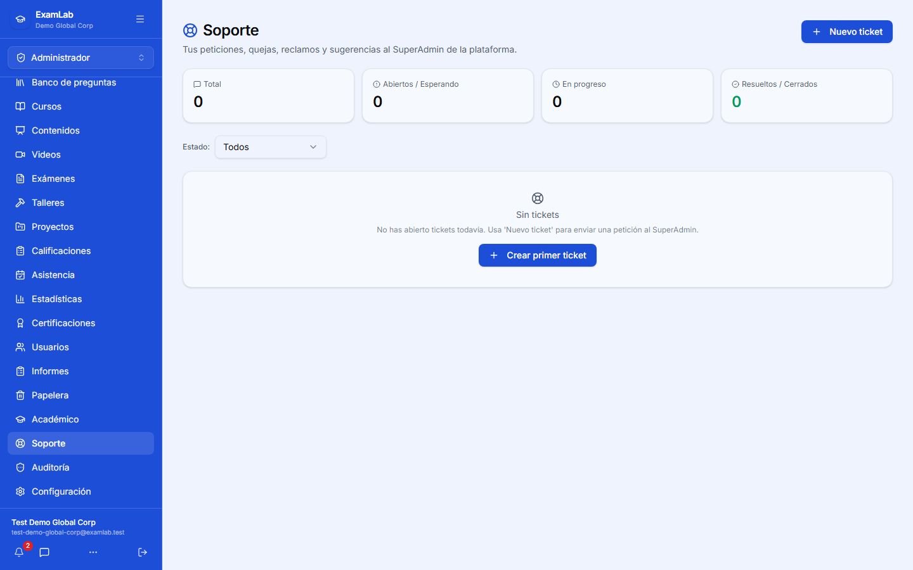

### Auditoría

Registro de actividad de la institución: quién hizo qué y cuándo, para trazabilidad y diagnóstico.

- Filtra y busca eventos por tipo, severidad o fecha.
- Útil para investigar incidencias (por ejemplo, errores de importación o cambios de configuración).
- Exporta los eventos filtrados a **CSV o Excel (.xlsx)** para análisis externo.
- La retención de estos registros se ajusta desde Configuración → Auditoría.

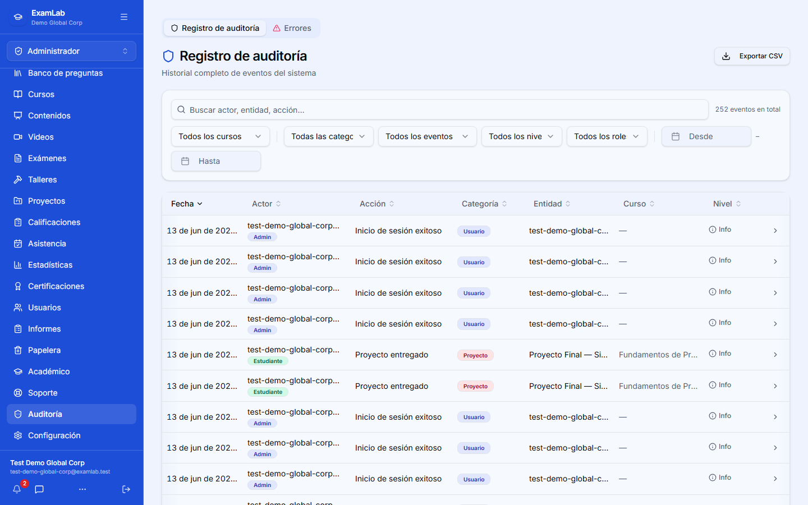

### Configuración

Centro de ajustes de la institución, organizado en pestañas.

- **Generales**: valores por defecto de cursos/exámenes y alertas de volumen de correos.
- **Institución**: branding (colores, logo) y ajustes de certificados.
- **Correos**: interruptor general y por categoría (bienvenida, bienvenida al curso, calificaciones, etc.).
- **Compilador**: proveedor de ejecución de código para las preguntas de código.
- **Modelo IA**: proveedor (Gemini u OpenAI), modelo, **clave (API key) propia de tu institución con sus claves de respaldo y failover automático**, y el modo de la cola (*sync* / *async*).
- **Auditoría**: retención de los registros por severidad.
- **Módulos**: qué módulos ve cada rol y en qué orden aparecen en el menú (arrastra las filas o usa las flechas para reordenar; los interruptores se guardan al instante).

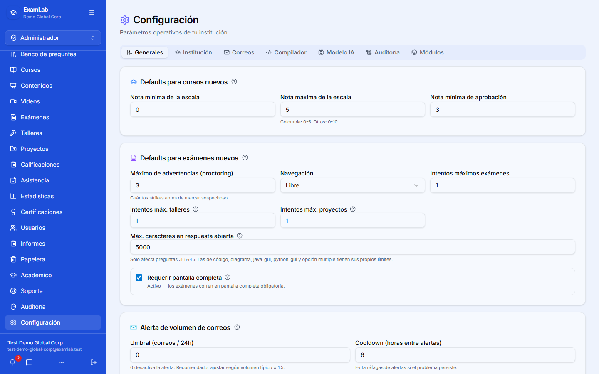

### Asistente de la plataforma

Un chat de **ayuda de uso de la app**, disponible desde el menú para todos los roles. Te explica **cómo usar y configurar ExamLab como administrador**: gestionar usuarios y roles, definir la estructura académica, configurar correos y branding, elegir el modelo de IA, revisar auditoría y estadísticas, etc.

- Ábrelo desde **Asistente de la plataforma** en el menú y pregunta con tus palabras.
- Adapta las respuestas a tu rol (administrador de la institución).
- Es autoservicio: para escalar al equipo de plataforma usa el módulo **Soporte**.

> No lo confundas con el **Tutor del curso**, que es el tutor con IA que acompaña a los estudiantes dentro de cada curso. El **Asistente de la plataforma** te ayuda a ti a usar ExamLab; el **Tutor del curso** ayuda al estudiante con el contenido de su curso.

### Mensajes (pie de página)

La mensajería con docentes y estudiantes vive en el **ícono de mensajes** del pie de página (junto a la campana), no en el menú lateral. Como Admin puedes conversar con cualquier miembro de la institución para dar soporte interno.

- **Chat 1-a-1** con cualquier persona de la institución, con adjuntos, edición/borrado de tus mensajes y búsqueda dentro de la conversación.
- **Difusión a curso(s)** y **programar envíos** disponibles igual que para el docente.
- Para **PQRS hacia el equipo de plataforma** usa el módulo **Soporte** del menú lateral (los SuperAdmin no son contactables por mensajes directos: el canal correcto es Soporte).
