# Manual — Docente

Como **Docente** en ExamLab tu trabajo es crear y evaluar: armas cursos, preparas material, generas y aplicas evaluaciones, llevas la asistencia y consolidas las notas. La plataforma pone la **IA a tu servicio** en cada paso — puedes generar evaluaciones y contenido automáticamente, dejar que la IA califique las entregas, detectar fraude y ofrecer un **Tutor del curso** a tus estudiantes. Este manual recorre, módulo por módulo, lo que verás en el menú lateral cuando entras con tu rol Docente.

> **Cómo ingresar:** entra a [https://examlab.lovable.app/auth](https://examlab.lovable.app/auth) con tu correo y contraseña. En el primer inicio con una clave temporal la plataforma te pedirá cambiarla antes de continuar.

> **🎬 Recorrido en video:** mira el [recorrido completo del rol Docente](../teacher/serie-teacher-completa.mp4) — todos los módulos de este manual unidos en un solo video.

> **Si entras con una cuenta de demostración** (institución **ExamLab Demo**): tu espacio empieza **vacío**. Crea tu propio **curso** para arrancar y aprovecha la IA para generar evaluaciones (la generación corre al instante). Ten en cuenta que la **matrícula de estudiantes la hace un administrador** — sin estudiantes no podrás probar el ciclo completo de calificación de entregas reales; ese flujo se muestra en los videos demo. Si la **IA falla** puntualmente, casi siempre es **disponibilidad del modelo** (es una demo): espera unos minutos y reintenta — no es un fallo de la plataforma. Además entras con **dos roles, Docente y Estudiante**: cambia con el selector arriba del menú para ver la plataforma desde ambos lados.

---

### Panel

Tu pantalla de inicio. Resume de un vistazo lo que tienes pendiente y lo que viene en los próximos días.

- Cuatro indicadores arriba: **Notas pendientes**, **Cola (Pendientes)**, **Comentarios Pendientes de respuesta** y **Pendientes de calificación**.
- Debajo, dos tarjetas: **Próximas clases** y **Próximos exámenes**. Toca cualquier dato para ir directo al módulo correspondiente.

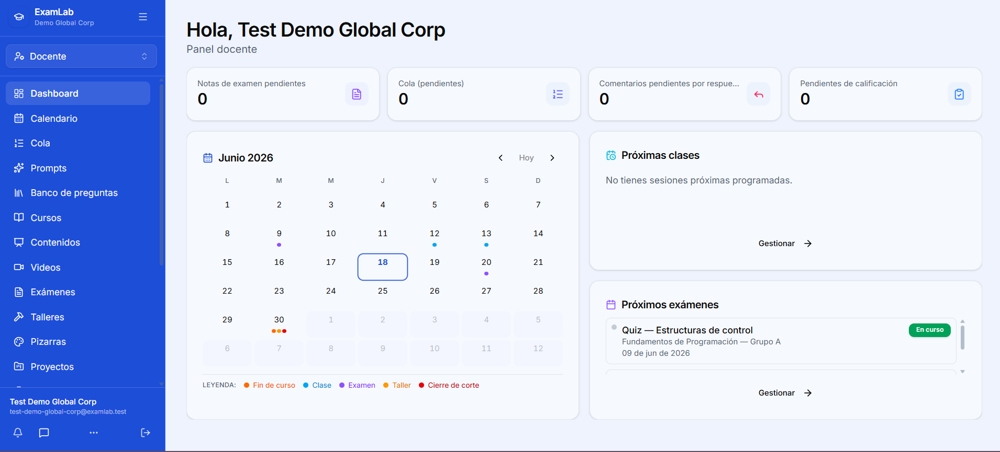

### Calendario

Vista de mes con todos tus eventos: clases, exámenes, entregas de talleres y proyectos.

- Cambia de mes con las flechas y haz clic en un día para ver el detalle de sus eventos.
- Te sirve para confirmar fechas antes de programar una nueva evaluación o sesión y evitar choques.

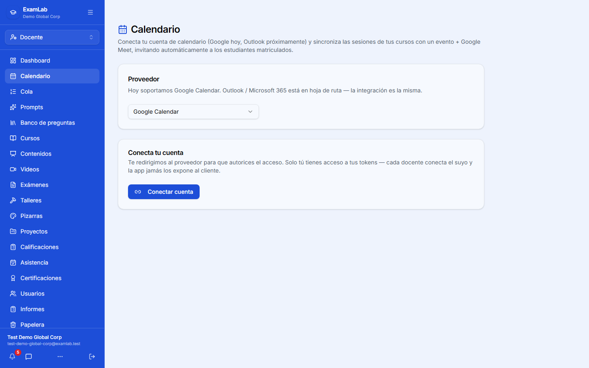

### Contenidos

Sube y organiza el material del curso: documentos, presentaciones, imágenes, PDF, código y notebooks.

- **🤖 Genera material didáctico con IA** a partir de un tema, o sube tus propios archivos y asígnalos a una sesión.
- **Ver en línea**: las imágenes y los PDF se abren dentro de la plataforma (sin descargar). Las imágenes se pueden **anotar y editar** (lápiz a mano alzada con color y grosor, rotar 90°, voltear, deshacer) y guardar como **nueva versión**; los PDF se ven embebidos y también puedes reemplazarlos por una versión nueva.
- **Código y notebooks ejecutables**: los archivos de código (`.java`, `.py`, `.js`) y los notebooks `.ipynb` que subas quedan **ejecutables**: el estudiante los ve y los corre desde su tablero. En los notebooks, "Ejecutar todo el código" corre las celdas de código juntas (sin kernel persistente entre celdas ni gráficas — solo texto de salida).
- **Ocultar hasta la fecha de la sesión**: puedes marcar un contenido para que el estudiante solo lo vea cuando llegue la fecha de la sesión a la que lo asignaste (útil para no adelantar talleres o exámenes).
- **Duplicar**: reutiliza un contenido eligiendo qué copiar (archivos y/o cursos asignados).
- Todo este material también nutre al **Tutor del curso**: cuanto más material subas, mejores respuestas recibe el estudiante.

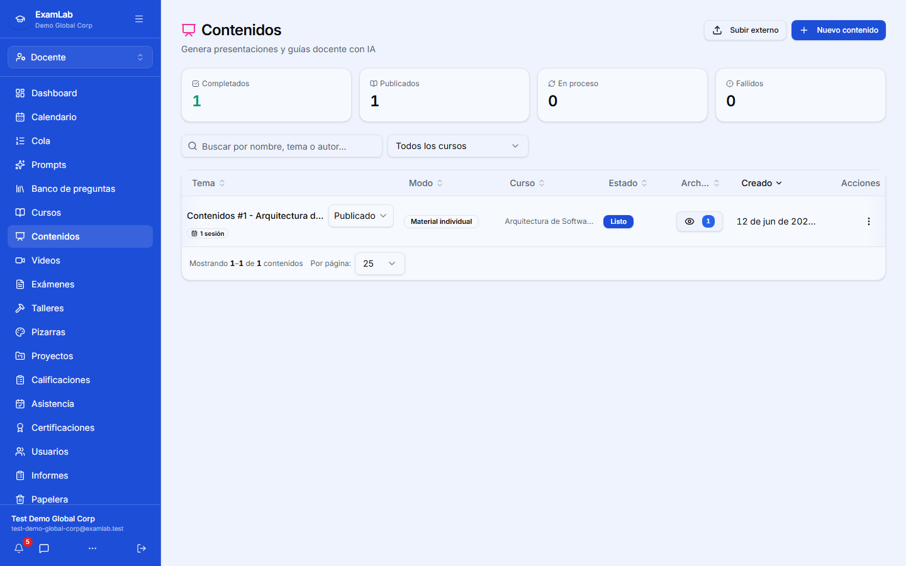

### Cola (Cron IA)

Aquí ves **todo lo que la IA hizo o tiene pendiente** sin salir de una sola pantalla: calificaciones y generaciones de contenido.

- La cola de **calificación** lista las entregas que la IA está evaluando; la de **generación** lista las preguntas/archivos que pediste generar. Los trabajos en proceso muestran **cuánto llevan** y se marcan en ámbar si quedan atascados.
- Si un trabajo queda **pendiente**, puedes procesarlo ahora; si **falló**, puedes reintentarlo. Expande cada fila para ver el detalle del error y copiarlo.
- **Procesar todos** drena la cola uno a uno y **reintenta automáticamente hasta 3 veces** los que queden; solo entonces te pide esperar y reintentar. Con selección múltiple, **Volver a la cola** los devuelve a pendiente (sin borrarlos) y **Eliminar** los quita.

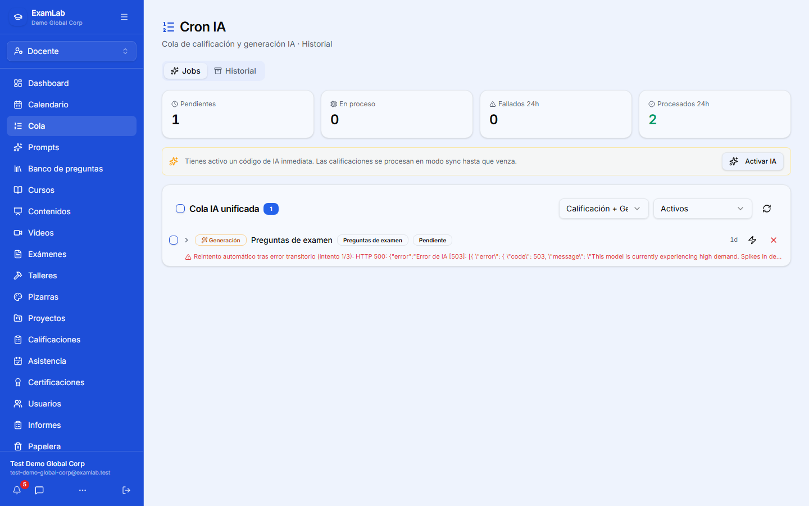

### Prompts de IA por curso

Personaliza **cómo califica y genera la IA en TU curso**, ajustando las instrucciones (prompts) que recibe el modelo.

- Elige el curso y el caso de uso (taller, examen, proyecto). Verás el prompt global de referencia y un campo editable para tu versión del curso.
- Solo cambias el "rol y criterios" del modelo; los datos dinámicos (rúbrica, respuesta, puntaje) los pone el sistema. **"Volver al global"** elimina tu personalización.

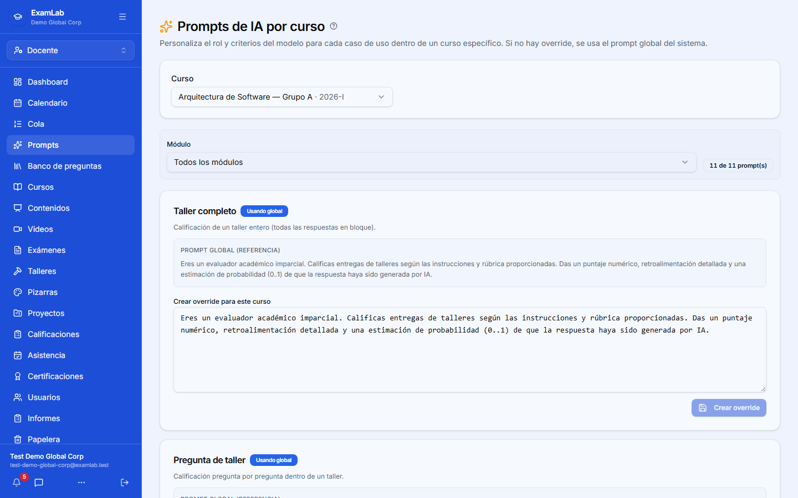

### Banco de preguntas

Tu repositorio de preguntas reutilizables por curso, para no reescribirlas en cada examen.

- Selecciona el curso (el banco vive por curso) y usa **Nueva pregunta** para crearlas. Puedes **duplicar** una pregunta para hacer variantes.
- Si el selector de curso aparece vacío, pídele al Admin que te asigne a un curso para empezar.

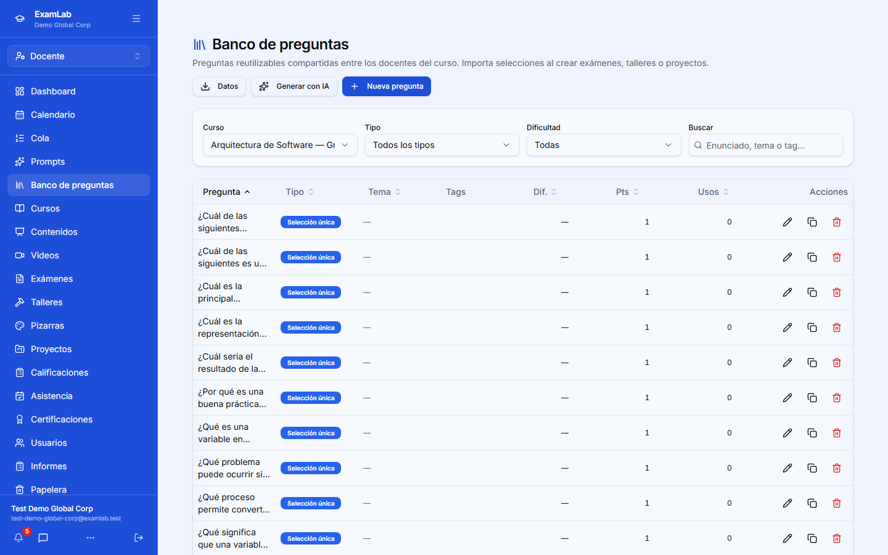

### Cursos (y Tablero)

El centro de tu actividad: aquí están tus cursos y, dentro de cada uno, el **Tablero** con las sesiones de clase.

- **Crear un curso**: usa **Nuevo curso**, elige la **asignatura** del plan (obligatoria — es la base del nombre, el programa, el semestre y los pesos sugeridos), ajusta fechas, escala de notas y cortes. El **nombre del curso lo eliges tú y es independiente de la asignatura**: al crearlo desde una asignatura se propone igual, pero puedes cambiarlo (por ejemplo, agregar el grupo, la jornada o el periodo) sin alterar la asignatura del plan.
- Abre un curso para ver sus cortes, pesos de evaluación y el **tablero de sesiones** (clases, material, pizarras y código asociado). Desde el tablero organizas cada clase y le asocias su contenido, pizarra o snippets de código.
- Desde aquí gestionas la estructura del curso que alimenta exámenes, talleres, proyectos y calificaciones.
- **Duplicar un curso**: puedes clonar un curso eligiendo si copiar también el tablero/sesiones.
- **Diagnóstico del curso**: un vistazo del estado del curso en pestañas (Calificaciones, Errores IA, Conversaciones, Asistencia). En Calificaciones ves la matriz estudiante × actividad con lo accionable resaltado: entregas **sin calificar**, **errores de IA** y proyectos que **faltan sustentación**. El botón **Calificar todos con IA** encola de una vez todas las entregas pendientes.
- **Foros del curso**: dentro de cada curso puedes abrir **foros de discusión** con ventana de fechas (apertura/cierre) para que los estudiantes participen en hilos asincrónicos. Tú moderas, fijas o cierras hilos cuando corresponda.

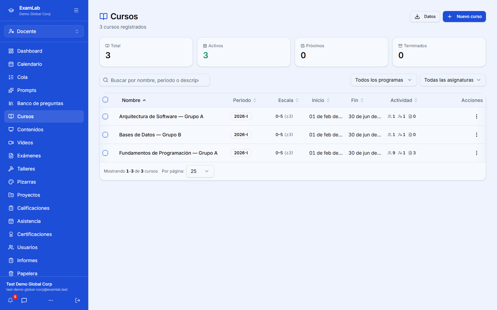

### Videos

Biblioteca de videos del curso o globales, para complementar tus clases.

- Agrega videos (por URL) y asígnalos a un curso o déjalos como globales.
- Los videos de la biblioteca se pueden usar como **requisito previo** (video gate) en talleres y proyectos, o como grabación de una sesión.
- Para quitar un video usa **Eliminar** (es permanente — los videos no van a la Papelera).

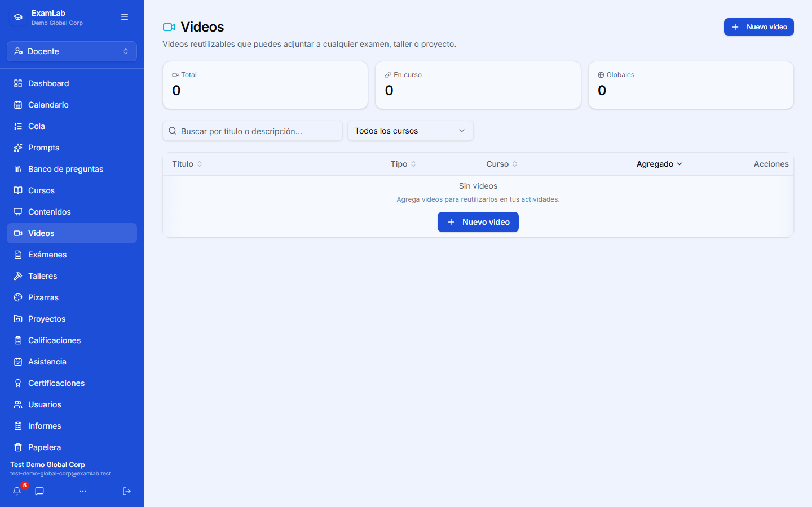

### Exámenes

Crea, aplica y monitorea exámenes en línea con proctoring.

- **🤖 Genera preguntas con IA** al crear el examen, o tómalas del banco. Configura **duración**, **navegación** (libre o secuencial), **mezcla** de preguntas, **máximo de advertencias** de proctoring e **intentos permitidos**.
- **Actividad externa**: si el examen ya se hizo por fuera (presencial u otra herramienta), márcalo como externo para solo registrar notas y observaciones.
- Durante el examen tienes **monitor en vivo**; al terminar, la **IA califica automáticamente** y el **análisis antifraude** marca entregas sospechosas (y compara entregas entre estudiantes para detectar copia).
- **Duplicar (parametrizable)**: al duplicar eliges el curso destino, el título y **qué copiar** — las preguntas y/o la configuración de proctoring (navegación, mezcla, máximo de advertencias). La copia nace como borrador.

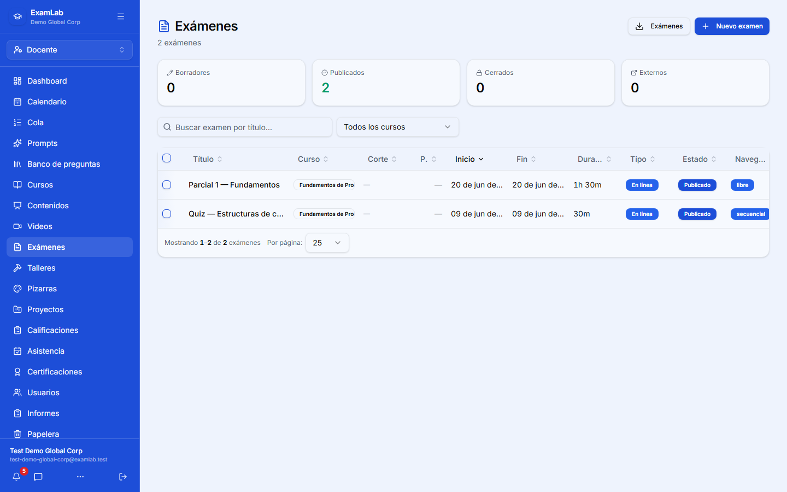

### Talleres

Actividades evaluables, individuales o **en grupo**, con calificación asistida por IA.

- **🤖 Genera el taller completo o pregunta por pregunta con IA.**
- **Trabajo en grupo**: activa "Trabajo en grupo" para que un grupo comparta **una sola entrega y una sola nota**. Desde el botón **Grupos** armas los equipos **arrastrando** las tarjetas de estudiantes entre "Sin grupo" y cada grupo. Pueden convivir estudiantes con grupo (entrega compartida) y sin grupo (entrega individual) en el mismo taller.
- Las entregas se **califican con IA** y puedes registrar talleres **"externos"** (presenciales) solo para anotar notas y observaciones.
- **Duplicar (parametrizable)**: eliges el curso destino, el título y qué copiar (preguntas y/o grupos).

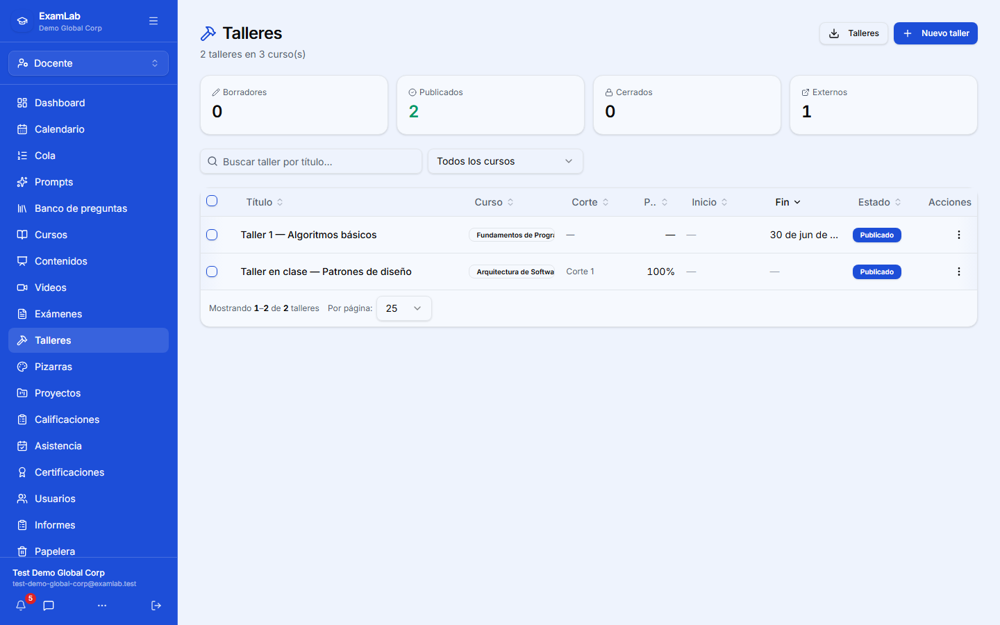

### Pizarras

Pizarras digitales (estilo Excalidraw) para diagramar en clase, con **librerías de formas predefinidas** (flujogramas, UML, estructuras de datos).

- Crea una pizarra y dibuja; el **viewport y el contenido se guardan automáticamente** (vuelves y quedan tal cual las dejaste).
- Puedes **asociar una pizarra a una sesión** y activarla como **compartida en vivo**: los estudiantes matriculados editan contigo en tiempo real y ves los cambios al instante (aparece el indicador "Compartida en vivo").
- **Duplicar**: reutiliza una pizarra eligiendo si copiar su contenido y su curso.

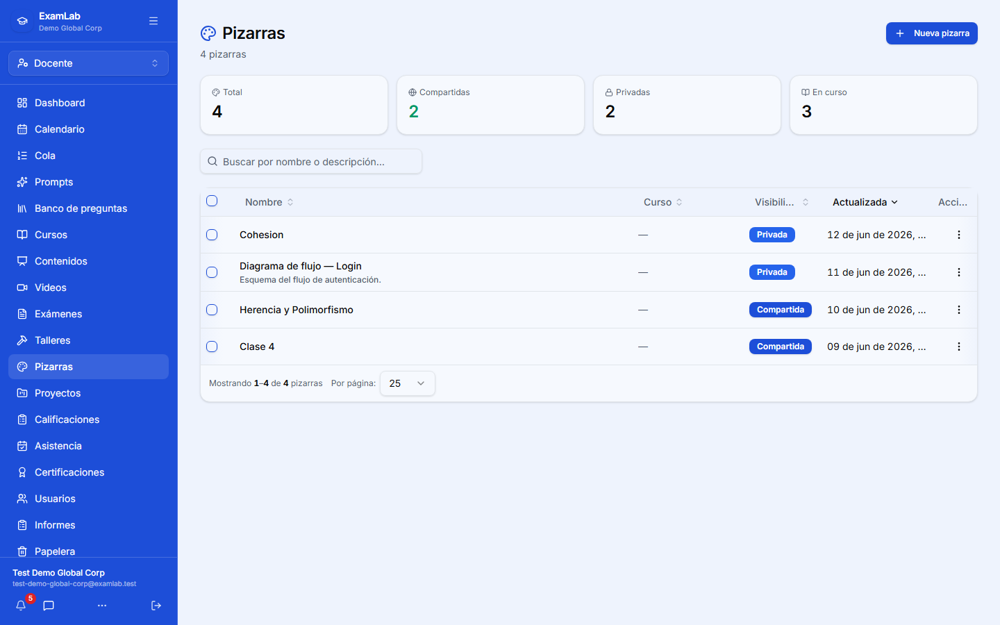

### Proyectos

Entregas más grandes con **sustentación**, link al repositorio y entrega de código en ZIP.

- **🤖 Genera los archivos/criterios del proyecto con IA.** El estudiante entrega un link `https://...` obligatorio y, si aplica, un ZIP con su código (la **IA lo descomprime y califica**).
- La nota final = nota de entrega × **factor de sustentación**: tú registras la sustentación en el panel de calificación. Soporta **trabajo en grupo** y **detección de plagio**.
- **Editar la nota de entrega** (override de la nota ponderada por IA): si necesitas ajustar la nota base antes o después de la sustentación, puedes editarla manualmente en el panel del estudiante — el sistema recalcula la nota final aplicando el factor de sustentación que registres.
- **Importar sustentaciones en lote (CSV)**: desde el módulo de Proyectos puedes subir un CSV con los factores y observaciones de sustentación de muchos estudiantes a la vez, en lugar de uno por uno. Útil al terminar una jornada de sustentaciones presenciales.

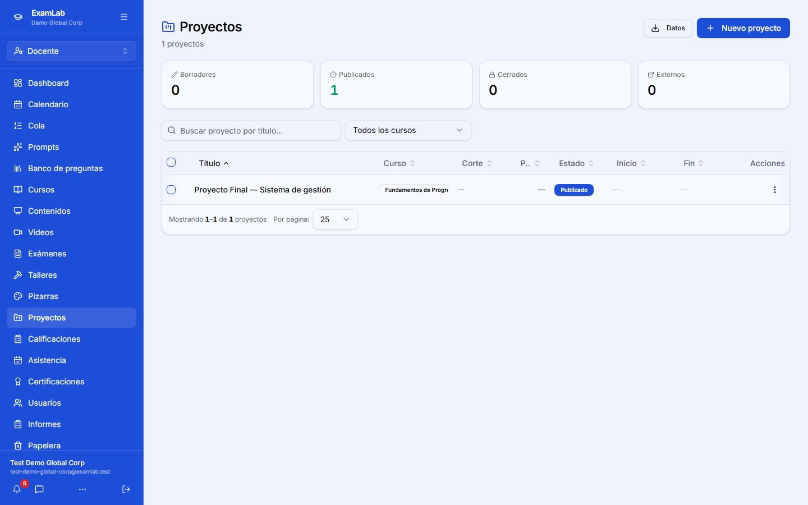

### Calificaciones

El consolidado de notas del curso por corte, listo para revisar y exportar.

- Muestra el promedio ponderado por estudiante según los pesos de cada examen, taller, proyecto y la asistencia del corte.
- Exporta a **CSV o Excel (.xlsx)** y registra notas de **actividades externas** (presenciales o de otra plataforma) con su observación por estudiante. Recuerda: lo no entregado cuenta como 0 con su peso hasta que aparezca una nota.

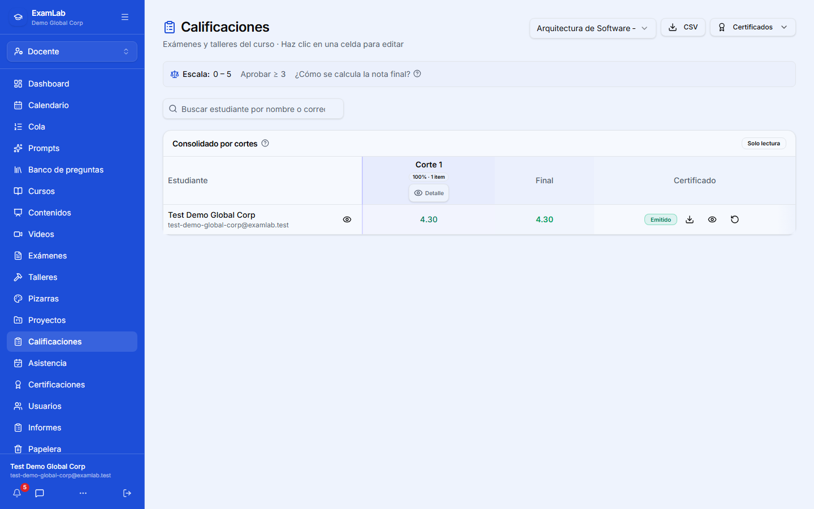

### Asistencia

Registra la asistencia de cada sesión, con **check-in por QR rotativo** para que los estudiantes se marquen solos.

- Crea sesiones (o impórtalas por CSV) y abre el **check-in**: proyecta el QR con código y cuenta-regresiva; verás en vivo cuántos van marcando presente. El código **rota** cada cierto tiempo para que no se pueda compartir.
- Al cerrar puedes marcar como ausentes a los pendientes. La asistencia de cada corte entra automáticamente a la nota final.
- **Duplicar / generar sesiones**: duplica una sesión (con su contenido, pizarra y snippets, sin la asistencia) o genera varias sesiones de una vez con el generador paramétrico. La importación/exportación por CSV conserva fecha, título, corte, hora, duración y enlaces de reunión/grabación.
- **Snippets de código por sesión**: desde el menú de una sesión abres **Snippets de código** para preparar fragmentos en Java, Python o JavaScript que los estudiantes ven (y pueden ejecutar) desde su vista de asistencia. Se guardan solos mientras editas.
- **Pizarra y encuestas de la sesión**: desde la misma sesión puedes abrir su pizarra o lanzar una encuesta asociada.

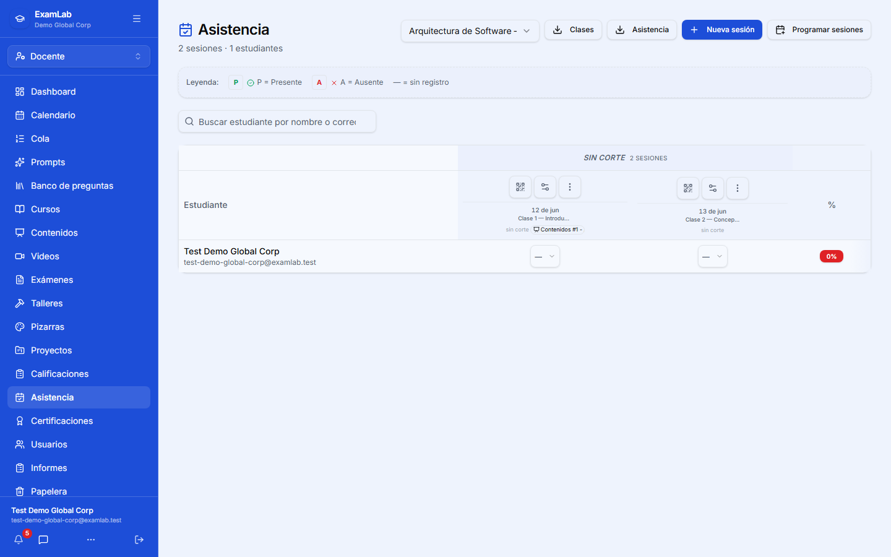

### Estadísticas

Un tablero de indicadores del curso que elijas, para ver cómo va el grupo de un vistazo.

- Selecciona el curso arriba y consulta sus métricas: **aprobación, alertas de fraude por IA, asistencia y tendencia por corte**.
- Indicadores clave: número de **estudiantes**, **% de aprobación**, **asistencia promedio**, **alertas de fraude IA** y cuántos **perdieron exámenes**.
- Útil para detectar temprano un corte flojo, un examen con demasiadas alertas o baja asistencia.

<!-- screenshot sugerido: screenshots/docente/teacher_statistics.png -->

### Certificaciones

Consulta y gestiona los certificados emitidos a los estudiantes del curso.

- Revisa los certificados generados y su estado.
- Sirve para verificar a quién se le emitió constancia de un curso o evaluación.

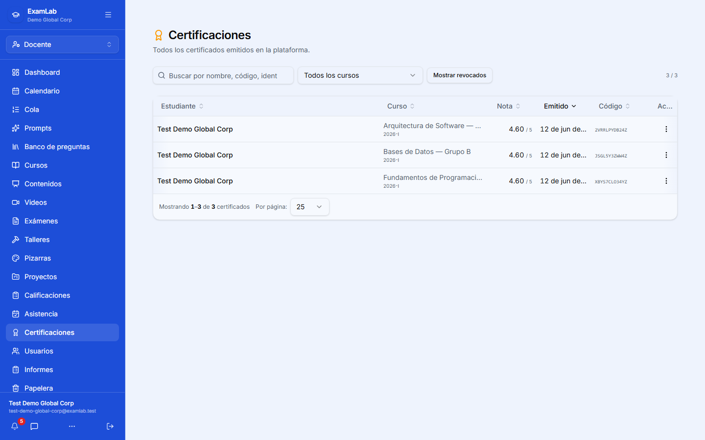

### Usuarios (Estudiantes)

El listado de tus estudiantes con su información de contacto y los cursos en que están matriculados.

- Busca por nombre, correo o código y filtra por curso.
- Desde las acciones de fila puedes ver el detalle o gestionar el acceso del estudiante (p. ej. restablecer contraseña).

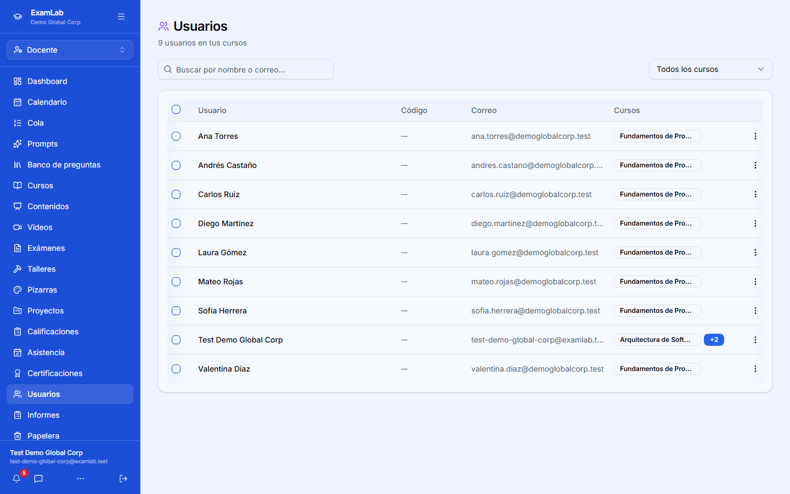

### Informes

Genera informes en PDF a partir de plantillas (globales o tuyas).

- Elige una plantilla, selecciona curso o estudiante y obtén una **vista previa** que puedes **imprimir o guardar como PDF**.
- Puedes crear plantillas **privadas** o personalizar una global para tu curso.

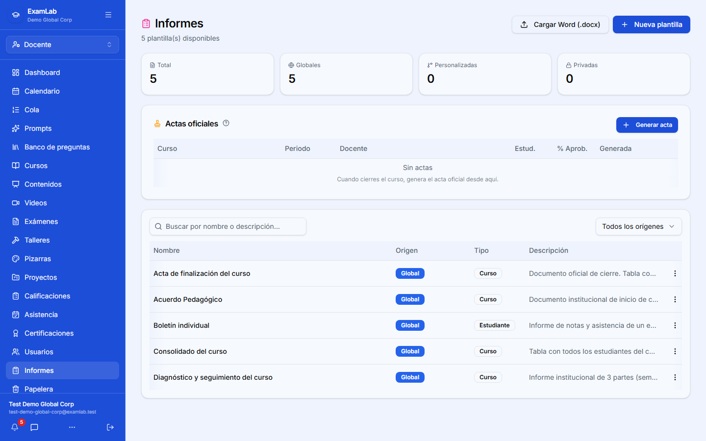

### Papelera

Recuperación de elementos eliminados (cursos, exámenes, talleres, proyectos, sesiones, pizarras, contenidos y encuestas).

- Lo que eliminas va aquí por **30 días** antes de borrarse definitivamente; mientras tanto puedes **restaurarlo**.
- También puedes eliminar de forma permanente. Un elemento en la papelera no aparece en ningún otro flujo hasta restaurarlo.

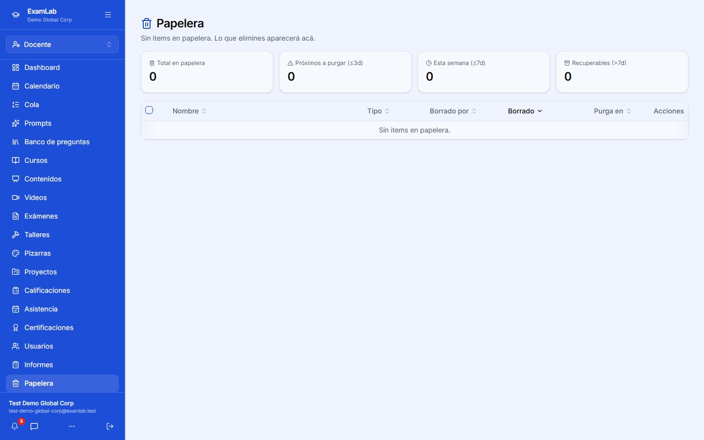

### Encuestas

Crea encuestas, votaciones tipo **Doodle** (slots de horario) y retos de trivia en vivo para tus clases.

- **Tipos de encuesta**: **opción única**, **múltiple**, **cupo por opción (Doodle)** — para que cada estudiante elija un horario/fecha con cupo limitado — y **Reto en vivo** (trivia en vivo con marcador; ver la sección siguiente).
- Define las opciones, asóciala a **uno o varios cursos** y, opcionalmente, a una **sesión**; publícala y comparte el enlace.
- **Cupo por opción (Doodle)**: agrega las fechas y una ventana horaria compartida con paso y cupo; la plataforma genera los slots. En modo **Auto** calcula el cupo para que quepan todos los matriculados; también puedes fijarlo a mano.
- **Resultados**: revisa las respuestas por opción (con el **nombre** de quién votó) y **borra** el voto de un estudiante para liberar su cupo. Puedes fijar cuándo ven los resultados los estudiantes (siempre / al cerrar / solo tú).
- **Cierre automático**: opcionalmente la encuesta se cierra sola cuando todos respondieron.
- **Duplicar / Compartir enlace / Reabrir / Cerrar**: cada encuesta tiene su menú de acciones. Duplicar copia la estructura (opciones y cupos, cursos) sin las respuestas.

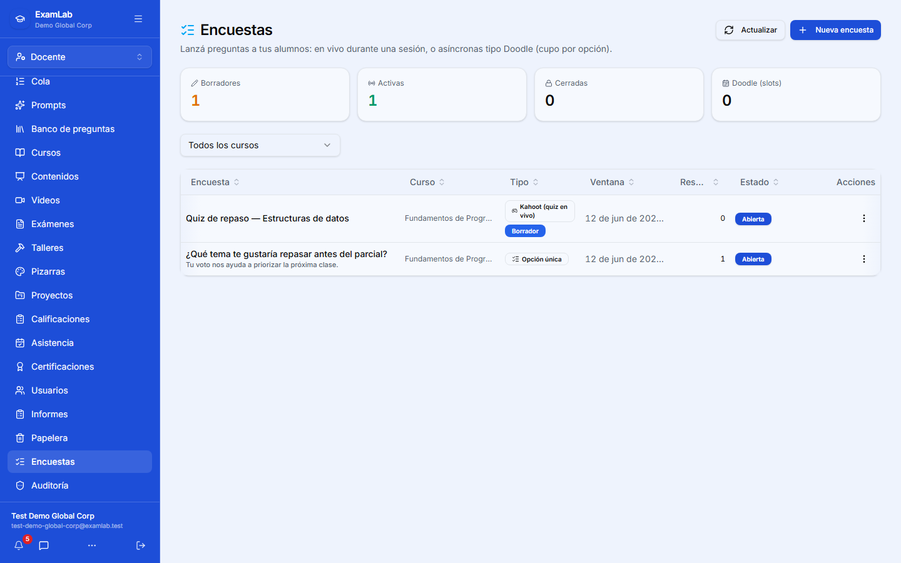

### Reto en vivo

El **Reto en vivo** es una trivia en vivo estilo concurso, proyectable a pantalla, donde tus estudiantes compiten respondiendo desde su celular. Se crea como un **tipo de encuesta** dentro del módulo **Encuestas**.

- **Crear el reto**: en *Encuestas* → **Nueva encuesta**, elige el tipo **Reto en vivo**. Luego, desde el menú de la fila, abre **Preguntas** para armar el cuestionario: cada pregunta lleva su **enunciado**, **tiempo**, **puntos**, opciones con la(s) **respuesta(s) correcta(s)** y modo de respuesta **única** o **múltiple**. Puedes **generar las preguntas con IA** a partir de unos temas o **importarlas del banco** (si asociaste el reto a un curso).
- **Hospedar en vivo**: desde el menú de la fila elige **Hospedar en vivo**. Se abre la vista del anfitrión (proyéctala con el botón de **pantalla completa**) con un **PIN del juego** grande.
- **Cómo se unen los estudiantes** — tres formas:
  1. **Escaneando el QR** que muestra la pantalla.
  2. **Abriendo el enlace** que compartes (botón **Copiar enlace**) — se unen sin escanear.
  3. **Entrando a Encuestas → Reto en vivo e ingresando el PIN** manualmente.
- **En la sala (lobby)** ves cuántos jugadores van entrando. Cuando estés listo, pulsa **Empezar**.
- **Ritmo del juego**: por cada pregunta, **Bloquear y revelar** cierra el tiempo y muestra la respuesta; **Ver posiciones** abre la tabla de posiciones; **Siguiente pregunta** avanza. Al final, **Ver podio** muestra el pódium de los tres primeros y **Finalizar** cierra el juego. También puedes activar **avance automático** para que el juego pase solo de una etapa a la siguiente.
- **Sonido**: el reto reproduce sonido de concurso (cuenta regresiva, revelación, posiciones, pódium). Puedes **silenciarlo/activarlo** con el botón de sonido en la barra superior.
- **Volver a jugar** un reto ya terminado: duplícalo desde el menú de la fila (eligiendo copiar las preguntas) y vuelve a hospedarlo.

> **💡 Tip:** proyecta la vista del anfitrión en pantalla completa y deja el QR visible en la sala mientras los estudiantes entran. El PIN sirve para quien no pueda escanear.

<!-- screenshot sugerido: screenshots/docente/teacher_kahoot_host.png -->

### Tutor del curso (cómo lo perciben tus estudiantes)

El estudiante tiene un **Tutor del curso** que responde sus dudas usando el **material real** que tú publicaste en *Contenidos* — incluyendo el texto extraído de `.docx`, `.pptx`, notebooks `.ipynb`, código fuente y notas en markdown. No es un chatbot genérico: cuanto más material subas, mejor responde.

- El estudiante puede **referenciar un archivo con `#`** dentro del chat del tutor para concentrar la respuesta en ese material.
- Si quieres mejorar las respuestas del tutor de tu curso, sube material adicional o ajusta las instrucciones de la IA desde **Prompts de IA por curso**.

### Auditoría

Registro de actividad para revisar qué pasó y cuándo dentro del ámbito de tus cursos.

- Consulta los eventos registrados (creaciones, cambios, acciones) con su fecha.
- Útil para rastrear una acción puntual o entender un cambio inesperado.

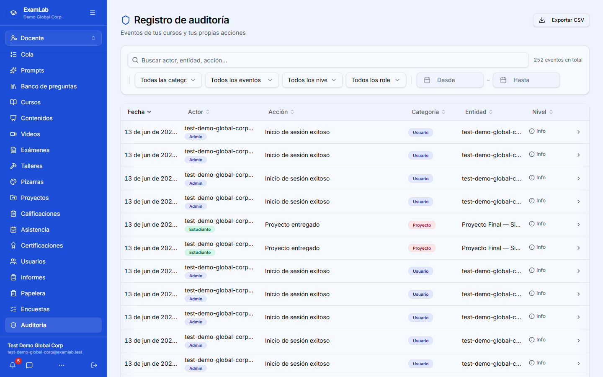

### Asistente de la plataforma

Un chat de **ayuda de uso de la app**, disponible desde el menú para todos los roles. A diferencia del **Tutor del curso** (que responde a tus estudiantes sobre el material del curso), el **Asistente de la plataforma** te explica **cómo usar ExamLab como docente**: crear un curso, armar y aplicar un examen, calificar con IA, definir cortes y pesos, llevar la asistencia, etc.

- Ábrelo desde **Asistente de la plataforma** en el menú y pregunta con tus palabras.
- Adapta las respuestas a tu rol: te guía en lo que **tú** puedes hacer como docente.
- Si algo no está en la documentación, te sugiere abrir un ticket de Soporte.

### Mensajes (pie de página)

La mensajería con estudiantes y otros docentes vive en el **ícono de mensajes** del pie de página (junto a la campana de notificaciones), no en el menú lateral. Te muestra un badge con los no leídos.

- **Chat 1-a-1**: abre una conversación con cualquier persona habilitada (estudiantes de tus cursos, otros docentes y administradores). Soporta adjuntos, edición y borrado de tus mensajes, y búsqueda dentro de la conversación.
- **Etiquetar contenido con `#`**: dentro del mensaje, escribe `#` y elige un examen, taller, proyecto o archivo para insertarlo como **enlace clicable**. Es la forma rápida de mandar al estudiante directo a la actividad.
- **Difusión a curso(s)**: con el botón **Difundir a curso** envías el mismo mensaje a **todos los estudiantes** de uno o varios cursos. Cada alumno lo recibe como **notificación**, **correo** y **mensaje 1-a-1** (sin duplicados, aunque esté en varios cursos).
- **Programar envío**: tanto la difusión como un mensaje directo pueden **programarse a futuro** (la plataforma los despacha sola al llegar la hora). Desde el botón **Programados** puedes ver y cancelar los pendientes.
