# Manual — Estudiante

Bienvenido a ExamLab. Como estudiante, aquí aprendes con el material de tus cursos, presentas tus evaluaciones (exámenes, talleres y proyectos), registras tu asistencia y haces seguimiento a tus notas y certificados. Esta guía recorre, módulo por módulo, qué hace cada sección y cómo usarla en el día a día. Varias funciones se apoyan en **inteligencia artificial**: un tutor que responde con base en el material de tu curso, la calificación automática de tus entregas y la detección de fraude — todo se resalta a lo largo del manual.

---

### Panel

Es tu pantalla de inicio: un vistazo rápido a lo que tienes pendiente y lo que viene.

- Revisa los cuatro indicadores de arriba: Proximos exámenes,Proximos talleres, proximos proyectos, y conversaciones por responder.
- Usa el **calendario de eventos** (izquierda) y la **agenda** (próximas clases y próximos exámenes, derecha) para no perder fechas.
- Haz clic en cualquier indicador o evento para ir directo a esa actividad.

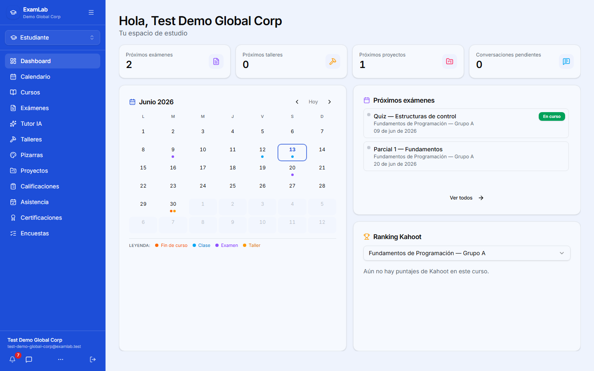

### Calendario

Vista mensual con todas tus actividades del curso para que organices tu estudio.

- Cambia de mes con las flechas y observa los puntos de color que marcan cada tipo de evento (clase, examen, taller, proyecto).
- Haz clic en un día para ver el detalle de lo que ocurre y abrir la actividad correspondiente.
- Solo aparecen actividades vigentes; lo que el docente elimina deja de mostrarse automáticamente.

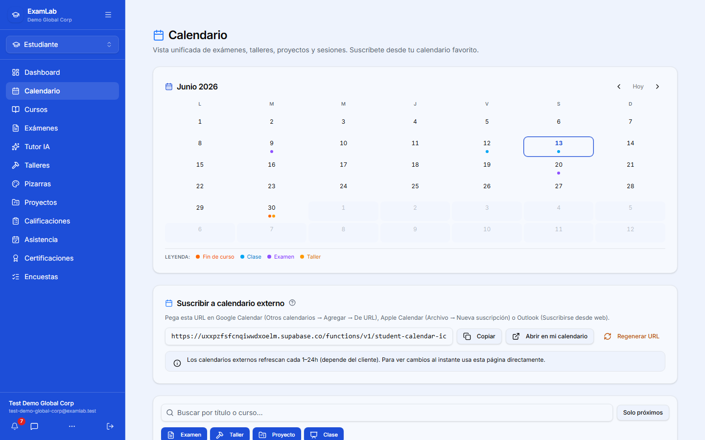

### Mis cursos

El tablero de cada curso: aquí encuentras el material de clase organizado por sesión.

- Abre un curso y recorre sus sesiones para ver documentos, presentaciones, imágenes y PDF.
- Visualiza imágenes y PDF **dentro de la app** (sin descargar) y descarga lo que necesites.
- Ejecuta archivos de código (Java, Python, JavaScript) con el botón **Ejecutar**, o abre notebooks `.ipynb` con **Abrir notebook** para correr todo el código de una vez.

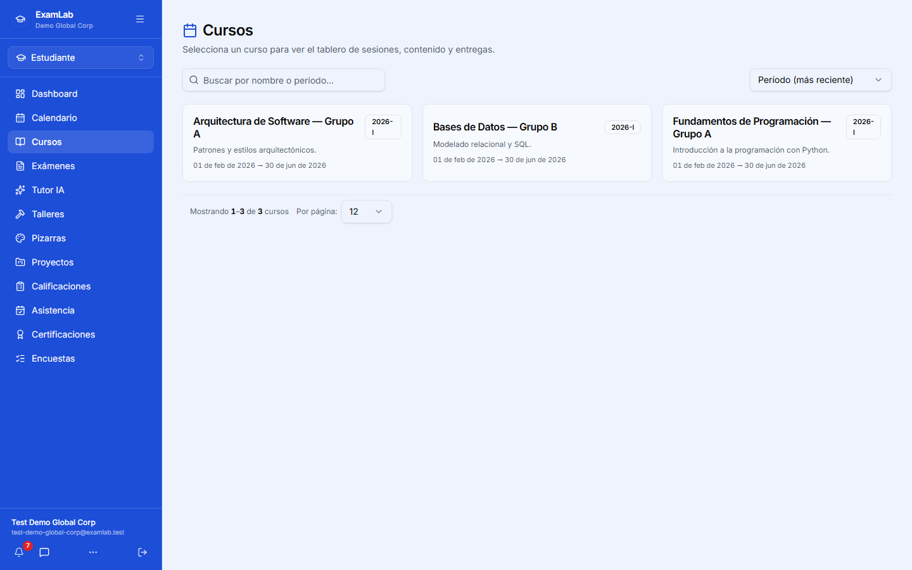

### Exámenes

Lista de tus exámenes para presentarlos y, después, revisar resultados.

- Entra a un examen disponible y respóndelo; el sistema **guarda tu avance automáticamente** cada pocos segundos.
- Atiende las reglas de cada examen (tiempo límite, navegación secuencial o libre, pantalla completa). Si sales de la pantalla del examen, puede registrarse una advertencia (**antifraude por proctoring**).
- Al entregar, muchas preguntas se califican con **IA** y luego puedes ver tu nota y la retroalimentación en la revisión de resultados.

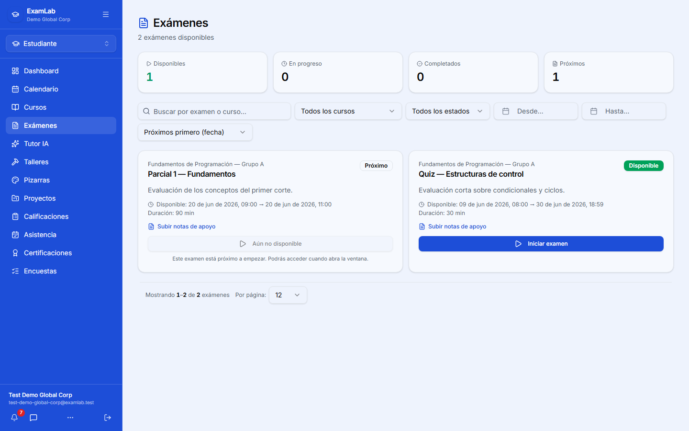

### Tutor IA

Un asistente con **inteligencia artificial** que responde tus dudas usando el material real de tu curso.

- Escribe tu pregunta y recibe la respuesta en vivo; el tutor lee el contenido publicado por el docente (documentos, presentaciones, notebooks, código), no solo los títulos.
- Escribe `#` para **referenciar un archivo** del curso y enfocar la respuesta en ese material concreto.
- Úsalo para repasar antes de un examen, aclarar conceptos o entender un ejemplo de clase.

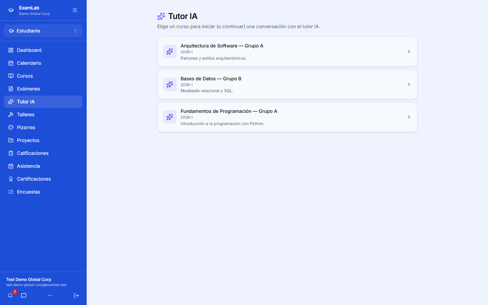

### Talleres

Actividades prácticas con preguntas que entregas para calificación.

- Abre el taller, responde y entrega; si el docente lo configuró como **trabajo en grupo**, verás tu grupo y compartirán una sola entrega y la misma nota.
- Si dejas respuestas en blanco, la app te pide confirmar antes de entregar.
- Tus respuestas pueden calificarse con **IA** y la retroalimentación queda disponible al terminar.

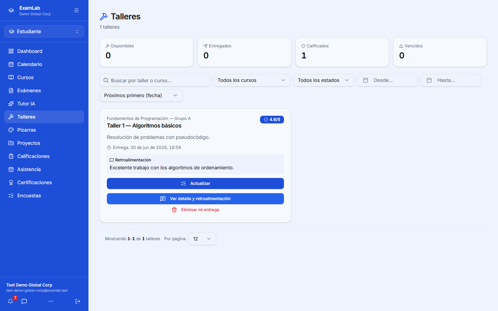

### Pizarras

Espacio de dibujo y diagramas para colaborar en clase cuando el docente lo habilita.

- Aparece el botón **Pizarra** en tus sesiones solo cuando el docente activa la pizarra compartida.
- Dibuja y edita junto a tu profesor y compañeros: los cambios se sincronizan **en vivo**.
- Útil para flujos, diagramas UML o estructuras de datos durante la sesión.

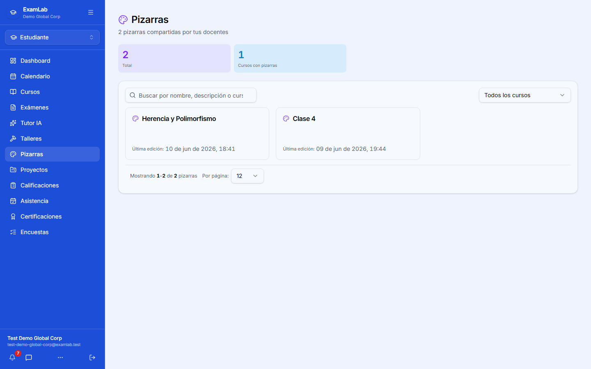

### Proyectos

Entregas más grandes que combinan archivos, código y, a veces, sustentación.

- Sube tus entregables (documentos, diagramas y, si aplica, tu código completo en un `.zip`) y agrega el **enlace al repositorio** cuando se solicite (es obligatorio: `https://...`).
- Al entregar, la **IA** califica tu trabajo y deja una nota preliminar.
- La **nota final** se confirma tras la **sustentación**; mientras tanto verás "Falta sustentación".

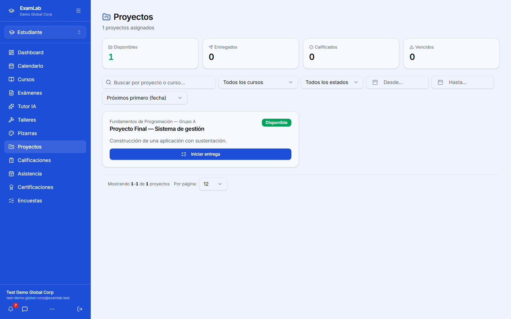

### Calificaciones

Tu boletín por curso: cómo van tus notas corte por corte.

- Selecciona el curso para ver el desglose por corte y por actividad (exámenes, talleres, proyectos y asistencia).
- Recuerda que las actividades sin nota cuentan como cero hasta que se califiquen, así que entrega a tiempo.
- Si una vista no carga, usa **Reintentar** para volver a consultarla.

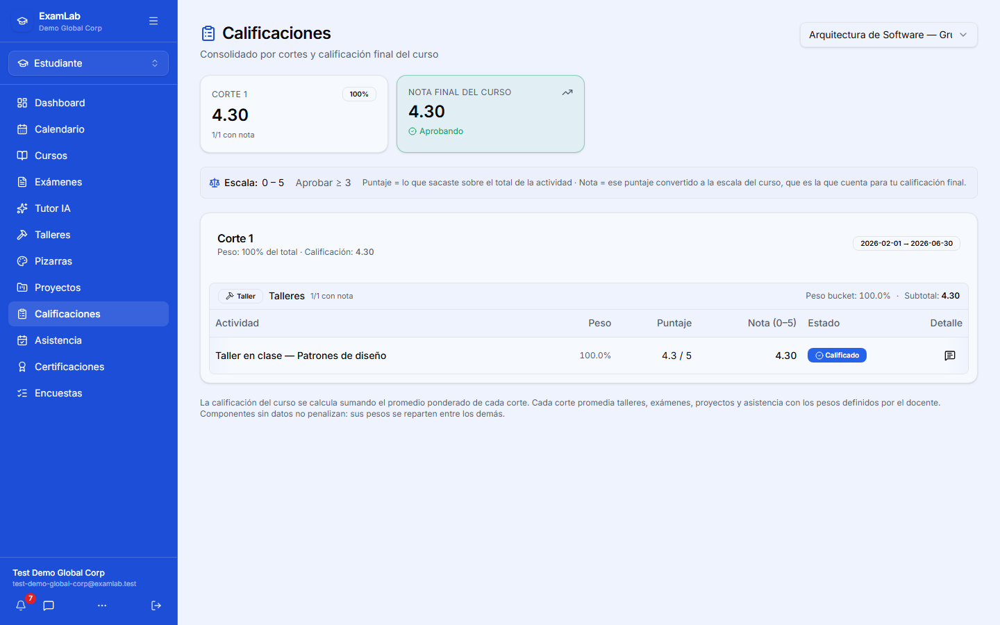

### Asistencia

Registra tu presencia en clase de forma autónoma, sin que el docente llame uno por uno.

- Cuando el profesor abre el check-in, aparece la tarjeta **Check-in disponible**: escanea el **código QR** con la cámara o ingresa el **código de 6 dígitos** manualmente.
- El código rota cada cierto tiempo; ingrésalo mientras esté visible (hay una pequeña gracia entre rotaciones).
- Desde cada sesión también puedes abrir los **snippets de código** que preparó el docente para verlos o ejecutarlos.

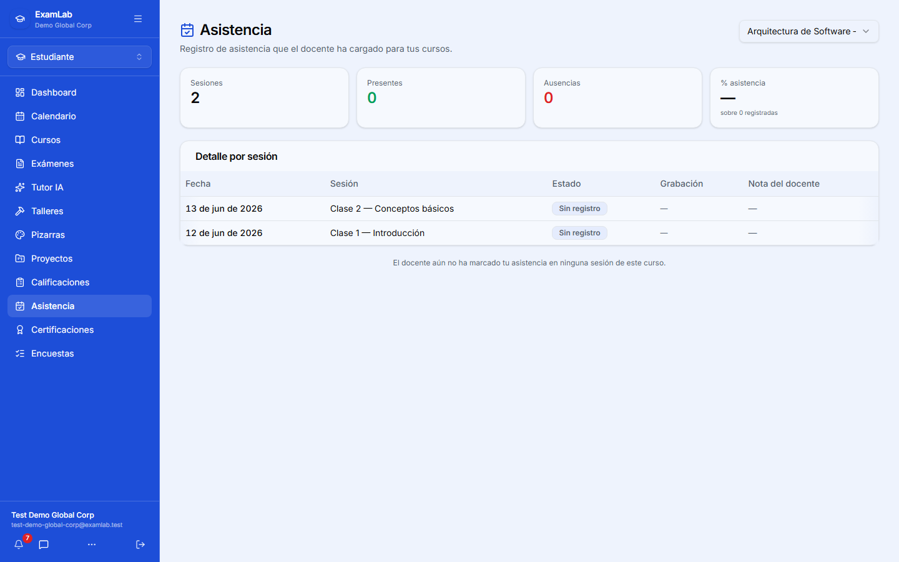

### Certificaciones

Consulta y descarga los certificados que te emite la institución.

- Revisa la lista de tus certificados disponibles por curso o programa.
- Descarga el documento cuando lo necesites para trámites o tu portafolio.
- Usa el buscador y la paginación si tienes varios certificados acumulados.

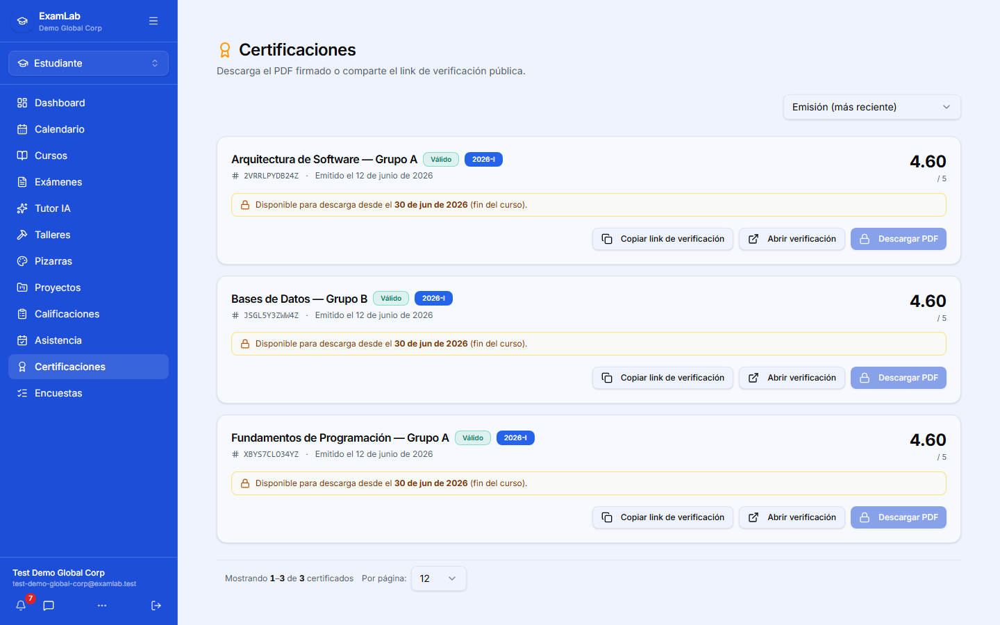

### Encuestas

Participa en encuestas y votaciones del curso, incluida la reserva de horarios tipo Doodle.

- Abre una encuesta activa, elige tu opción (o tu cupo de horario) y envía tu respuesta.
- Si la encuesta lo permite, puedes **cambiar tu respuesta** o usar **Quitar mi respuesta** mientras siga abierta.
- También puedes llegar directo a una encuesta mediante el enlace que comparta el docente.

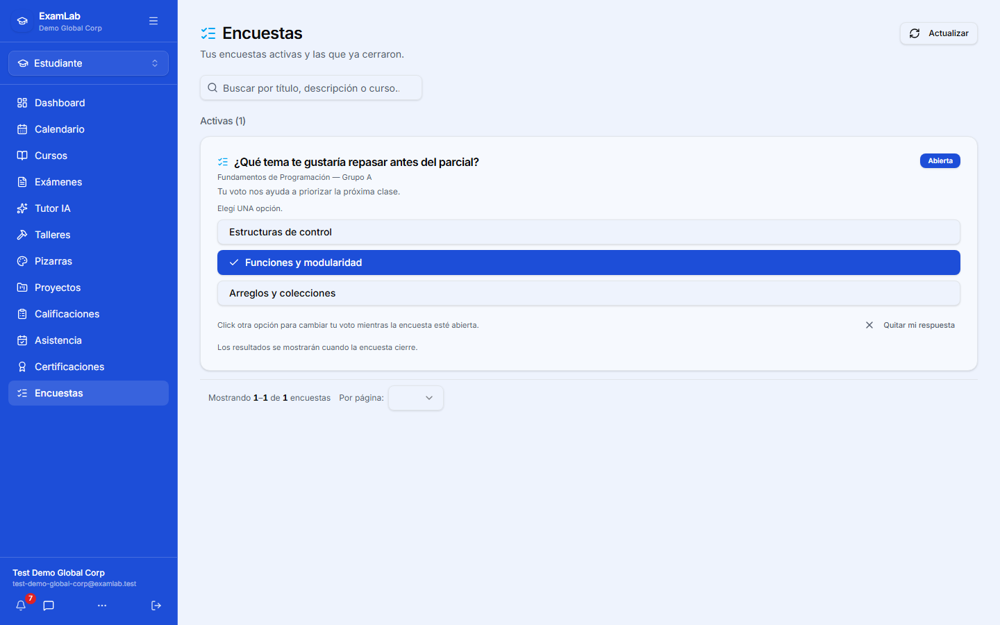

### Mensajes (Pie de pagina)

La mensajería con tus docentes y compañeros vive en el **ícono de mensajes** del pie de pagina, junto a la campana de notificaciones. El badge te marca los no leídos.

- **Chat 1-a-1** con tus docentes (y, según permisos, con compañeros): puedes escribir, adjuntar archivos y buscar dentro de la conversación.
- **Avisos del docente**: cuando un profesor envía una difusión a todo el curso, te llega como **notificación**, **correo** y un mensaje en tu conversación con él (así puedes responderle directo si tienes dudas).
- Tu profesor a veces incluye enlaces con `#` a un examen, taller o archivo del curso; al tocarlos te llevan directo a esa actividad.

### Foros del curso

Cuando tu docente abre un **foro de discusión** dentro de un curso, lo verás desde el tablero del curso. Sirven para debate asincrónico — preguntas, hilos colaborativos, discusión guiada por una pregunta del profesor.

- Cada foro tiene una **ventana** (apertura y cierre): solo puedes participar mientras esté abierto.
- Abre un hilo (o responde uno existente) y revisa las respuestas. Las notificaciones te avisan cuando alguien responde en un hilo donde participaste.
