# Deployment Flow - Flujo visual completo

Cómo funciona el despliegue de extremo a extremo.

## 📋 Fase 1: CloudShell Setup (5 minutos)

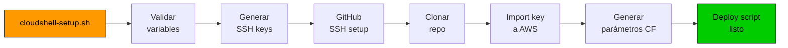

**Resultado**: Infraestructura lista para desplegarse

---

## 🏗️ Fase 2: CloudFormation Stacks (7 minutos)

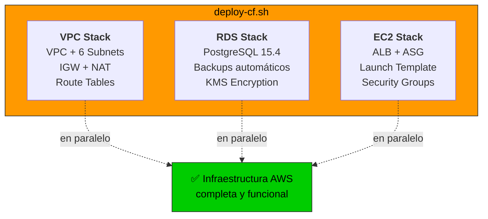

### Detalle del VPC Stack
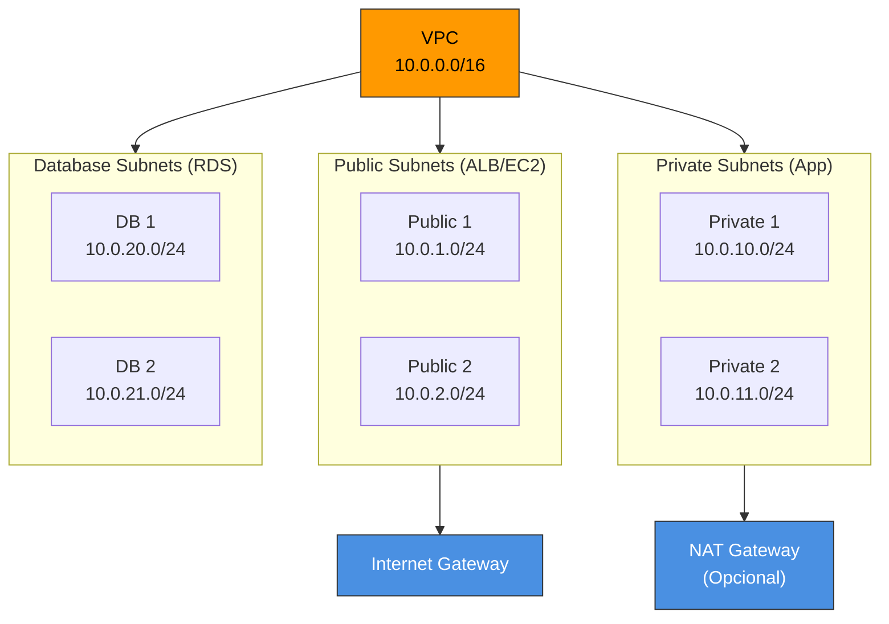

### Detalle del RDS Stack
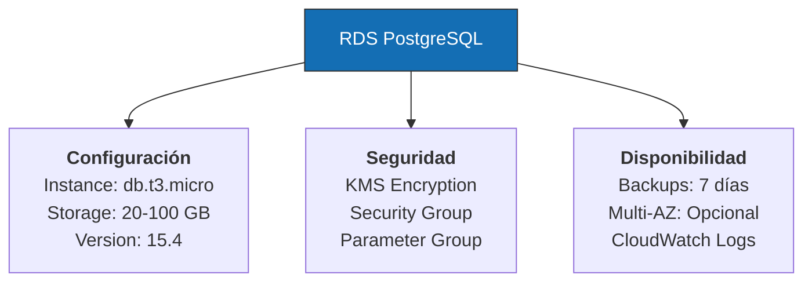

### Detalle del EC2 Stack
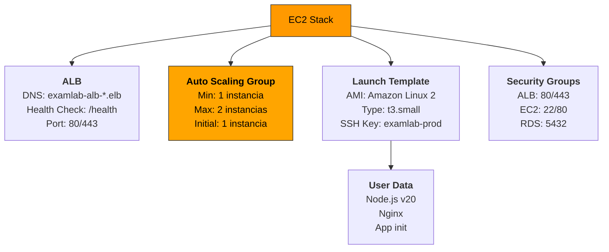

**Resultado**: Infraestructura AWS completa y funcional

---

## 🚀 Fase 3: Inicialización de EC2 (3 minutos)

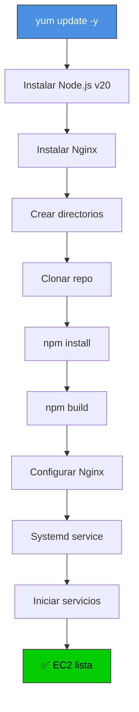

**Resultado**: EC2 lista con aplicación corriendo

---

## 🔄 Fase 4: Health Checks (1 minuto)

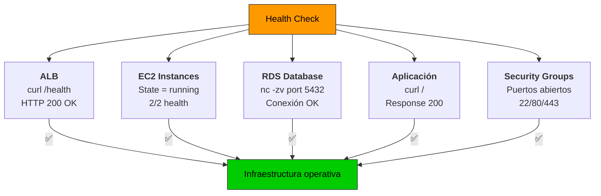

**Resultado**: Confirmación de que todo está online

---

## 💾 Fase 5: Backup (en cualquier momento)

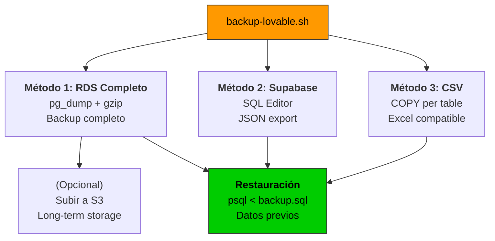

**Resultado**: Datos protegidos y recuperables

---

## 📊 Arquitectura final

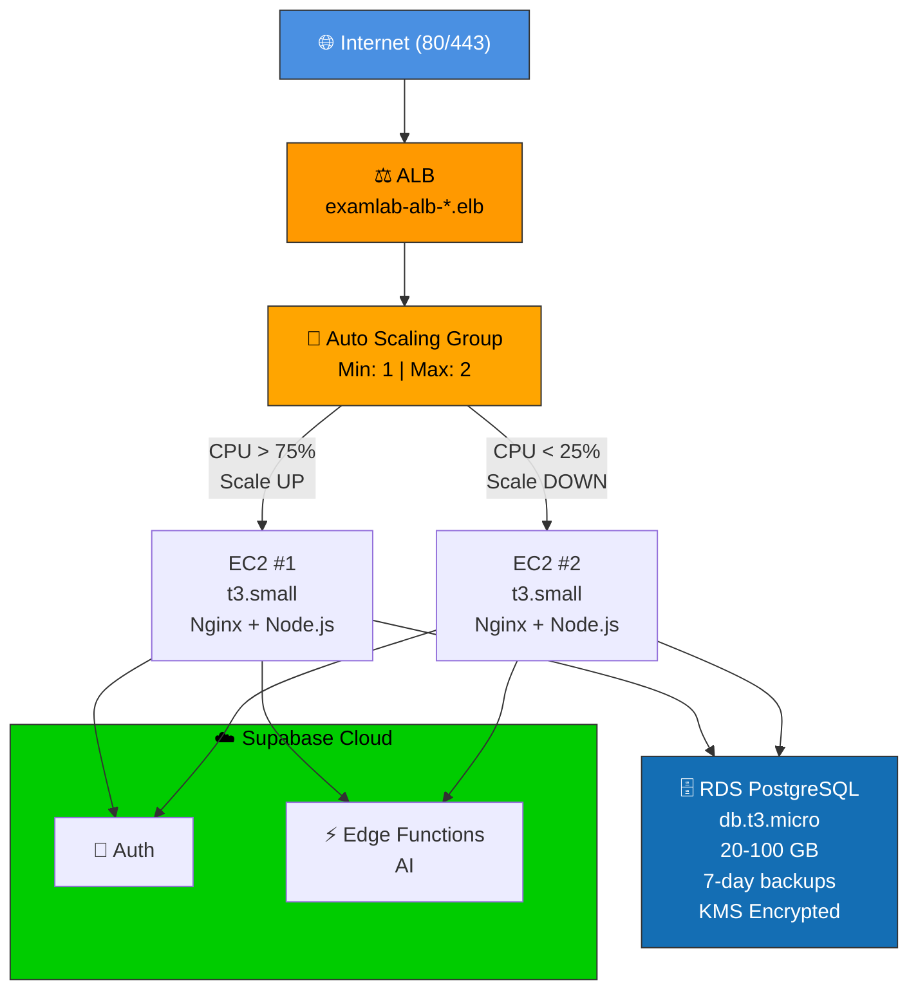

**VPC Networking:**
- VPC: `10.0.0.0/16`
- Public Subnets: `10.0.1-2.0/24` (ALB, EC2)
- Private Subnets: `10.0.10-11.0/24` (App)
- DB Subnets: `10.0.20-21.0/24` (RDS)

**Security:**
- ALB: 80, 443 ← 0.0.0.0/0
- EC2: 22 (SSH), 80 (from ALB)
- RDS: 5432 (from EC2)

---

## 📈 Escalamiento automático

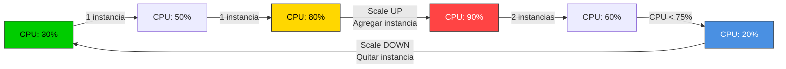

**Reglas:**
- Si CPU > 75% durante 5 min → Scale UP
- Si CPU < 25% durante 10 min → Scale DOWN
- Máximo: 2 instancias
- Mínimo: 1 instancia

---

## 🔁 Ciclo de vida de un request

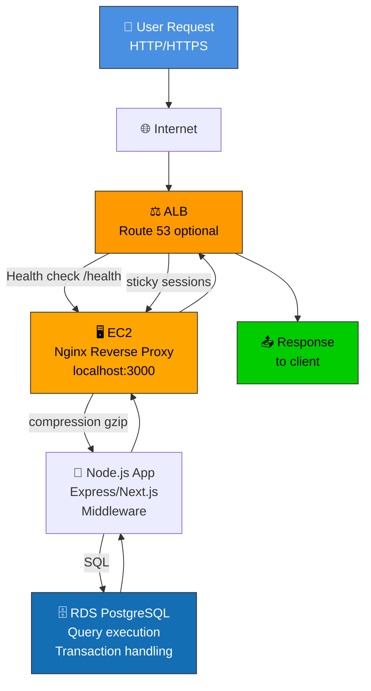

---

## 🔄 Acceso a tu aplicación

**Después del despliegue, el script mostrará:**

```
📍 ACCESO A TU APLICACIÓN:
   HTTP:  http://examlab-alb-prod-123.us-east-1.elb.amazonaws.com

🔑 ACCESO SSH A EC2:
   ssh -i ~/.ssh/examlab-production.pem ec2-user@examlab-alb-prod-123...

💾 BASE DE DATOS:
   Host:     examlab-postgres.xxxxx.us-east-1.rds.amazonaws.com
```

**Para mostrar esta información de nuevo:**
```bash
bash scripts/print-access-info.sh
```

---

## 📋 Checklist de despliegue

- [ ] Editar `cloudshell-vars.env` con tus valores
- [ ] Ejecutar `bash cloudshell-setup.sh`
- [ ] Verificar SSH key agregada a GitHub
- [ ] Ejecutar `bash scripts/deploy-cf.sh`
- [ ] Esperar ~5 minutos a CloudFormation
- [ ] Ejecutar `bash scripts/health-check.sh`
- [ ] Acceder a ALB DNS en navegador
- [ ] Hacer SSH a EC2
- [ ] Configurar dominio (opcional)
- [ ] Habilitar HTTPS (recomendado)
- [ ] Configurar backups automáticos

---

## ⏱️ Tiempos estimados

| Fase | Tiempo | Descripción |
|------|--------|-------------|
| CloudShell Setup | 5 min | Variables, SSH, GitHub |
| CloudFormation Deploy | 7 min | Crear stacks AWS |
| EC2 Initialization | 3 min | Node.js, Nginx, App |
| Health Checks | 1 min | Verificar infraestructura |
| **Total** | **~16 minutos** | Desde cero a producción |

---

## 💰 Costos durante despliegue

| Servicio | Cantidad | Costo/hora | Costo/mes |
|----------|----------|-----------|-----------|
| EC2 t3.small | 1-2 | $0.0208 | $15/instancia |
| ALB | 1 | $0.0225 | $16.20 |
| RDS db.t3.micro | 1 | $0.0175 | $13.14 |
| Data transfer | varies | variable | $0-50 |
| **Total mínimo** | - | - | **~$30** |
| **Total recomendado** | - | - | **~$130** |

