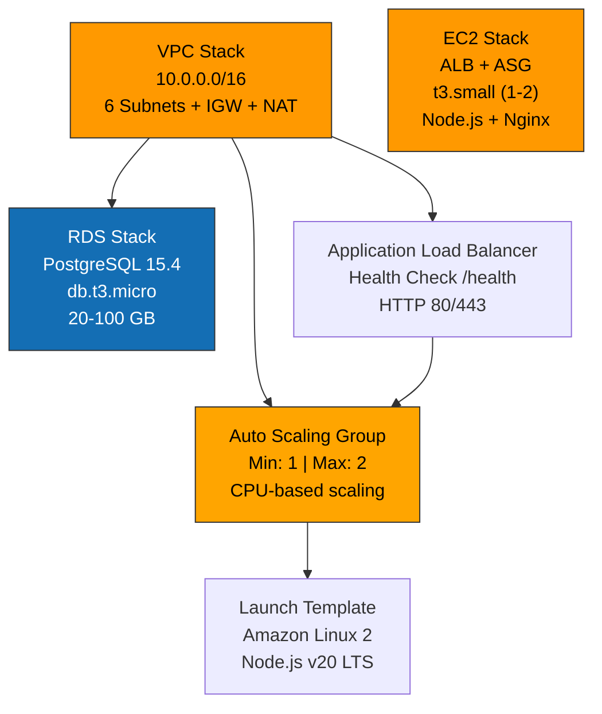

# Lovable → AWS CloudFormation Deployment

Despliegue **completamente automatizado** de Lovable/ExamLab en AWS desde **CloudShell** en 10 minutos.

**Sin Terraform, sin complicaciones, variables genéricas fáciles de cambiar.**

## 🚀 Inicio rápido (3 pasos)

### 1️⃣ Abrir AWS CloudShell

```
https://console.aws.amazon.com/cloudshell/
```

### 2️⃣ Clonar y ejecutar

```bash
git clone https://github.com/tu-usuario/examlab.git
cd examlab/lovable-aws-deployment
bash cloudshell-setup.sh
```

### 3️⃣ Editar variables (si lo deseas)

```bash
nano cloudshell-vars.env
# Cambiar PROJECT_NAME, ENVIRONMENT, DB_PASSWORD, etc.
```

## ✨ Lo que hace `cloudshell-setup.sh`

```
✓ Valida variables genéricas
✓ Genera SSH keys en CloudShell
✓ Agrega clave pública a GitHub automáticamente
✓ Clona repositorio
✓ Importa SSH key a AWS EC2
✓ Crea parámetros para CloudFormation
✓ Prepara stacks para despliegue
```

## 📁 Estructura

```
lovable-aws-deployment/
├── cloudshell-vars.env              ← EDITAR AQUÍ (variables genéricas)
├── cloudshell-setup.sh              ← Ejecutar primero
├── README.md
│
├── cloudformation/
│   ├── vpc-stack.yaml               ← VPC, subnets, IGW
│   ├── rds-stack.yaml               ← PostgreSQL (Supabase-compatible)
│   ├── ec2-stack.yaml               ← EC2, ALB, Auto Scaling
│   └── parameters.json              ← Auto-generado por setup.sh
│
├── scripts/
│   ├── backup-lovable.sh            ← Backup RDS / Supabase / CSV
│   ├── health-check.sh              ← Verificar infraestructura
│   └── deploy-cf.sh                 ← Auto-generado
│
└── configs/
    └── user_data.sh                 ← Script init EC2
```

## 🎯 Variables genéricas (cloudshell-vars.env)

Estos son los **ÚNICOS** valores que necesitas cambiar:

```bash
# Identificadores
PROJECT_NAME="examlab"              # Nombre del proyecto
ENVIRONMENT="production"            # production|staging|development
AWS_REGION="us-east-1"             # Región AWS
OWNER_NAME="YourName"              # Nombre del dueño

# GitHub (opcional)
GITHUB_OWNER="tu-usuario"          # Tu usuario GitHub
GITHUB_REPO="examlab"              # Nombre del repo
GITHUB_BRANCH="main"               # Branch a deployar

# Infraestructura
EC2_INSTANCE_TYPE="t3.small"       # t3.micro|t3.small|t3.medium
DB_INSTANCE_TYPE="db.t3.micro"    # db.t3.micro|db.t3.small

# IMPORTANTE: Cambiar contraseña
DB_PASSWORD="ExamLab2024ChangeMe!" # !!!CAMBIAR!!!

# Supabase (opcional)
SUPABASE_URL=""                    # Si usas Supabase
SUPABASE_ANON_KEY=""
```

**Todo lo demás se genera automáticamente.**

## 📊 CloudFormation Stacks



### VPC Stack
- VPC + 6 subnets (2x public, 2x private, 2x database)
- Internet Gateway + NAT Gateway (opcional)
- Route tables
- DB Subnet Group (para RDS)

### RDS Stack
- PostgreSQL 15.4 (Supabase-compatible)
- Backups automáticos (7 días)
- Enhanced Monitoring
- KMS encryption
- Multi-AZ (opcional)

### EC2 Stack
- Application Load Balancer
- Auto Scaling Group (1-2 instancias)
- Launch Template (Node.js, Nginx)
- Security Groups
- IAM roles (CloudWatch, S3, etc)

## 🔐 SSH Key Management

El script genera SSH keys automáticamente en CloudShell:

```bash
# Generar
cloudshell-setup.sh
# Genera: ~/.ssh/examlab-production.pem

# Conectar a EC2
ssh -i ~/.ssh/examlab-production.pem ec2-user@<alb-dns>

# Agregar a GitHub (automático si tienes token)
# O manual: https://github.com/settings/keys
```

## 📦 Despliegue CloudFormation

Después de correr `cloudshell-setup.sh`:

```bash
# Desplegar todos los stacks
bash scripts/deploy-cf.sh

# El script imprimirá automáticamente:
# ✅ Información de acceso
# ✅ URLs de ALB
# ✅ Endpoints RDS
# ✅ Instrucciones SSH
```

**Acceso a tu aplicación:**
```
HTTP:  http://<ALB-DNS>
SSH:   ssh -i ~/.ssh/examlab-production.pem ec2-user@<ALB-DNS>
```

La IP pública se mostrará al final del despliegue.

## 💰 Costos estimados (monthly)

| Recurso | Config mínima | Config recomendada |
|---------|---------------|-------------------|
| EC2 | t3.micro ($7.59) | t3.small ($16) |
| RDS | db.t3.micro ($13.14) | db.t3.micro ($13.14) |
| ALB | $16 | $16 |
| Data | varies | ~$100/TB |
| **TOTAL** | **~$30** | **~$130** |

## 🔄 Backup

### Método 1: RDS completo

```bash
bash scripts/backup-lovable.sh rds

# Genera: ~/examlab-backups/examlab_rds_YYYYMMDD.sql.gz
# Sube a S3 si lo deseas
```

### Método 2: Supabase

```bash
bash scripts/backup-lovable.sh supabase

# Requiere:
# 1. Supabase connection string
# 2. O usar SQL Editor en https://app.supabase.com
```

### Método 3: CSV export

```bash
bash scripts/backup-lovable.sh csv

# Exporta cada tabla a CSV
# Genera: ~/examlab-backups/csv_YYYYMMDD/*.csv
```

### Restaurar

```bash
bash scripts/backup-lovable.sh restore

# Selecciona archivo y restaura
```

## 🏥 Health Check

```bash
bash scripts/health-check.sh

# Verifica:
# ✓ ALB respondiendo
# ✓ EC2 instancias running
# ✓ RDS disponible
# ✓ Aplicación lista
```

## 🆘 Troubleshooting

### "CloudShell not found"
```bash
# Abre: https://console.aws.amazon.com/cloudshell/
```

### "Git command not found"
```bash
# Git está pre-instalado en CloudShell
# Si no: yum install -y git
```

### "Can't connect to RDS"
```bash
# Verificar Security Group permite tráfico desde EC2
# Desde EC2:
ssh -i ~/.ssh/examlab-prod.pem ec2-user@<alb-dns>
telnet <rds-endpoint> 5432
```

### "ALB responde 502"
```bash
# Esperar 3-5 minutos a que EC2 inicie
# Luego:
ssh -i ~/.ssh/examlab-prod.pem ec2-user@<alb-dns>
sudo systemctl status nginx
sudo tail -f /var/log/examlab/*.log
```

### "Can't clone repo"
```bash
# Agregar SSH key a GitHub:
cat ~/.ssh/examlab-production.pub

# Copiar output y pegar en:
# https://github.com/settings/keys
```

## 📚 Archivos importantes

| Archivo | Propósito |
|---------|-----------|
| `cloudshell-vars.env` | Variables genéricas (editar) |
| `cloudshell-setup.sh` | Setup inicial (SSH, GitHub, CF prep) |
| `cloudformation/*.yaml` | Templates CloudFormation |
| `scripts/backup-lovable.sh` | Backup RDS/Supabase/CSV |
| `scripts/health-check.sh` | Verificar infraestructura |
| `scripts/deploy-cf.sh` | Desplegar stacks (auto-generado) |

## 🔄 Flujo típico

```bash
# 1. Abre CloudShell
# 2. Clona repo
git clone ...

# 3. Edita variables (si necesario)
nano cloudshell-vars.env

# 4. Ejecuta setup
bash cloudshell-setup.sh

# 5. Deploya (cuando esté listo)
bash scripts/deploy-cf.sh

# 6. Espera ~5 minutos a que se cree infraestructura
# 7. Verifica
bash scripts/health-check.sh

# 8. Accede a la aplicación
curl http://<alb-dns>

# 9. Conecta vía SSH
ssh -i ~/.ssh/examlab-prod.pem ec2-user@<alb-dns>

# 10. Haz backup
bash scripts/backup-lovable.sh rds
```

## 🎯 Variables reutilizables

Cada variable en `cloudshell-vars.env` es genérica:

```bash
# Cambiar ambiente
ENVIRONMENT="staging"  # staging en lugar de production
# Todos los nombres de stacks, security groups, etc., se actualizan automáticamente

# Cambiar región
AWS_REGION="eu-west-1"  # Desplegar en Irlanda
# CloudFormation usa la región especificada

# Cambiar repo
GITHUB_OWNER="another-org"
GITHUB_REPO="different-project"
# El mismo setup.sh funciona para cualquier proyecto
```

## 🚀 Próximos pasos

1. **Programar backups automáticos**
   ```bash
   # Agregar a crontab en EC2:
   # 0 2 * * * bash /opt/examlab/scripts/backup-lovable.sh rds
   ```

2. **Monitoreo**
   ```bash
   # Ver CloudWatch Logs en AWS Console
   # O localmente:
   ssh -i ~/.ssh/examlab-production.pem ec2-user@<alb-dns>
   sudo tail -f /var/log/examlab/app.log
   ```

3. **Dominio personalizado** (opcional, después)
   ```bash
   # Ver: docs/FREETIER_DOMAINS.md
   # Para configurar dominio con Cloudflare
   ```

## 📝 Licencia

MIT - Usa libremente para tus proyectos

---

**¿Preguntas?** Ver troubleshooting arriba o abrir un issue.

**¿Problema con CloudFormation?** Chequea los logs:
```bash
aws cloudformation describe-stack-events \
  --stack-name examlab-ec2-production \
  --region us-east-1 | jq '.StackEvents[] | select(.ResourceStatus=="CREATE_FAILED")'
```
