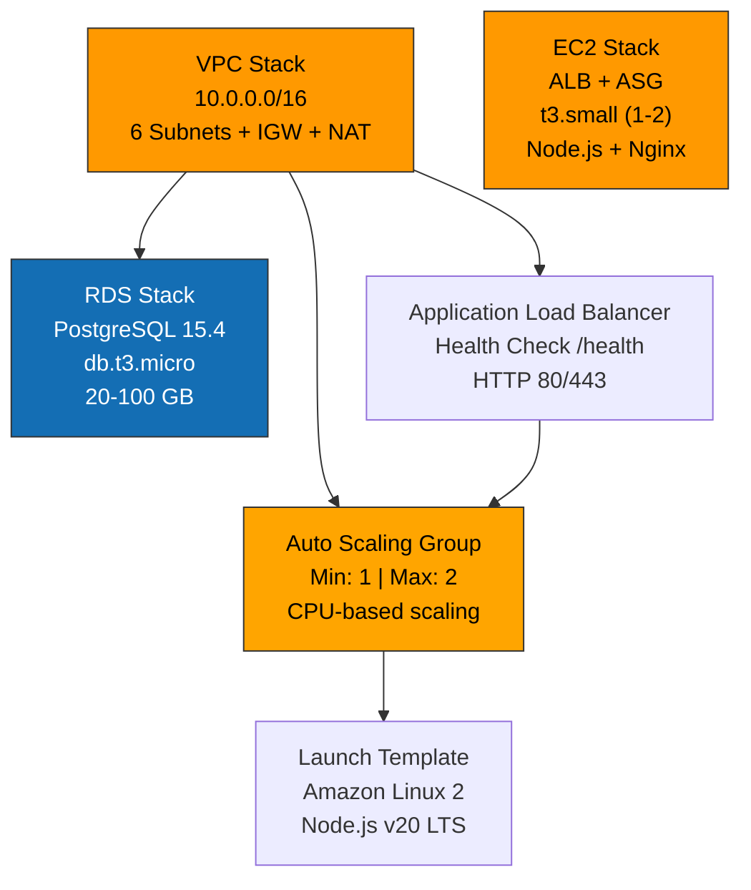

# Lovable → AWS CloudFormation Deployment

Despliegue **completamente automatizado** de Lovable/ExamLab en AWS desde **CloudShell** en 10 minutos.

**Sin Terraform, sin complicaciones, variables genéricas fáciles de cambiar.**

## 🔐 Permisos AWS — mínimo privilegio para desplegar

`cloudshell-setup.sh` despliega 3 stacks CloudFormation (VPC + RDS + EC2)
con ~25 recursos. Tu usuario IAM (o rol asumido en CloudShell) necesita
estos permisos.

### Recursos que se crean

| Stack | Recursos AWS |
|---|---|
| **VPC** (`<PROJECT>-vpc-<ENV>`) | VPC, Subnets, IGW, NAT Gateway, EIP, Route Tables, RDS DB Subnet Group |
| **RDS** (`<PROJECT>-rds-<ENV>`) | RDS PostgreSQL instance, Parameter Group, Security Group, IAM Role (monitoring), KMS Key + Alias (encryption at-rest), CloudWatch Log Group |
| **EC2** (`<PROJECT>-ec2-<ENV>`) | Auto Scaling Group, Launch Template, Security Group, Application Load Balancer (Listener + Target Group), IAM Role + InstanceProfile + inline Policy, CloudWatch Alarms + Scaling Policies |

Más, fuera de CloudFormation, el script hace `aws ec2 import-key-pair`
para subir tu SSH public key generada en CloudShell.

### ¿Cuál policy elegir?

Hay **dos versiones** según tu nivel de confianza con el usuario IAM:

| Versión | Permite | Cuándo usar |
|---|---|---|
| **Least-privilege** (slim, abajo) | Crear + actualizar + leer | El usuario va a desplegar/iterar pero NUNCA debe borrar (operadores, devs) |
| **Completa** (más abajo) | Todo lo anterior + delete/teardown | Admins de la cuenta o automation que necesita poder destruir stacks (ej. para CI ephemeral envs) |

Las dos comparten el mismo scope de recursos (`<PROJECT>-*`).
Adjuntá UNA u OTRA, no las dos al mismo usuario.

---

### Versión A — Least-privilege (CREATE + UPDATE + READ)

**No incluye** `Delete*`, `Terminate*`, `Release*`, `Revoke*`,
`Detach*`, `Remove*` ni `Schedule*Deletion`. Con esta policy podés
desplegar y actualizar la plataforma, pero **NO podés destruir la
infra**. Si necesitás borrar stacks o recursos, pedí permisos
adicionales temporales o usá la versión completa.

Reemplazá `<ACCOUNT_ID>` por tu ID de cuenta (12 dígitos) y `<PROJECT>`
por el `PROJECT_NAME` de `cloudshell-vars.env` (default: `examlab`).

```json
{
  "Version": "2012-10-17",
  "Statement": [
    {
      "Sid": "IdentityValidation",
      "Effect": "Allow",
      "Action": [
        "sts:GetCallerIdentity",
        "cloudformation:ValidateTemplate",
        "cloudformation:GetTemplateSummary"
      ],
      "Resource": "*"
    },
    {
      "Sid": "CloudFormationCreateUpdateRead",
      "Effect": "Allow",
      "Action": [
        "cloudformation:CreateStack",
        "cloudformation:UpdateStack",
        "cloudformation:DescribeStacks",
        "cloudformation:DescribeStackEvents",
        "cloudformation:DescribeStackResources",
        "cloudformation:DescribeStackResource",
        "cloudformation:GetTemplate",
        "cloudformation:ListStackResources",
        "cloudformation:CreateChangeSet",
        "cloudformation:DescribeChangeSet",
        "cloudformation:ExecuteChangeSet",
        "cloudformation:ListChangeSets"
      ],
      "Resource": [
        "arn:aws:cloudformation:*:<ACCOUNT_ID>:stack/<PROJECT>-vpc-*/*",
        "arn:aws:cloudformation:*:<ACCOUNT_ID>:stack/<PROJECT>-rds-*/*",
        "arn:aws:cloudformation:*:<ACCOUNT_ID>:stack/<PROJECT>-ec2-*/*"
      ]
    },
    {
      "Sid": "VpcNetworking",
      "Effect": "Allow",
      "Action": [
        "ec2:CreateVpc",
        "ec2:ModifyVpcAttribute",
        "ec2:DescribeVpcs",
        "ec2:DescribeVpcAttribute",
        "ec2:CreateSubnet",
        "ec2:ModifySubnetAttribute",
        "ec2:DescribeSubnets",
        "ec2:CreateInternetGateway",
        "ec2:AttachInternetGateway",
        "ec2:DescribeInternetGateways",
        "ec2:CreateNatGateway",
        "ec2:DescribeNatGateways",
        "ec2:AllocateAddress",
        "ec2:DescribeAddresses",
        "ec2:CreateRouteTable",
        "ec2:DescribeRouteTables",
        "ec2:CreateRoute",
        "ec2:AssociateRouteTable",
        "ec2:CreateTags",
        "ec2:DescribeAvailabilityZones",
        "ec2:DescribeAccountAttributes"
      ],
      "Resource": "*"
    },
    {
      "Sid": "Ec2Compute",
      "Effect": "Allow",
      "Action": [
        "ec2:ImportKeyPair",
        "ec2:CreateKeyPair",
        "ec2:DescribeKeyPairs",
        "ec2:CreateLaunchTemplate",
        "ec2:CreateLaunchTemplateVersion",
        "ec2:DescribeLaunchTemplates",
        "ec2:DescribeLaunchTemplateVersions",
        "ec2:ModifyLaunchTemplate",
        "ec2:CreateSecurityGroup",
        "ec2:DescribeSecurityGroups",
        "ec2:AuthorizeSecurityGroupIngress",
        "ec2:AuthorizeSecurityGroupEgress",
        "ec2:DescribeImages",
        "ec2:DescribeInstances",
        "ec2:DescribeInstanceStatus",
        "ec2:RunInstances",
        "ec2:StartInstances"
      ],
      "Resource": "*"
    },
    {
      "Sid": "AutoScalingAndAlb",
      "Effect": "Allow",
      "Action": [
        "autoscaling:CreateAutoScalingGroup",
        "autoscaling:UpdateAutoScalingGroup",
        "autoscaling:DescribeAutoScalingGroups",
        "autoscaling:DescribeAutoScalingInstances",
        "autoscaling:PutScalingPolicy",
        "autoscaling:DescribePolicies",
        "autoscaling:CreateOrUpdateTags",
        "elasticloadbalancing:CreateLoadBalancer",
        "elasticloadbalancing:ModifyLoadBalancerAttributes",
        "elasticloadbalancing:DescribeLoadBalancers",
        "elasticloadbalancing:DescribeLoadBalancerAttributes",
        "elasticloadbalancing:CreateListener",
        "elasticloadbalancing:ModifyListener",
        "elasticloadbalancing:DescribeListeners",
        "elasticloadbalancing:CreateTargetGroup",
        "elasticloadbalancing:ModifyTargetGroup",
        "elasticloadbalancing:DescribeTargetGroups",
        "elasticloadbalancing:DescribeTargetHealth",
        "elasticloadbalancing:RegisterTargets",
        "elasticloadbalancing:AddTags",
        "cloudwatch:PutMetricAlarm",
        "cloudwatch:DescribeAlarms"
      ],
      "Resource": "*"
    },
    {
      "Sid": "RdsDatabase",
      "Effect": "Allow",
      "Action": [
        "rds:CreateDBInstance",
        "rds:ModifyDBInstance",
        "rds:DescribeDBInstances",
        "rds:CreateDBSubnetGroup",
        "rds:DescribeDBSubnetGroups",
        "rds:CreateDBParameterGroup",
        "rds:ModifyDBParameterGroup",
        "rds:DescribeDBParameterGroups",
        "rds:DescribeDBParameters",
        "rds:AddTagsToResource",
        "rds:ListTagsForResource"
      ],
      "Resource": "*"
    },
    {
      "Sid": "IamRolesAndInstanceProfile",
      "Effect": "Allow",
      "Action": [
        "iam:CreateRole",
        "iam:GetRole",
        "iam:PassRole",
        "iam:AttachRolePolicy",
        "iam:PutRolePolicy",
        "iam:GetRolePolicy",
        "iam:ListRolePolicies",
        "iam:ListAttachedRolePolicies",
        "iam:CreateInstanceProfile",
        "iam:GetInstanceProfile",
        "iam:AddRoleToInstanceProfile",
        "iam:TagRole"
      ],
      "Resource": [
        "arn:aws:iam::<ACCOUNT_ID>:role/<PROJECT>-*",
        "arn:aws:iam::<ACCOUNT_ID>:instance-profile/<PROJECT>-*"
      ]
    },
    {
      "Sid": "KmsForRdsEncryption",
      "Effect": "Allow",
      "Action": [
        "kms:CreateKey",
        "kms:DescribeKey",
        "kms:EnableKey",
        "kms:CreateAlias",
        "kms:UpdateAlias",
        "kms:ListAliases",
        "kms:TagResource",
        "kms:PutKeyPolicy",
        "kms:GetKeyPolicy"
      ],
      "Resource": "*"
    },
    {
      "Sid": "CloudWatchLogs",
      "Effect": "Allow",
      "Action": [
        "logs:CreateLogGroup",
        "logs:DescribeLogGroups",
        "logs:DescribeLogStreams",
        "logs:PutRetentionPolicy",
        "logs:TagLogGroup",
        "logs:TagResource",
        "logs:ListTagsForResource",
        "logs:FilterLogEvents",
        "logs:GetLogEvents"
      ],
      "Resource": "arn:aws:logs:*:<ACCOUNT_ID>:log-group:/aws/*"
    }
  ]
}
```

### Versión B — Completa (CREATE + UPDATE + READ + DELETE)

Para administradores que también deben **destruir stacks** (teardown
de envs ephemeral, limpieza de recursos viejos, recreación cuando algo
queda stale). Incluye todo lo de la slim **más**: `Delete*`, `Modify*`
extendidos, `Revoke*` de security groups, `Detach*` / `Disassociate*`,
`Terminate*` de EC2, `Remove*` de tags, y `ScheduleKeyDeletion` para
KMS. Sigue restringida a recursos con prefijo `<PROJECT>-*` donde IAM
lo permite.

```json
{
  "Version": "2012-10-17",
  "Statement": [
    {
      "Sid": "IdentityValidation",
      "Effect": "Allow",
      "Action": [
        "sts:GetCallerIdentity",
        "cloudformation:ValidateTemplate",
        "cloudformation:GetTemplateSummary"
      ],
      "Resource": "*"
    },
    {
      "Sid": "CloudFormationFull",
      "Effect": "Allow",
      "Action": [
        "cloudformation:CreateStack",
        "cloudformation:UpdateStack",
        "cloudformation:DeleteStack",
        "cloudformation:DescribeStacks",
        "cloudformation:DescribeStackEvents",
        "cloudformation:DescribeStackResources",
        "cloudformation:DescribeStackResource",
        "cloudformation:GetTemplate",
        "cloudformation:ListStackResources",
        "cloudformation:CreateChangeSet",
        "cloudformation:DescribeChangeSet",
        "cloudformation:ExecuteChangeSet",
        "cloudformation:DeleteChangeSet",
        "cloudformation:ListChangeSets",
        "cloudformation:SetStackPolicy",
        "cloudformation:CancelUpdateStack",
        "cloudformation:ContinueUpdateRollback"
      ],
      "Resource": [
        "arn:aws:cloudformation:*:<ACCOUNT_ID>:stack/<PROJECT>-vpc-*/*",
        "arn:aws:cloudformation:*:<ACCOUNT_ID>:stack/<PROJECT>-rds-*/*",
        "arn:aws:cloudformation:*:<ACCOUNT_ID>:stack/<PROJECT>-ec2-*/*"
      ]
    },
    {
      "Sid": "VpcNetworkingFull",
      "Effect": "Allow",
      "Action": [
        "ec2:CreateVpc",
        "ec2:DeleteVpc",
        "ec2:ModifyVpcAttribute",
        "ec2:DescribeVpcs",
        "ec2:DescribeVpcAttribute",
        "ec2:CreateSubnet",
        "ec2:DeleteSubnet",
        "ec2:ModifySubnetAttribute",
        "ec2:DescribeSubnets",
        "ec2:CreateInternetGateway",
        "ec2:DeleteInternetGateway",
        "ec2:AttachInternetGateway",
        "ec2:DetachInternetGateway",
        "ec2:DescribeInternetGateways",
        "ec2:CreateNatGateway",
        "ec2:DeleteNatGateway",
        "ec2:DescribeNatGateways",
        "ec2:AllocateAddress",
        "ec2:ReleaseAddress",
        "ec2:DescribeAddresses",
        "ec2:CreateRouteTable",
        "ec2:DeleteRouteTable",
        "ec2:DescribeRouteTables",
        "ec2:CreateRoute",
        "ec2:DeleteRoute",
        "ec2:AssociateRouteTable",
        "ec2:DisassociateRouteTable",
        "ec2:CreateTags",
        "ec2:DeleteTags",
        "ec2:DescribeAvailabilityZones",
        "ec2:DescribeAccountAttributes"
      ],
      "Resource": "*"
    },
    {
      "Sid": "Ec2ComputeFull",
      "Effect": "Allow",
      "Action": [
        "ec2:ImportKeyPair",
        "ec2:CreateKeyPair",
        "ec2:DeleteKeyPair",
        "ec2:DescribeKeyPairs",
        "ec2:CreateLaunchTemplate",
        "ec2:DeleteLaunchTemplate",
        "ec2:CreateLaunchTemplateVersion",
        "ec2:DeleteLaunchTemplateVersions",
        "ec2:DescribeLaunchTemplates",
        "ec2:DescribeLaunchTemplateVersions",
        "ec2:ModifyLaunchTemplate",
        "ec2:CreateSecurityGroup",
        "ec2:DeleteSecurityGroup",
        "ec2:DescribeSecurityGroups",
        "ec2:AuthorizeSecurityGroupIngress",
        "ec2:AuthorizeSecurityGroupEgress",
        "ec2:RevokeSecurityGroupIngress",
        "ec2:RevokeSecurityGroupEgress",
        "ec2:DescribeImages",
        "ec2:DescribeInstances",
        "ec2:DescribeInstanceStatus",
        "ec2:RunInstances",
        "ec2:TerminateInstances",
        "ec2:StopInstances",
        "ec2:StartInstances",
        "ec2:RebootInstances"
      ],
      "Resource": "*"
    },
    {
      "Sid": "AutoScalingAndAlbFull",
      "Effect": "Allow",
      "Action": [
        "autoscaling:CreateAutoScalingGroup",
        "autoscaling:UpdateAutoScalingGroup",
        "autoscaling:DeleteAutoScalingGroup",
        "autoscaling:DescribeAutoScalingGroups",
        "autoscaling:DescribeAutoScalingInstances",
        "autoscaling:PutScalingPolicy",
        "autoscaling:DeletePolicy",
        "autoscaling:DescribePolicies",
        "autoscaling:CreateOrUpdateTags",
        "autoscaling:DeleteTags",
        "autoscaling:SetDesiredCapacity",
        "autoscaling:TerminateInstanceInAutoScalingGroup",
        "elasticloadbalancing:CreateLoadBalancer",
        "elasticloadbalancing:DeleteLoadBalancer",
        "elasticloadbalancing:ModifyLoadBalancerAttributes",
        "elasticloadbalancing:DescribeLoadBalancers",
        "elasticloadbalancing:DescribeLoadBalancerAttributes",
        "elasticloadbalancing:CreateListener",
        "elasticloadbalancing:DeleteListener",
        "elasticloadbalancing:ModifyListener",
        "elasticloadbalancing:DescribeListeners",
        "elasticloadbalancing:CreateTargetGroup",
        "elasticloadbalancing:DeleteTargetGroup",
        "elasticloadbalancing:ModifyTargetGroup",
        "elasticloadbalancing:DescribeTargetGroups",
        "elasticloadbalancing:DescribeTargetHealth",
        "elasticloadbalancing:RegisterTargets",
        "elasticloadbalancing:DeregisterTargets",
        "elasticloadbalancing:AddTags",
        "elasticloadbalancing:RemoveTags",
        "cloudwatch:PutMetricAlarm",
        "cloudwatch:DeleteAlarms",
        "cloudwatch:DescribeAlarms"
      ],
      "Resource": "*"
    },
    {
      "Sid": "RdsDatabaseFull",
      "Effect": "Allow",
      "Action": [
        "rds:CreateDBInstance",
        "rds:DeleteDBInstance",
        "rds:ModifyDBInstance",
        "rds:RebootDBInstance",
        "rds:DescribeDBInstances",
        "rds:CreateDBSubnetGroup",
        "rds:DeleteDBSubnetGroup",
        "rds:ModifyDBSubnetGroup",
        "rds:DescribeDBSubnetGroups",
        "rds:CreateDBParameterGroup",
        "rds:DeleteDBParameterGroup",
        "rds:ModifyDBParameterGroup",
        "rds:DescribeDBParameterGroups",
        "rds:DescribeDBParameters",
        "rds:AddTagsToResource",
        "rds:RemoveTagsFromResource",
        "rds:ListTagsForResource",
        "rds:CreateDBSnapshot",
        "rds:DeleteDBSnapshot",
        "rds:DescribeDBSnapshots"
      ],
      "Resource": "*"
    },
    {
      "Sid": "IamRolesAndInstanceProfileFull",
      "Effect": "Allow",
      "Action": [
        "iam:CreateRole",
        "iam:DeleteRole",
        "iam:GetRole",
        "iam:PassRole",
        "iam:AttachRolePolicy",
        "iam:DetachRolePolicy",
        "iam:PutRolePolicy",
        "iam:DeleteRolePolicy",
        "iam:GetRolePolicy",
        "iam:ListRolePolicies",
        "iam:ListAttachedRolePolicies",
        "iam:CreateInstanceProfile",
        "iam:DeleteInstanceProfile",
        "iam:GetInstanceProfile",
        "iam:AddRoleToInstanceProfile",
        "iam:RemoveRoleFromInstanceProfile",
        "iam:TagRole",
        "iam:UntagRole",
        "iam:UpdateAssumeRolePolicy"
      ],
      "Resource": [
        "arn:aws:iam::<ACCOUNT_ID>:role/<PROJECT>-*",
        "arn:aws:iam::<ACCOUNT_ID>:instance-profile/<PROJECT>-*"
      ]
    },
    {
      "Sid": "KmsForRdsEncryptionFull",
      "Effect": "Allow",
      "Action": [
        "kms:CreateKey",
        "kms:DescribeKey",
        "kms:EnableKey",
        "kms:DisableKey",
        "kms:ScheduleKeyDeletion",
        "kms:CancelKeyDeletion",
        "kms:CreateAlias",
        "kms:DeleteAlias",
        "kms:UpdateAlias",
        "kms:ListAliases",
        "kms:TagResource",
        "kms:UntagResource",
        "kms:PutKeyPolicy",
        "kms:GetKeyPolicy"
      ],
      "Resource": "*"
    },
    {
      "Sid": "CloudWatchLogsFull",
      "Effect": "Allow",
      "Action": [
        "logs:CreateLogGroup",
        "logs:DeleteLogGroup",
        "logs:DescribeLogGroups",
        "logs:DescribeLogStreams",
        "logs:PutRetentionPolicy",
        "logs:DeleteRetentionPolicy",
        "logs:TagLogGroup",
        "logs:UntagLogGroup",
        "logs:TagResource",
        "logs:UntagResource",
        "logs:ListTagsForResource",
        "logs:FilterLogEvents",
        "logs:GetLogEvents",
        "logs:DeleteLogStream"
      ],
      "Resource": "arn:aws:logs:*:<ACCOUNT_ID>:log-group:/aws/*"
    }
  ]
}
```

### Cómo aplicar la policy

1. IAM Console → **Policies** → **Create policy** → tab **JSON** → pegar el bloque (A o B).
2. Reemplazar `<ACCOUNT_ID>` (12 dígitos) y `<PROJECT>` (default `examlab`).
3. Nombre: `LovableAwsDeployment` (slim) o `LovableAwsDeploymentFull` (completa). Crear.
4. IAM Console → **Users** → tu usuario → **Permissions** → **Add permissions** → **Attach policies directly** → seleccionar UNA de las dos.
5. En CloudShell: `aws sts get-caller-identity` para verificar.

### Gotchas frecuentes

| Error | Causa | Solución |
|---|---|---|
| `User is not authorized to perform iam:PassRole` | El usuario no puede asociar el InstanceProfile a las EC2 | Confirmar que la policy custom incluye `iam:PassRole` en `IamRolesAndInstanceProfile` |
| `Encountered unsupported property KmsKeyId` | KMS no autorizado | Verificar que `KmsForRdsEncryption` esté en la policy |
| `Resource handler returned message: ... is not authorized to perform: rds:CreateDBSubnetGroup` | Falta el statement RDS | Verificá `RdsDatabase` |
| `The security token included in the request is invalid` | Sesión de CloudShell expirada | Recargar la pestaña de CloudShell |
| Permissions Boundary/SCP del org bloquea acciones | La cuenta tiene un guardrail que prohíbe `ec2:RunInstances`/`rds:Create*` | Pedir al admin de la org que actualice el boundary o use una cuenta separada |
| `Stack ... cannot be deleted: User is not authorized` | La policy excluye `Delete*` a propósito | Pedir permisos temporales de teardown o que el admin lo borre |

### Por qué algunos `Resource: "*"`

`ec2:CreateVpc`, `ec2:CreateSubnet`, `rds:CreateDBInstance`,
`kms:CreateKey` y similares **NO aceptan restricción por ARN**. Es una
limitación del modelo IAM de AWS: la restricción aplica DESPUÉS de
crear el recurso, no durante la creación (porque el ARN aún no existe).
Donde sí se puede restringir (CloudFormation stacks, IAM roles, log
groups), la policy lo hace.

---

## 🚀 Inicio rápido (3 pasos)

### 1️⃣ Abrir AWS CloudShell

```
https://console.aws.amazon.com/cloudshell/
```

### 2️⃣ Clonar y ejecutar

```bash
git clone https://github.com/tu-usuario/examlab.git
cd examlab/lovable-aws-deployment
bash cloudshell-setup.sh
```

### 3️⃣ Editar variables (si lo deseas)

```bash
nano cloudshell-vars.env
# Cambiar PROJECT_NAME, ENVIRONMENT, DB_PASSWORD, etc.
```

## ✨ Lo que hace `cloudshell-setup.sh`

```
✓ Valida variables genéricas
✓ Genera SSH keys en CloudShell
✓ Agrega clave pública a GitHub automáticamente
✓ Clona repositorio
✓ Importa SSH key a AWS EC2
✓ Crea parámetros para CloudFormation
✓ Prepara stacks para despliegue
```

## 📁 Estructura

```
lovable-aws-deployment/
├── cloudshell-vars.env              ← EDITAR AQUÍ (variables genéricas)
├── cloudshell-setup.sh              ← Ejecutar primero
├── README.md
│
├── cloudformation/
│   ├── vpc-stack.yaml               ← VPC, subnets, IGW
│   ├── rds-stack.yaml               ← PostgreSQL (Supabase-compatible)
│   ├── ec2-stack.yaml               ← EC2, ALB, Auto Scaling
│   └── parameters.json              ← Auto-generado por setup.sh
│
├── scripts/
│   ├── backup-lovable.sh            ← Backup RDS / Supabase / CSV
│   ├── health-check.sh              ← Verificar infraestructura
│   └── deploy-cf.sh                 ← Auto-generado
│
└── configs/
    └── user_data.sh                 ← Script init EC2
```

## 🎯 Variables genéricas (cloudshell-vars.env)

Estos son los **ÚNICOS** valores que necesitas cambiar:

```bash
# Identificadores
PROJECT_NAME="examlab"              # Nombre del proyecto
ENVIRONMENT="production"            # production|staging|development
AWS_REGION="us-east-1"             # Región AWS
OWNER_NAME="YourName"              # Nombre del dueño

# GitHub (opcional)
GITHUB_OWNER="tu-usuario"          # Tu usuario GitHub
GITHUB_REPO="examlab"              # Nombre del repo
GITHUB_BRANCH="main"               # Branch a deployar

# Infraestructura
EC2_INSTANCE_TYPE="t3.small"       # t3.micro|t3.small|t3.medium
DB_INSTANCE_TYPE="db.t3.micro"    # db.t3.micro|db.t3.small

# IMPORTANTE: Cambiar contraseña
DB_PASSWORD="ExamLab2024ChangeMe!" # !!!CAMBIAR!!!

# Supabase (opcional)
SUPABASE_URL=""                    # Si usas Supabase
SUPABASE_ANON_KEY=""
```

**Todo lo demás se genera automáticamente.**

## 📊 CloudFormation Stacks



### VPC Stack
- VPC + 6 subnets (2x public, 2x private, 2x database)
- Internet Gateway + NAT Gateway (opcional)
- Route tables
- DB Subnet Group (para RDS)

### RDS Stack
- PostgreSQL 15.4 (Supabase-compatible)
- Backups automáticos (7 días)
- Enhanced Monitoring
- KMS encryption
- Multi-AZ (opcional)

### EC2 Stack
- Application Load Balancer
- Auto Scaling Group (1-2 instancias)
- Launch Template (Node.js, Nginx)
- Security Groups
- IAM roles (CloudWatch, S3, etc)

## 🔐 SSH Key Management

El script genera SSH keys automáticamente en CloudShell:

```bash
# Generar
cloudshell-setup.sh
# Genera: ~/.ssh/examlab-production.pem

# Conectar a EC2
ssh -i ~/.ssh/examlab-production.pem ec2-user@<alb-dns>

# Agregar a GitHub (automático si tienes token)
# O manual: https://github.com/settings/keys
```

## 📦 Despliegue CloudFormation

Después de correr `cloudshell-setup.sh`:

```bash
# Desplegar todos los stacks
bash scripts/deploy-cf.sh

# El script imprimirá automáticamente:
# ✅ Información de acceso
# ✅ URLs de ALB
# ✅ Endpoints RDS
# ✅ Instrucciones SSH
```

**Acceso a tu aplicación:**
```
HTTP:  http://<ALB-DNS>
SSH:   ssh -i ~/.ssh/examlab-production.pem ec2-user@<ALB-DNS>
```

La IP pública se mostrará al final del despliegue.

## 💰 Costos estimados (monthly)

| Recurso | Config mínima | Config recomendada |
|---------|---------------|-------------------|
| EC2 | t3.micro ($7.59) | t3.small ($16) |
| RDS | db.t3.micro ($13.14) | db.t3.micro ($13.14) |
| ALB | $16 | $16 |
| Data | varies | ~$100/TB |
| **TOTAL** | **~$30** | **~$130** |

## 🔄 Backup

### Método 1: RDS completo

```bash
bash scripts/backup-lovable.sh rds

# Genera: ~/examlab-backups/examlab_rds_YYYYMMDD.sql.gz
# Sube a S3 si lo deseas
```

### Método 2: Supabase

```bash
bash scripts/backup-lovable.sh supabase

# Requiere:
# 1. Supabase connection string
# 2. O usar SQL Editor en https://app.supabase.com
```

### Método 3: CSV export

```bash
bash scripts/backup-lovable.sh csv

# Exporta cada tabla a CSV
# Genera: ~/examlab-backups/csv_YYYYMMDD/*.csv
```

### Restaurar

```bash
bash scripts/backup-lovable.sh restore

# Selecciona archivo y restaura
```

## 🏥 Health Check

```bash
bash scripts/health-check.sh

# Verifica:
# ✓ ALB respondiendo
# ✓ EC2 instancias running
# ✓ RDS disponible
# ✓ Aplicación lista
```

## 🆘 Troubleshooting

### "CloudShell not found"
```bash
# Abre: https://console.aws.amazon.com/cloudshell/
```

### "Git command not found"
```bash
# Git está pre-instalado en CloudShell
# Si no: yum install -y git
```

### "Can't connect to RDS"
```bash
# Verificar Security Group permite tráfico desde EC2
# Desde EC2:
ssh -i ~/.ssh/examlab-prod.pem ec2-user@<alb-dns>
telnet <rds-endpoint> 5432
```

### "ALB responde 502"
```bash
# Esperar 3-5 minutos a que EC2 inicie
# Luego:
ssh -i ~/.ssh/examlab-prod.pem ec2-user@<alb-dns>
sudo systemctl status nginx
sudo tail -f /var/log/examlab/*.log
```

### "Can't clone repo"
```bash
# Agregar SSH key a GitHub:
cat ~/.ssh/examlab-production.pub

# Copiar output y pegar en:
# https://github.com/settings/keys
```

## 📚 Archivos importantes

| Archivo | Propósito |
|---------|-----------|
| `cloudshell-vars.env` | Variables genéricas (editar) |
| `cloudshell-setup.sh` | Setup inicial (SSH, GitHub, CF prep) |
| `cloudformation/*.yaml` | Templates CloudFormation |
| `scripts/backup-lovable.sh` | Backup RDS/Supabase/CSV |
| `scripts/health-check.sh` | Verificar infraestructura |
| `scripts/deploy-cf.sh` | Desplegar stacks (auto-generado) |

## 🔄 Flujo típico

```bash
# 1. Abre CloudShell
# 2. Clona repo
git clone ...

# 3. Edita variables (si necesario)
nano cloudshell-vars.env

# 4. Ejecuta setup
bash cloudshell-setup.sh

# 5. Deploya (cuando esté listo)
bash scripts/deploy-cf.sh

# 6. Espera ~5 minutos a que se cree infraestructura
# 7. Verifica
bash scripts/health-check.sh

# 8. Accede a la aplicación
curl http://<alb-dns>

# 9. Conecta vía SSH
ssh -i ~/.ssh/examlab-prod.pem ec2-user@<alb-dns>

# 10. Haz backup
bash scripts/backup-lovable.sh rds
```

## 🎯 Variables reutilizables

Cada variable en `cloudshell-vars.env` es genérica:

```bash
# Cambiar ambiente
ENVIRONMENT="staging"  # staging en lugar de production
# Todos los nombres de stacks, security groups, etc., se actualizan automáticamente

# Cambiar región
AWS_REGION="eu-west-1"  # Desplegar en Irlanda
# CloudFormation usa la región especificada

# Cambiar repo
GITHUB_OWNER="another-org"
GITHUB_REPO="different-project"
# El mismo setup.sh funciona para cualquier proyecto
```

## 🚀 Próximos pasos

1. **Programar backups automáticos**
   ```bash
   # Agregar a crontab en EC2:
   # 0 2 * * * bash /opt/examlab/scripts/backup-lovable.sh rds
   ```

2. **Monitoreo**
   ```bash
   # Ver CloudWatch Logs en AWS Console
   # O localmente:
   ssh -i ~/.ssh/examlab-production.pem ec2-user@<alb-dns>
   sudo tail -f /var/log/examlab/app.log
   ```

3. **Dominio personalizado** (opcional, después)
   ```bash
   # Ver: docs/FREETIER_DOMAINS.md
   # Para configurar dominio con Cloudflare
   ```

## 📝 Licencia

MIT - Usa libremente para tus proyectos

---

**¿Preguntas?** Ver troubleshooting arriba o abrir un issue.

**¿Problema con CloudFormation?** Chequea los logs:
```bash
aws cloudformation describe-stack-events \
  --stack-name examlab-ec2-production \
  --region us-east-1 | jq '.StackEvents[] | select(.ResourceStatus=="CREATE_FAILED")'
```
