# 📊 Guía Visual Completa - Todos los Diagramas

Acceso rápido a todos los diagramas Mermaid de la documentación.

## 🎯 Diagramas por categoría

### 🚀 Despliegue y Setup

#### 1. Inicio Rápido (3 pasos)
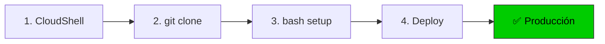

#### 2. CloudShell Setup Phase
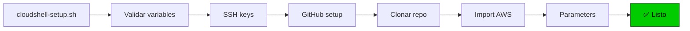

#### 3. CloudFormation Stacks (Paralelo)
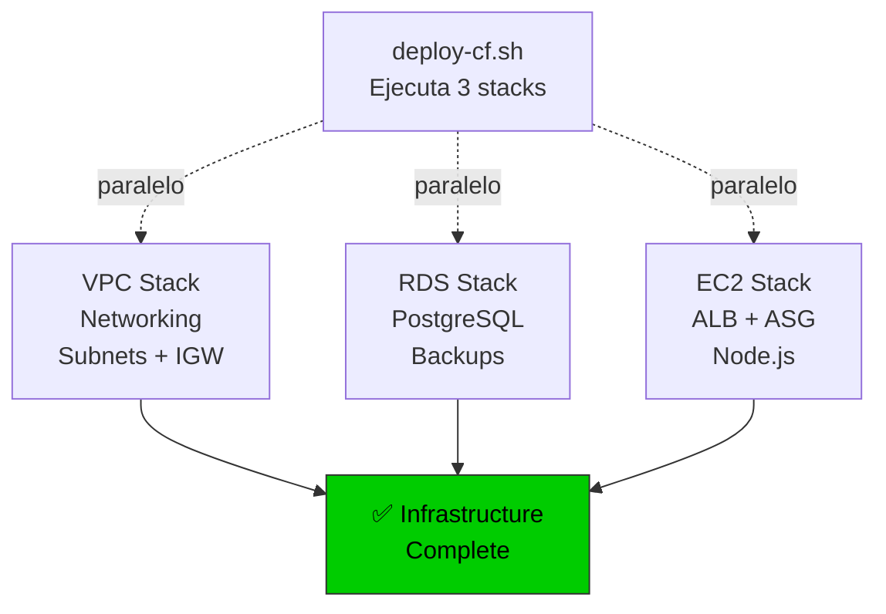

---

### 🏛️ Arquitectura General

#### 4. AWS + Supabase Integration
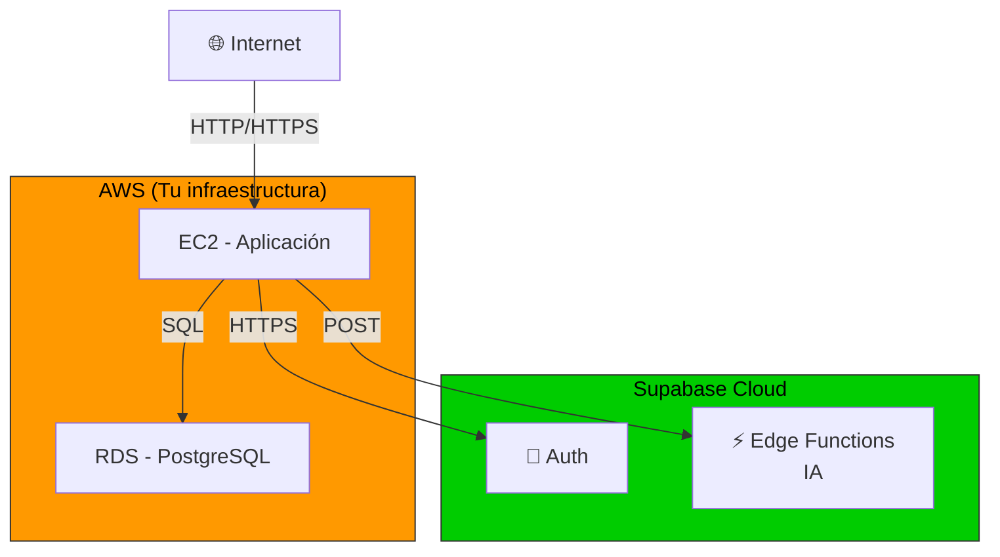

#### 5. CloudFormation Stack Overview
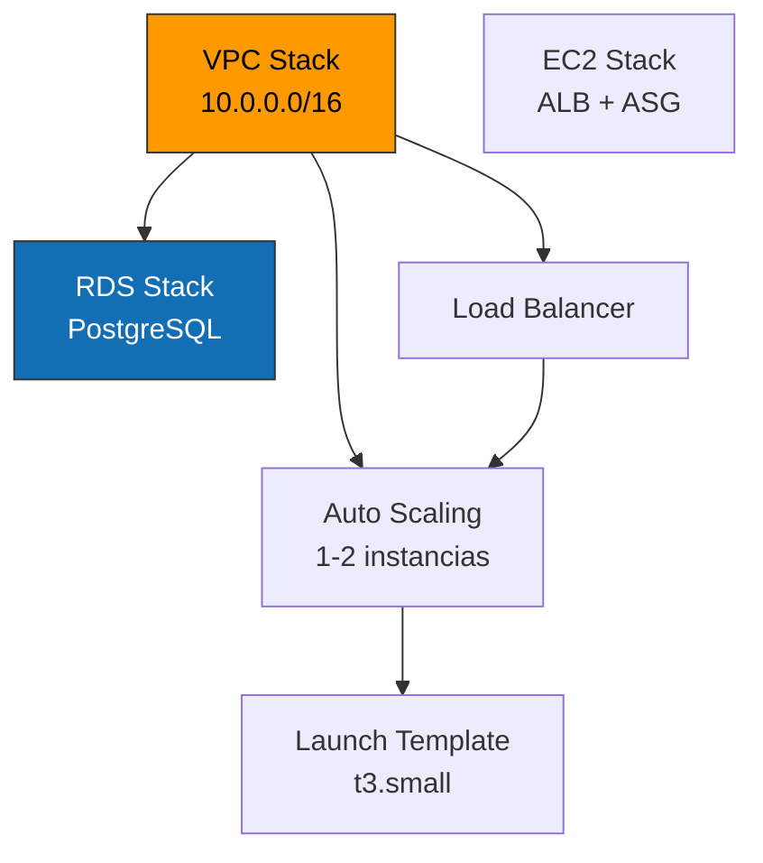

---

### 🌐 Networking

#### 6. VPC Architecture (2 AZ)
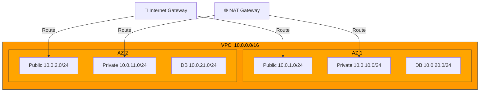

#### 7. Route Tables
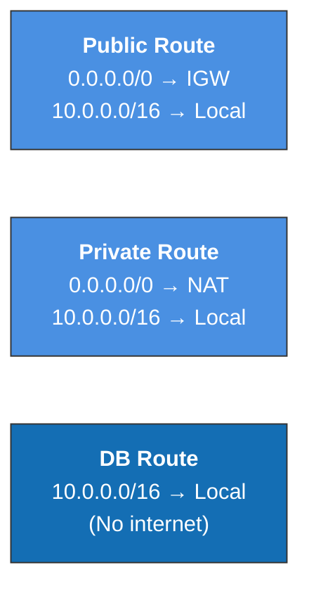

---

### 🔐 Security

#### 8. Security Groups Hierarchy
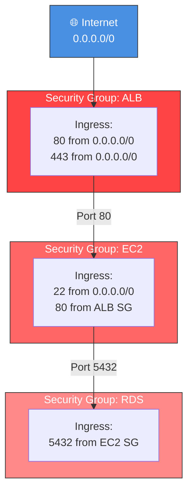

#### 9. Security Layers
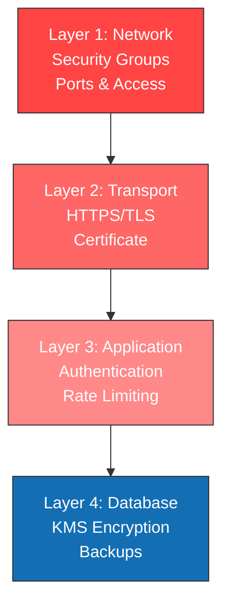

---

### 💾 Database

#### 10. RDS Architecture
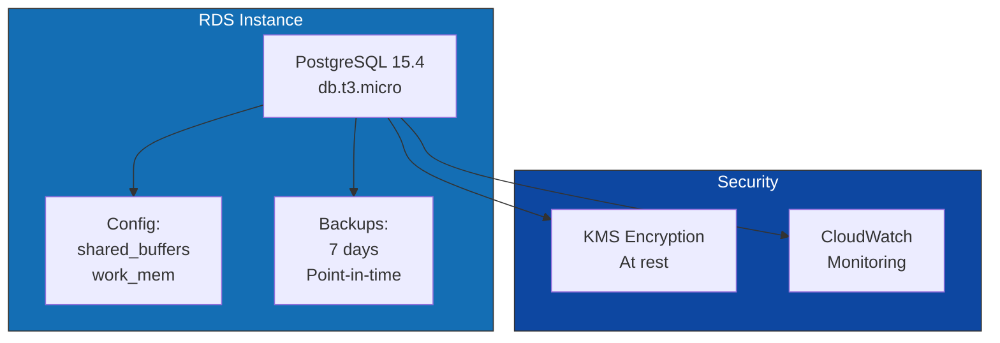

---

### 🖥️ Compute

#### 11. EC2 & Auto Scaling
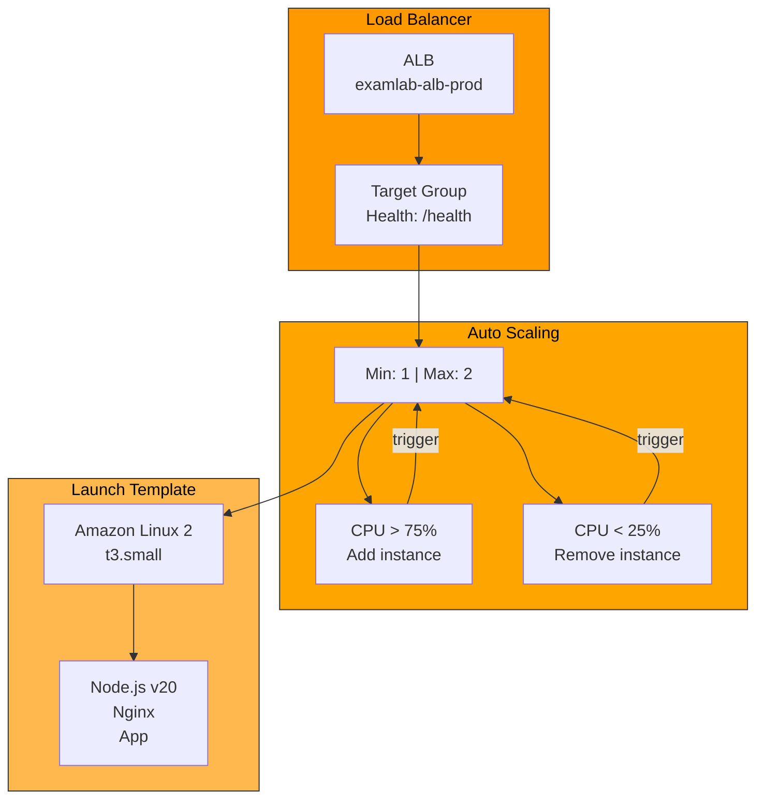

#### 12. EC2 Instance Lifecycle
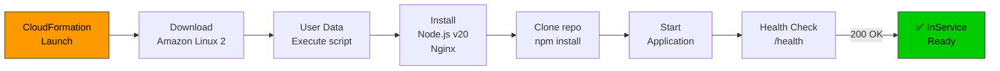

---

### 📊 Application Flow

#### 13. Request Lifecycle
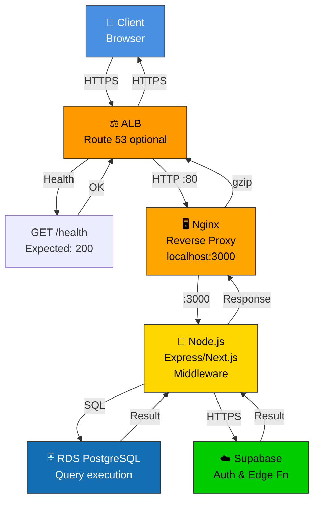

#### 14. Request Data Flow (Sequence)
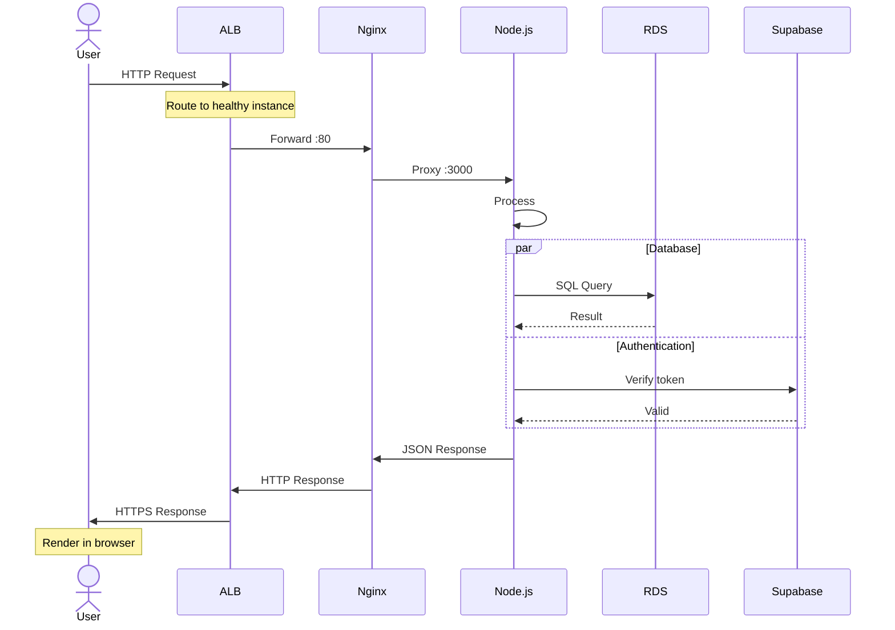

---

### 📈 Scaling

#### 15. Auto Scaling Decision Tree
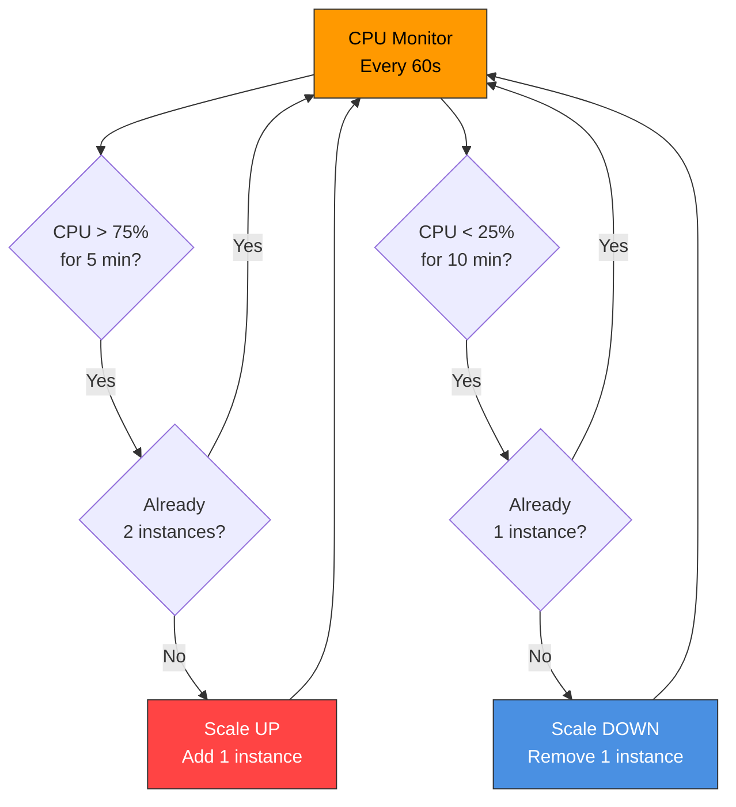

#### 16. CPU Scaling Example Timeline
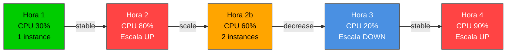

---

### 🔄 Deployment

#### 17. Continuous Deployment Flow
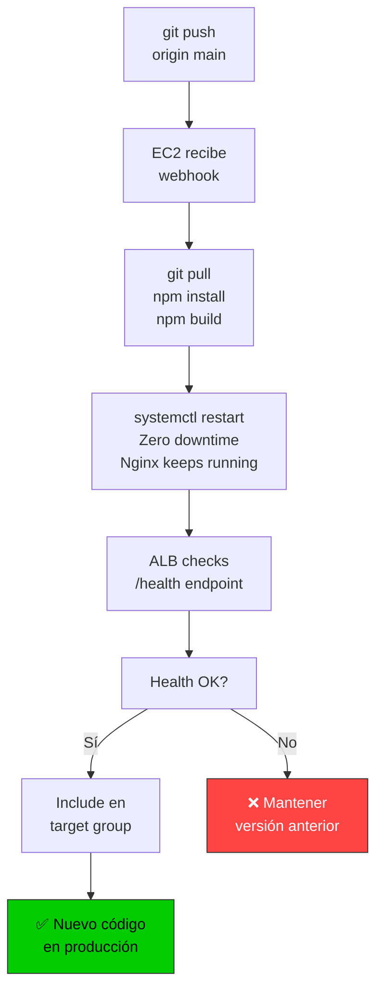

---

### 💰 Costs

#### 18. Cost Breakdown
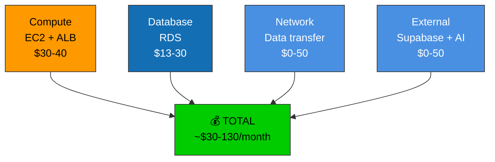

---

## 🎓 Cómo leer estos diagramas

1. **Empieza por arriba/izquierda** - El flujo va en esa dirección
2. **Sigue las flechas** - Indican dependencias y flujo
3. **Busca por color**:
   - 🟠 Orange = AWS
   - 🔵 Blue = Externos
   - 🔷 Dark Blue = Database
   - 🟢 Green = Success
4. **Lee los labels** - Contienen detalles técnicos
5. **Zoom si es necesario** - En navegadores puedes hacer zoom

---

## 📚 Referencias cruzadas

| Diagrama | Ubicación | Propósito |
|----------|-----------|-----------|
| 1. Quick Start | README.md | Visión general |
| 2. Setup Phase | DEPLOYMENT_FLOW.md | Fase 1 |
| 3. CloudFormation | DEPLOYMENT_FLOW.md | Fase 2 |
| 4. AWS+Supabase | docs/AI_SUPABASE_ONLY.md | IA |
| 5. Stack Overview | docs/ARCHITECTURE.md | General |
| 6. VPC | docs/ARCHITECTURE.md | Networking |
| 7. Routes | docs/ARCHITECTURE.md | Networks |
| 8. Security Groups | docs/ARCHITECTURE.md | Security |
| 9. Layers | docs/ARCHITECTURE.md | Seguridad |
| 10. RDS | docs/ARCHITECTURE.md | Database |
| 11. EC2 + ASG | docs/ARCHITECTURE.md | Compute |
| 12. Lifecycle | docs/ARCHITECTURE.md | Setup |
| 13. Requests | docs/ARCHITECTURE.md | App Flow |
| 14. Sequence | docs/ARCHITECTURE.md | Detailed |
| 15. Scaling | DEPLOYMENT_FLOW.md | Auto Scaling |
| 16. Timeline | DEPLOYMENT_FLOW.md | Example |
| 17. Deployment | DEPLOYMENT_FLOW.md | CI/CD |
| 18. Costs | docs/ARCHITECTURE.md | Budget |

---

## 🔄 Flujo recomendado de lectura

**Opción A: DevOps (2 horas)**
1. Diagrama 1 (Quick Start) - 5 min
2. Diagramas 2-3 (Deployment) - 15 min
3. Diagramas 4-5 (Architecture) - 20 min
4. Diagramas 6-9 (Networking & Security) - 30 min
5. Diagramas 10-12 (Compute & Database) - 20 min
6. Diagramas 13-18 (Application & Costs) - 30 min

**Opción B: Developer (1 hora)**
1. Diagrama 1 (Quick Start) - 5 min
2. Diagramas 2-3 (Setup & Deploy) - 15 min
3. Diagrama 5 (Stack Overview) - 10 min
4. Diagrama 13 (Request Flow) - 15 min
5. Diagrama 17 (Deployment) - 10 min
6. Ejecutar: `bash cloudshell-setup.sh` - 5 min

**Opción C: PM/Manager (30 min)**
1. Diagrama 1 (Quick Start) - 5 min
2. Diagrama 5 (Stack Overview) - 5 min
3. Diagrama 18 (Costs) - 10 min
4. Diagramas 15-16 (Scaling) - 10 min

---

## 💡 Pro Tips

1. **Exportar diagramas** - Usa `mmdc` para PNG/SVG/PDF
2. **Integrar en Confluence** - Exporta y carga como imagen
3. **Presentar a stakeholders** - Los diagramas 1, 5, 18 son best
4. **Entrenar nuevos devs** - Sigue la ruta A (DevOps)
5. **Troubleshooting** - Consulta docs/TROUBLESHOOTING.md

---

**Última actualización:** 2026-04-28
**Version:** 2.0 (Diagramas Mermaid)

