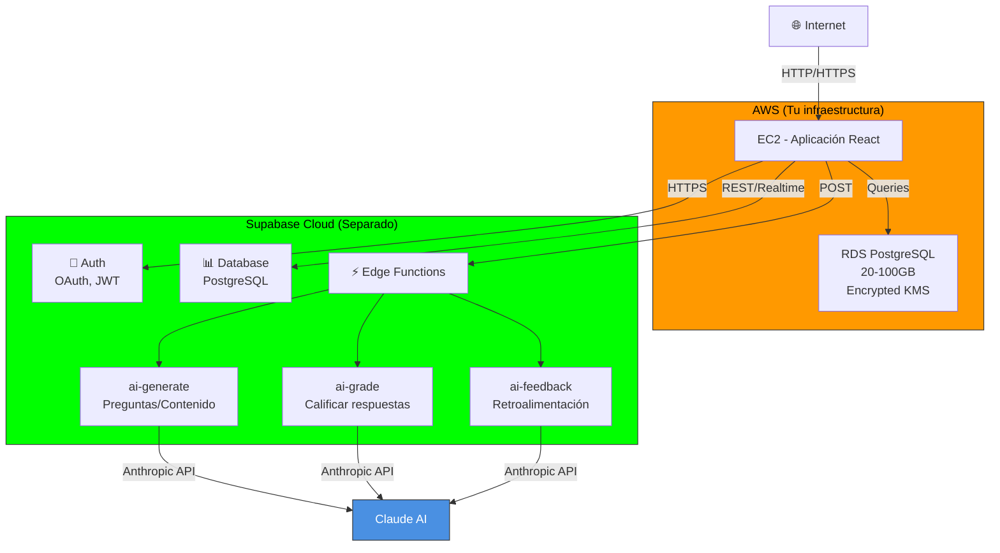

# IA con Supabase Edge Functions - Guía simplificada

**La forma más simple de mantener IA en AWS: usar Supabase que ya tienes.**

## ✅ Por qué Supabase es la mejor opción

```
Lovable → AWS (migraste todo)

Pero NO necesitas cambiar IA:
✓ Supabase está separado de Lovable
✓ Las Edge Functions siguen funcionando
✓ Mismo código IA, sin cambios
✓ Gratis hasta 2M invocaciones/mes
✓ Ya lo tienes configurado
```

---

## 🏗️ Arquitectura



---

## 📋 Setup (15 minutos)

### Paso 1: Obtener credenciales Supabase

```bash
# Ir a: https://app.supabase.com/project/[id]/settings/api

# Copiar:
SUPABASE_URL=https://xxxxx.supabase.co
SUPABASE_ANON_KEY=eyJ...
SUPABASE_SERVICE_ROLE_KEY=eyJ...
```

### Paso 2: Agregar a `cloudshell-vars.env`

```bash
# Editar archivo
nano cloudshell-vars.env

# Cambiar:
SUPABASE_URL="https://xxxxx.supabase.co"
SUPABASE_ANON_KEY="eyJ..."
SUPABASE_SERVICE_ROLE_KEY="eyJ..."

# Edge Functions (nombres de funciones)
SUPABASE_AI_GENERATE_FUNCTION="ai-generate"
SUPABASE_AI_GRADE_FUNCTION="ai-grade"
SUPABASE_AI_FEEDBACK_FUNCTION="ai-feedback"
```

### Paso 3: Verificar Edge Functions en Supabase

```bash
# Ir a: https://app.supabase.com/project/[id]/functions

# Deben estar presentes:
✓ ai-generate     (generar preguntas/contenido)
✓ ai-grade        (calificar respuestas)
✓ ai-feedback     (retroalimentación)
```

**Si no existen**, crear desde Supabase dashboard o:

```bash
# Desde tu proyecto (en local)
supabase functions deploy ai-generate --project-id xxxxx
supabase functions deploy ai-grade --project-id xxxxx
supabase functions deploy ai-feedback --project-id xxxxx
```

### Paso 4: Desplegar infraestructura AWS

```bash
# CloudShell
bash cloudshell-setup.sh
bash scripts/deploy-cf.sh

# Esto SOLO crea VPC, EC2, RDS
# NO toca Supabase (sigue en la nube)
```

---

## 💻 Código en ExamLab

### Archivo: `src/lib/ai.ts` (copiar esto)

```typescript
/**
 * ai.ts - Wrapper para IA con Supabase Edge Functions
 *
 * Llama a funciones serverless en Supabase
 * Sin cambios en lógica, misma API que Lovable
 */

const SUPABASE_URL = process.env.NEXT_PUBLIC_SUPABASE_URL;
const SUPABASE_ANON_KEY = process.env.NEXT_PUBLIC_SUPABASE_ANON_KEY;

if (!SUPABASE_URL || !SUPABASE_ANON_KEY) {
  throw new Error("Missing Supabase credentials");
}

async function callEdgeFunction(
  functionName: string,
  body: Record<string, unknown>
): Promise<unknown> {
  const response = await fetch(
    `${SUPABASE_URL}/functions/v1/${functionName}`,
    {
      method: "POST",
      headers: {
        "Authorization": `Bearer ${SUPABASE_ANON_KEY}`,
        "Content-Type": "application/json",
      },
      body: JSON.stringify(body),
    }
  );

  if (!response.ok) {
    const error = await response.text();
    console.error(`[AI] Error calling ${functionName}:`, error);
    throw new Error(`Function error: ${error}`);
  }

  return response.json();
}

/**
 * GENERAR PREGUNTAS DE EXAMEN
 *
 * ANTES (Lovable):
 * const questions = await lovable.AI.generateQuestions(topic);
 *
 * AHORA (Supabase):
 * const questions = await AI.generateExamQuestions(topic, 'medium', 5);
 */
export async function generateExamQuestions(
  topic: string,
  difficulty: "easy" | "medium" | "hard",
  count: number = 5
) {
  return callEdgeFunction("ai-generate", {
    type: "exam_questions",
    topic,
    difficulty,
    count,
  });
}

/**
 * GENERAR ARCHIVOS DE PROYECTO
 *
 * ANTES (Lovable):
 * const files = await lovable.AI.generateProjectFiles(description, count);
 *
 * AHORA (Supabase):
 * const files = await AI.generateProjectFiles(description, 3);
 */
export async function generateProjectFiles(
  projectDescription: string,
  fileCount: number
) {
  return callEdgeFunction("ai-generate", {
    type: "project_files",
    description: projectDescription,
    fileCount,
  });
}

/**
 * CALIFICAR RESPUESTA DE EXAMEN
 *
 * ANTES (Lovable):
 * const grade = await lovable.AI.grade(answer, rubric);
 *
 * AHORA (Supabase):
 * const grade = await AI.gradeExamAnswer(question, answer, correct, rubric);
 */
export async function gradeExamAnswer(
  question: string,
  studentAnswer: string,
  correctAnswer: string,
  rubric: string
) {
  return callEdgeFunction("ai-grade", {
    type: "exam_answer",
    question,
    studentAnswer,
    correctAnswer,
    rubric,
  });
}

/**
 * CALIFICAR ARCHIVO DE PROYECTO
 *
 * ANTES (Lovable):
 * const grade = await lovable.AI.gradeFile(content, rubric);
 *
 * AHORA (Supabase):
 * const grade = await AI.gradeProjectFile(name, content, expected, rubric);
 */
export async function gradeProjectFile(
  fileName: string,
  fileContent: string,
  expectedStructure: string,
  rubric: string
) {
  return callEdgeFunction("ai-grade", {
    type: "project_file",
    fileName,
    fileContent,
    expectedStructure,
    rubric,
  });
}

/**
 * GENERAR RETROALIMENTACIÓN PERSONALIZADA
 *
 * ANTES (Lovable):
 * const feedback = await lovable.AI.feedback(grades);
 *
 * AHORA (Supabase):
 * const feedback = await AI.generatePersonalizedFeedback(name, grades, course);
 */
export interface StudentPerformance {
  examsGrade: number;
  workshopsGrade: number;
  projectsGrade: number;
  attendance: number;
}

export async function generatePersonalizedFeedback(
  studentName: string,
  performance: StudentPerformance,
  courseName: string
) {
  return callEdgeFunction("ai-feedback", {
    type: "personalized",
    studentName,
    performance,
    courseName,
  });
}

/**
 * GENERAR RESUMEN DE LECCIÓN
 */
export async function generateLessonSummary(
  lessonTitle: string,
  lessonContent: string,
  keyPoints: string[]
) {
  return callEdgeFunction("ai-generate", {
    type: "lesson_summary",
    title: lessonTitle,
    content: lessonContent,
    keyPoints,
  });
}

/**
 * Export principal
 */
export const AI = {
  generateExamQuestions,
  generateProjectFiles,
  gradeExamAnswer,
  gradeProjectFile,
  generatePersonalizedFeedback,
  generateLessonSummary,
};
```

---

## 🔄 Cambios en tu código ExamLab

### Antes (Lovable)
```typescript
import { lovableAI } from '@lovable/ai';

// En componentes o API routes
const questions = await lovableAI.generateQuestions(topic);
const grade = await lovableAI.grade(answer, rubric);
const feedback = await lovableAI.feedback(studentGrades);
```

### Después (AWS + Supabase)
```typescript
import { AI } from '@/lib/ai';

// En componentes o API routes (cambios mínimos)
const questions = await AI.generateExamQuestions(topic, 'medium', 5);
const grade = await AI.gradeExamAnswer(question, answer, correct, rubric);
const feedback = await AI.generatePersonalizedFeedback(name, grades, course);
```

**Solo cambias:** el nombre de las funciones y parámetros. La lógica es la misma.

---

## 🔐 Configuración segura

### En `.env.local` (local development)
```bash
NEXT_PUBLIC_SUPABASE_URL=https://xxxxx.supabase.co
NEXT_PUBLIC_SUPABASE_ANON_KEY=eyJ...
```

### En EC2 (producción en AWS)
```bash
# Guardar en Secrets Manager
aws secretsmanager create-secret \
  --name examlab/supabase-keys \
  --secret-string '{
    "url": "https://xxxxx.supabase.co",
    "anon_key": "eyJ...",
    "service_role_key": "eyJ..."
  }' \
  --region us-east-1

# En user_data.sh de EC2:
export NEXT_PUBLIC_SUPABASE_URL=$(aws secretsmanager get-secret-value \
  --secret-id examlab/supabase-keys \
  --query SecretString --output text | jq -r '.url')

export NEXT_PUBLIC_SUPABASE_ANON_KEY=$(aws secretsmanager get-secret-value \
  --secret-id examlab/supabase-keys \
  --query SecretString --output text | jq -r '.anon_key')
```

### En `.gitignore`
```bash
# No commitear credenciales
.env.local
.env.*.local
cloudshell-vars.env
```

---

## 📊 Costos

```
Supabase Edge Functions:
├─ 2M invocaciones/mes  → Gratis
├─ Sobre 2M            → $0.000015 por invocación
├─ IA (Anthropic)      → Tu contrato con Anthropic
└─ TOTAL               → $0-60/mes (depende volumen IA)

En Lovable ya estabas pagando esto.
En AWS, solo pagas lo mismo.
```

---

## ✅ Checklist

- [ ] Obtuve credenciales Supabase (URL + keys)
- [ ] Agregué a `cloudshell-vars.env`
- [ ] Verifiqué Edge Functions existen en Supabase
- [ ] Copié `ai.ts` a `src/lib/ai.ts`
- [ ] Reemplacé imports en mi código
- [ ] Cambié funciones (ejemplo: lovableAI → AI)
- [ ] Probé localmente con `npm run dev`
- [ ] Desplegué AWS con `bash scripts/deploy-cf.sh`
- [ ] Probé en EC2 que IA funciona
- [ ] Monitoreo de costos habilitado

---

## 🧪 Testing

### Local (desarrollo)
```bash
# En tu proyecto ExamLab
npm run dev

# Probar en navegador
http://localhost:3000

# Probar IA
const result = await AI.generateExamQuestions('Python', 'medium', 3);
console.log(result);
```

### En EC2 (producción)
```bash
# SSH a EC2
ssh -i ~/.ssh/examlab-production.pem ec2-user@<alb-dns>

# Verificar variables
echo $NEXT_PUBLIC_SUPABASE_URL

# Ver logs
sudo tail -f /var/log/examlab/app.log

# Si hay error, revisar:
# 1. ¿Está EC2 en la misma VPC que... (no importa, es HTTPS)
# 2. ¿Credenciales Supabase correctas?
# 3. ¿Edge Functions existen en Supabase?
```

---

## 🆘 Troubleshooting

### "Cannot reach Supabase"

```bash
# Verificar credenciales
echo $NEXT_PUBLIC_SUPABASE_URL
# Debe ser: https://xxxxx.supabase.co (sin trailing slash)

# Probar curl
curl https://xxxxx.supabase.co/rest/v1/
# Debe responder 401 Unauthorized (normal)
```

### "Edge Function not found"

```bash
# Verificar en dashboard
https://app.supabase.com/project/[id]/functions

# Si falta, deployar:
supabase functions deploy ai-generate --project-id xxxxx

# O desde dashboard: Functions → Create → ai-generate
```

### "Invalid API key"

```bash
# Verificar que usas anon_key, no service_role_key
echo $NEXT_PUBLIC_SUPABASE_ANON_KEY
# Debe empezar con: eyJ... (no es service_role)

# Si está mal, actualizar en Secrets Manager
aws secretsmanager update-secret \
  --secret-id examlab/supabase-keys \
  --secret-string '{"url":"...","anon_key":"..."}'
```

### "IA response es vacía"

```typescript
// Comprobar que Edge Function retorna JSON
// En Supabase, Edge Function debe:

return new Response(
  JSON.stringify({ /* resultado */ }),
  { headers: { "Content-Type": "application/json" } }
);

// NO:
return /* string o data sin JSON.stringify */
```

---

## 📚 Documentación Supabase

- Edge Functions: https://supabase.com/docs/guides/functions
- Client library: https://supabase.com/docs/reference/javascript/introduction
- Credentials: https://supabase.com/docs/guides/api/keys-and-tokens

---

## 🎯 Resumen

| Aspecto | Lovable | AWS + Supabase |
|--------|---------|----------------|
| IA | Integrada | Supabase Edge Fn |
| Datos | Supabase | RDS + Supabase |
| Cambio código | 0% | ~5% (nombres funciones) |
| Costo IA | Incluido | Mismo que Lovable |
| Sencillez | Alto | Alto (nada cambia) |

**La magia: Supabase está en la nube, completamente separado de AWS. Sigue funcionando igual que en Lovable.** ✅

