# Arquitectura CloudFormation - Diagramas detallados

Visión completa de la arquitectura desplegada en AWS.

## 🏛️ Stack Overview

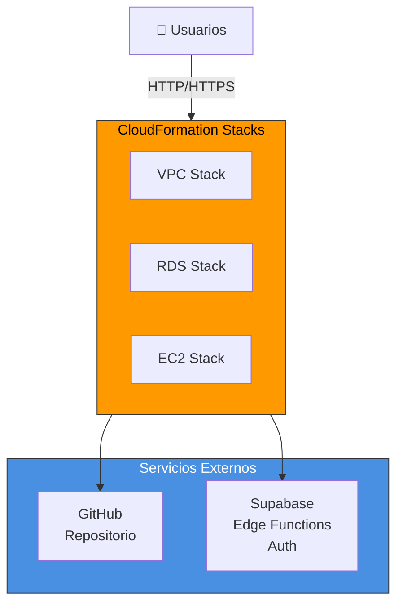

---

## 🌐 VPC Architecture

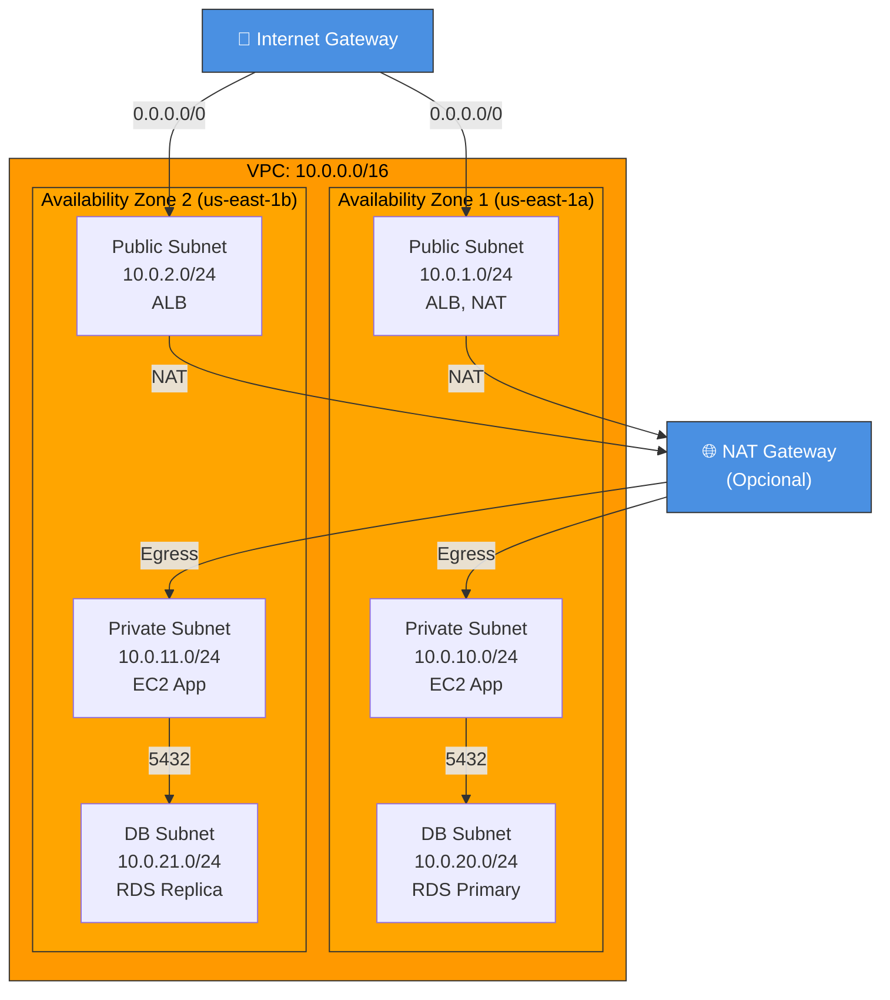

### Route Tables

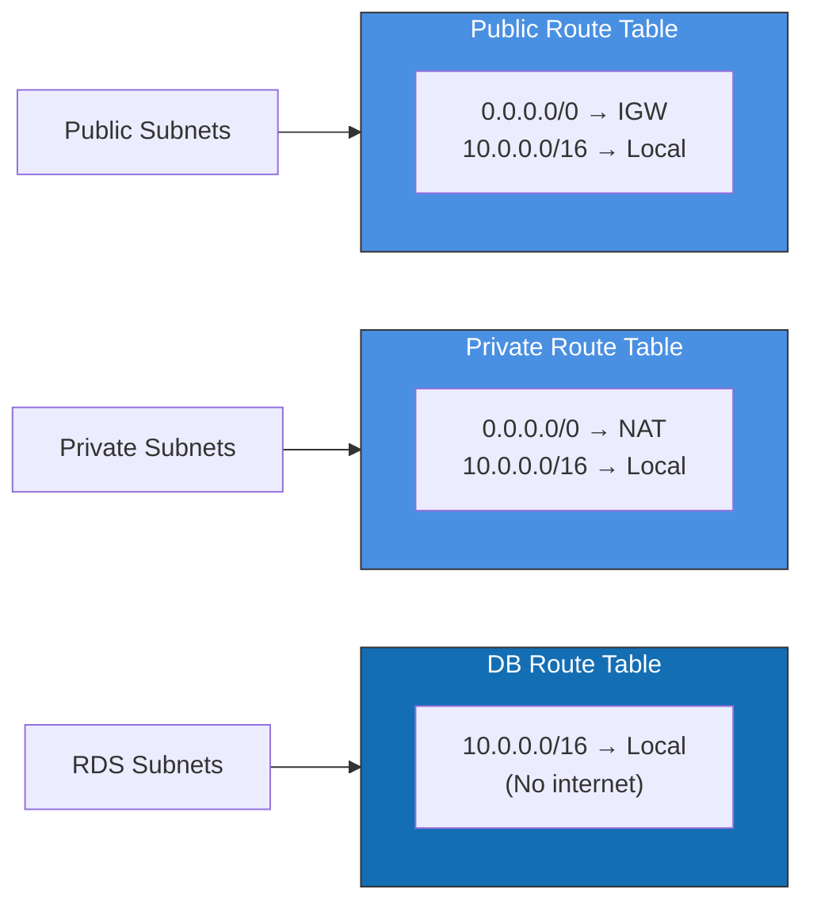

---

## 🔐 Security Architecture

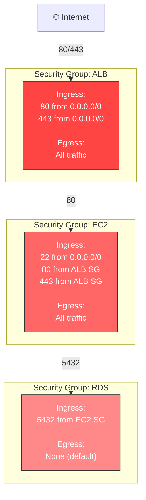

---

## 💾 RDS Architecture

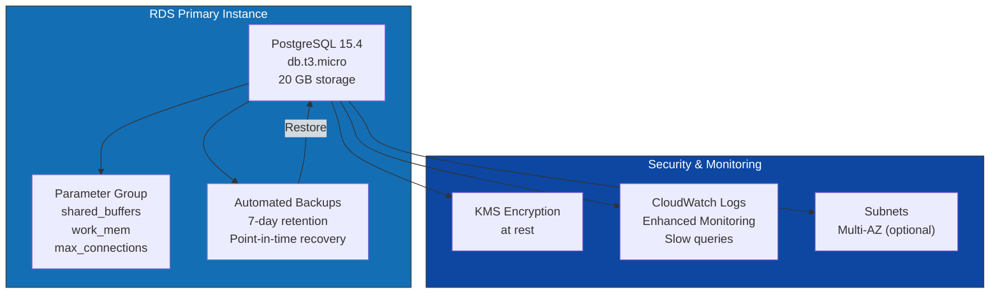

---

## 🖥️ EC2 & Scaling Architecture

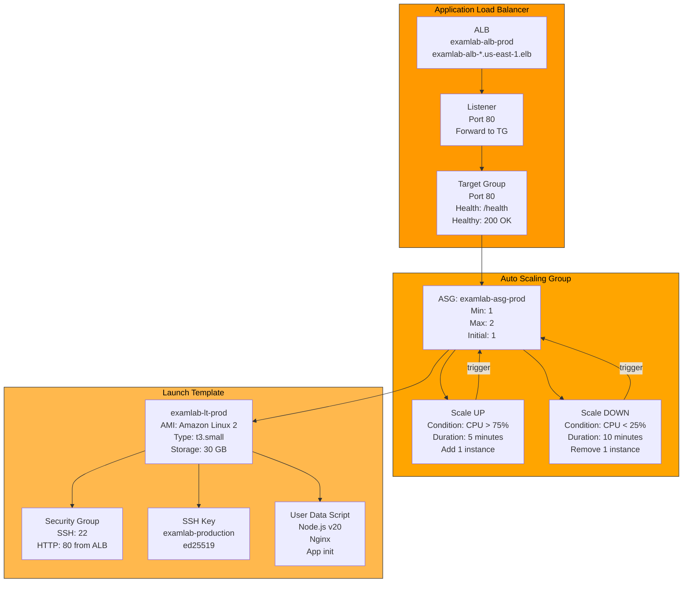

### Instance Lifecycle

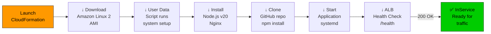

---

## 📊 Application Flow Architecture

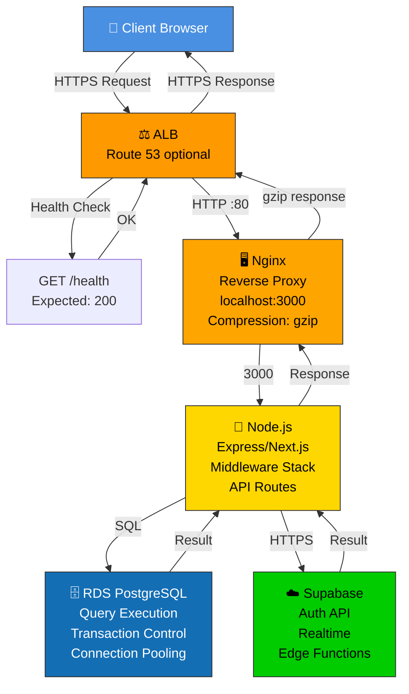

---

## 🔄 Data Flow: User Request

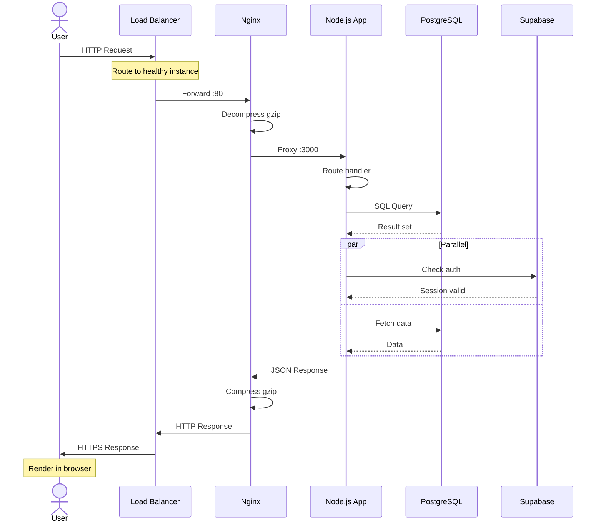

---

## 🔐 Security Layers

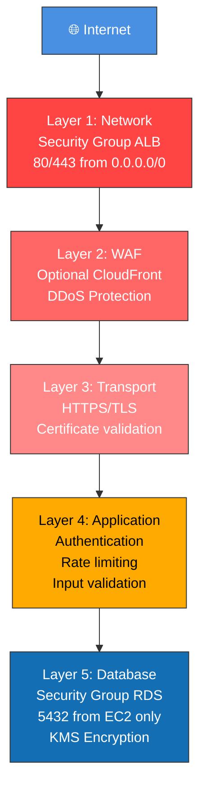

---

## 📈 Performance Architecture

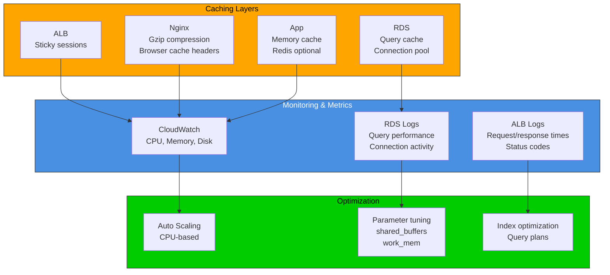

---

## 🔄 Deployment Architecture

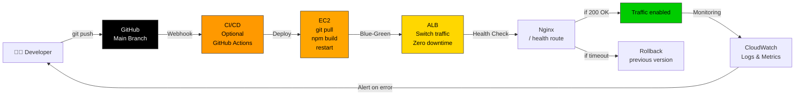

---

## 💰 Cost Structure

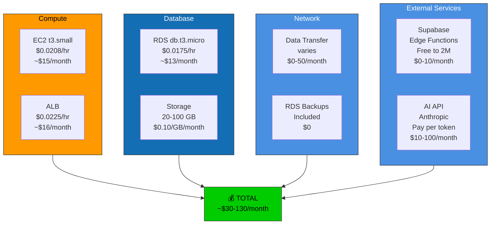

