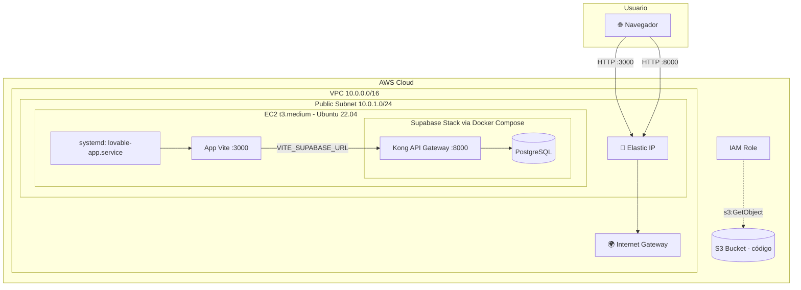
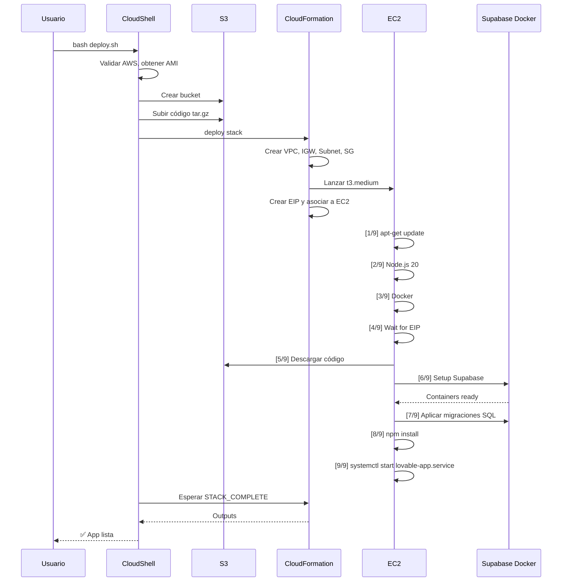

# 🏗️ Arquitectura del despliegue AWS

Detalle técnico de cómo está construido el despliegue de proyectos Lovable en AWS.

---

## 🌐 Vista general



---

## 🧱 Componentes principales

### 1. CloudFormation Stack único

Archivo: [`cloudformation/all-in-one-stack.yaml`](../cloudformation/all-in-one-stack.yaml)

Un solo template crea todos los recursos. Lo elegimos sobre múltiples stacks porque:
- Más simple de razonar y debuggear
- No hay outputs/imports cross-stack
- `delete-stack` borra todo de una vez
- Suficiente para prototipos/demos

### 2. Networking

| Recurso | Detalle |
|---------|---------|
| VPC | `10.0.0.0/16` con DNS habilitado |
| Subnet | `10.0.1.0/24` pública, una AZ |
| Internet Gateway | Conectado al VPC |
| Route Table | Default route → IGW |
| Security Group | Ingress 80, 443, 3000, 8000 desde `0.0.0.0/0` |

### 3. EC2 + Elastic IP

| Atributo | Valor | Por qué |
|----------|-------|---------|
| Instance type | `t3.medium` | Supabase consume ~3 GB; t3.small (2 GB) no alcanza |
| AMI | Ubuntu 22.04 LTS dynamic | Resolver el AMI ID dinámicamente evita errores por región |
| Volumen | 30 GB gp3 | 8 GB default no alcanza para Docker images de Supabase + node_modules |
| Elastic IP | Asociada con `DependsOn: AttachGateway` | IP fija; el user-data espera por ella antes de configurar URLs |

### 4. IAM Role

El rol IAM de la EC2 tiene:
- `CloudWatchAgentServerPolicy` (managed) — para enviar logs y métricas
- `AmazonSSMManagedInstanceCore` (managed) — habilita Session Manager
- Inline `S3CodeAccess` — `s3:GetObject` y `s3:ListBucket` solo del bucket de deploy
- Inline `CloudWatchLogs` — para crear log streams y enviar eventos

> **No hay credenciales AWS estáticas** dentro de la EC2: usa el rol IAM. AWS CLI lo detecta automáticamente.

### 5. S3 Bucket

`<projectname>-deploy-<account-id>-<region>`

- Creado por `deploy.sh` antes del CloudFormation
- Contiene `lovable-app-code-<timestamp>.tar.gz` (código de la app, ~2-5 MB)
- La EC2 lo descarga durante `[5/9]` del user-data
- **No se elimina automáticamente** al borrar el stack

### 6. Supabase self-hosted

El user-data clona [supabase/supabase](https://github.com/supabase/supabase) shallow y usa `docker/docker-compose.yml` oficial. Levanta:

| Servicio | Puerto | Función |
|----------|--------|---------|
| `kong` | 8000 (público) | API gateway |
| `auth` (GoTrue) | interno | Autenticación |
| `rest` (PostgREST) | interno | Auto-API REST sobre PostgreSQL |
| `realtime` | interno | Subscripciones tiempo real |
| `storage` | interno | Almacenamiento de archivos |
| `studio` | 8000/`/` (público vía Kong) | UI de admin |
| `meta` | interno | Metadata de DB |
| `db` (PostgreSQL) | 5432 (interno) | Base de datos |

Todo se controla desde `/opt/supabase` con `docker compose`.

### 7. Generación de claves JWT

El user-data genera dinámicamente:
- `JWT_SECRET` — 32 bytes random hex (`openssl rand -hex 32`)
- `ANON_KEY` — JWT firmado con `role: anon`, válido 10 años
- `SERVICE_ROLE_KEY` — JWT firmado con `role: service_role`, válido 10 años

La firma se hace con un script Node.js inline (HMAC-SHA256). Esto evita depender de `jq`, `python-jwt` o herramientas externas.

### 8. Aplicación de migraciones

Las migraciones SQL en `supabase/migrations/` del repo se aplican una a una:

```bash
docker exec -i supabase-db psql -U postgres -d postgres < migration.sql
```

Si una migración falla, el script continúa con un warning (no rompe el deploy completo).

### 9. Servicio systemd

```ini
[Unit]
Description=$APP_NAME Vite Dev Server
After=network.target docker.service

[Service]
Type=simple
User=ubuntu
WorkingDirectory=/opt/lovable-app
EnvironmentFile=/opt/lovable-app/.env
ExecStart=/usr/bin/npm run dev -- --host 0.0.0.0 --port 3000
Restart=always
RestartSec=10
StandardOutput=append:/var/log/lovable-app.log
StandardError=append:/var/log/lovable-app.log

[Install]
WantedBy=multi-user.target
```

- `EnvironmentFile=/opt/lovable-app/.env` carga `VITE_SUPABASE_URL`, `VITE_SUPABASE_PUBLISHABLE_KEY`, etc.
- `--host 0.0.0.0` para que Vite escuche en todas las interfaces
- `--port 3000` porque el security group permite ese puerto
- `Restart=always` reinicia el servicio si crashea

---

## 🔄 Secuencia de despliegue



---

## 🔐 Modelo de seguridad

### Buenas prácticas implementadas

- ✅ Sin credenciales AWS estáticas en la EC2 (rol IAM)
- ✅ Sin credenciales GitHub en la EC2 (descarga desde S3 propio)
- ✅ JWT secret aleatorio generado por instancia (no compartido)
- ✅ Session Manager habilitado (no requiere SSH key)
- ✅ Credenciales en `/root/lovable-app-credentials.txt` modo 600

### Limitaciones conocidas

- ❌ Ingress `0.0.0.0/0` en puertos 3000 y 8000 — restringir por CIDR para producción
- ❌ Sin HTTPS (puerto 80/443 abiertos pero sin certificado configurado)
- ❌ Anon key con 10 años de validez — rotarla periódicamente en producción
- ❌ Supabase Studio expuesto al mundo (protegido solo por basic auth)

---

## 📊 Decisiones de diseño

### ¿Por qué EC2 + Docker en lugar de RDS + Lambda/ECS?

| Opción | Pros | Contras |
|--------|------|---------|
| **EC2 + Docker** ✅ | Simple, todo en una caja, fácil de debuggear | Sin alta disponibilidad, escala vertical |
| RDS + Lambda | Escalable | Configuración compleja, vendor lock-in |
| ECS Fargate + RDS | Buen balance | Más caro, requiere más recursos AWS |
| EKS + RDS | Producción-ready | Mucho overhead para un prototipo |

Para demos / prototipos, EC2 + Docker es la opción más pragmática.

### ¿Por qué descargar el código desde S3 en vez de `git clone`?

- El repo puede ser privado → la EC2 no tiene credenciales de GitHub
- Descargar de S3 usa el rol IAM (sin secretos)
- Permite empaquetar código local con cambios sin necesidad de pushear a GitHub primero

### ¿Por qué Supabase self-hosted en vez de Supabase Cloud?

- Todo dentro de la cuenta AWS (sin dependencia externa)
- Las migraciones se aplican localmente sin necesidad de proyecto en Supabase Cloud
- Costo predecible

Para producción real, considera Supabase Cloud (managed) — más barato y mantenido.

---

## 📁 Archivos clave del despliegue

| Archivo | Propósito |
|---------|-----------|
| [`deploy.sh`](../deploy.sh) | Orquestador en CloudShell |
| [`cloudformation/all-in-one-stack.yaml`](../cloudformation/all-in-one-stack.yaml) | Recursos AWS + user-data |
| [`scripts/create-github-iam-user.sh`](../scripts/create-github-iam-user.sh) | IAM user para CI/CD |

---

## 📚 Referencias

- [Supabase Docker Self-hosting](https://supabase.com/docs/guides/self-hosting/docker)
- [AWS CloudFormation User Data](https://docs.aws.amazon.com/AWSCloudFormation/latest/UserGuide/aws-properties-ec2-instance.html#cfn-ec2-instance-userdata)
- [AWS Systems Manager Session Manager](https://docs.aws.amazon.com/systems-manager/latest/userguide/session-manager.html)
