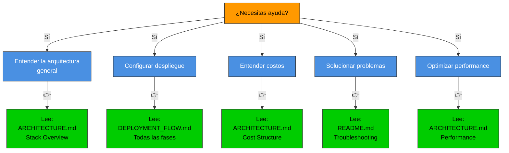
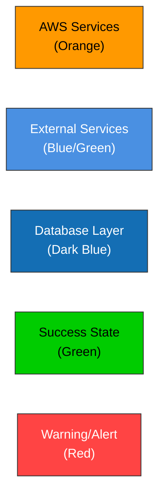

# Diagramas Mermaid - Referencia Visual Completa

Colección de diagramas interactivos para entender la arquitectura y flujo de despliegue.

## 📚 Índice de Diagramas

### 1. Arquitectura General
- [AI_SUPABASE_ONLY.md](AI_SUPABASE_ONLY.md#-arquitectura) - Integración de IA con Supabase
- [ARCHITECTURE.md](ARCHITECTURE.md#-stack-overview) - Stack Overview completo
- [README.md](../README.md#-cloudformation-stacks) - CloudFormation Stacks

### 2. Despliegue Paso a Paso
- [DEPLOYMENT_FLOW.md](../DEPLOYMENT_FLOW.md#-fase-1-cloudshell-setup-5-minutos) - Fase 1: CloudShell Setup
- [DEPLOYMENT_FLOW.md](../DEPLOYMENT_FLOW.md#-fase-2-cloudformation-stacks-7-minutos) - Fase 2: CloudFormation
- [DEPLOYMENT_FLOW.md](../DEPLOYMENT_FLOW.md#-fase-3-inicialización-de-ec2-3-minutos) - Fase 3: EC2 Init
- [DEPLOYMENT_FLOW.md](../DEPLOYMENT_FLOW.md#-fase-4-health-checks-1-minuto) - Fase 4: Health Checks
- [DEPLOYMENT_FLOW.md](../DEPLOYMENT_FLOW.md#-fase-5-backup-en-cualquier-momento) - Fase 5: Backup

### 3. Arquitectura Detallada
- [ARCHITECTURE.md](ARCHITECTURE.md#-vpc-architecture) - VPC Architecture
- [ARCHITECTURE.md](ARCHITECTURE.md#-security-architecture) - Security Groups
- [ARCHITECTURE.md](ARCHITECTURE.md#-rds-architecture) - RDS Configuration
- [ARCHITECTURE.md](ARCHITECTURE.md#️-ec2--scaling-architecture) - EC2 & Auto Scaling
- [ARCHITECTURE.md](ARCHITECTURE.md#-application-flow-architecture) - Application Flow
- [ARCHITECTURE.md](ARCHITECTURE.md#-data-flow-user-request) - Data Flow (Sequence)

### 4. Operación y Monitoreo
- [DEPLOYMENT_FLOW.md](../DEPLOYMENT_FLOW.md#️-escalamiento-automático) - Auto Scaling
- [DEPLOYMENT_FLOW.md](../DEPLOYMENT_FLOW.md#-ciclo-de-vida-de-un-request) - Request Lifecycle
- [DEPLOYMENT_FLOW.md](../DEPLOYMENT_FLOW.md#-flujo-de-actualización-continuous-deployment) - Deployment Flow
- [ARCHITECTURE.md](ARCHITECTURE.md#-security-layers) - Security Layers
- [ARCHITECTURE.md](ARCHITECTURE.md#-performance-architecture) - Performance & Caching

### 5. Costos y Escalabilidad
- [ARCHITECTURE.md](ARCHITECTURE.md#-cost-structure) - Cost Breakdown
- [DEPLOYMENT_FLOW.md](../DEPLOYMENT_FLOW.md#-costos-durante-despliegue) - Cost Table

---

## 🎯 Cómo usar estos diagramas

### En GitHub/Markdown
Los diagramas están incrustados directamente en los archivos `.md` usando bloques ` ```mermaid ` `.

Verás los diagramas renderizados cuando:
- Visualices los archivos en GitHub
- Abras los archivos con VS Code con extensión Mermaid
- Exportes a HTML con un procesador Markdown que soporte Mermaid

### En tu proyecto local
Para ver los diagramas localmente:

```bash
# Opción 1: VS Code con extensión
code . 
# Instala: "Markdown Preview Mermaid Support"

# Opción 2: Preview en navegador
# VS Code → Right-click .md → "Open Preview to the Side"

# Opción 3: Exportar a HTML
npx @mermaid-js/mermaid-cli -i DEPLOYMENT_FLOW.md -o flow.html
```

### Integrar en tu documentación
```markdown
# Tu sección

Para ver la arquitectura, consulta: [Diagramas Mermaid](docs/DIAGRAMS.md)

```mermaid
[copiar diagrama aquí]
```
```

---

## 📊 Diagrama de Decisión: ¿Qué leer?



---

## 🔗 Referencias cruzadas

### Por componente

#### 🌐 Internet & Load Balancing
- [ALB Overview](DEPLOYMENT_FLOW.md#-fase-2-cloudformation-stacks-7-minutos)
- [ALB Configuration](ARCHITECTURE.md#️-ec2--scaling-architecture)
- [Request Flow](ARCHITECTURE.md#-application-flow-architecture)

#### 🖥️ Compute (EC2)
- [EC2 Launch](ARCHITECTURE.md#instance-lifecycle)
- [Auto Scaling](DEPLOYMENT_FLOW.md#️-escalamiento-automático)
- [User Data Script](DEPLOYMENT_FLOW.md#-fase-3-inicialización-de-ec2-3-minutos)

#### 🗄️ Database (RDS)
- [RDS Setup](ARCHITECTURE.md#-rds-architecture)
- [Security Groups](ARCHITECTURE.md#-security-architecture)
- [Backup Strategy](DEPLOYMENT_FLOW.md#-fase-5-backup-en-cualquier-momento)

#### 🔐 Security
- [Security Layers](ARCHITECTURE.md#-security-layers)
- [Network Security](ARCHITECTURE.md#-security-architecture)
- [Encryption](ARCHITECTURE.md#-rds-architecture)

#### ☁️ Supabase Integration
- [Supabase Architecture](AI_SUPABASE_ONLY.md#-arquitectura)
- [Auth Flow](ARCHITECTURE.md#-application-flow-architecture)
- [Edge Functions](AI_SUPABASE_ONLY.md)

---

## 📈 Complejidad de los diagramas

| Diagrama | Complejidad | Propósito |
|----------|-------------|----------|
| Stack Overview | ⭐ Baja | Visión general |
| VPC Architecture | ⭐⭐ Media | Networking |
| Security Architecture | ⭐⭐ Media | Security Groups |
| RDS Architecture | ⭐⭐ Media | Database |
| EC2 & Scaling | ⭐⭐⭐ Alta | Compute complexity |
| Application Flow | ⭐⭐⭐ Alta | Request path |
| Data Flow Sequence | ⭐⭐⭐ Alta | Detailed interactions |
| Deployment Phases | ⭐⭐⭐ Alta | Sequential steps |

---

## 🎨 Leyenda de colores



**Colores usados:**
- 🟠 **Orange (#FF9900)** - Servicios AWS (EC2, ALB, etc)
- 🔵 **Blue (#4A90E2)** - Servicios externos (Supabase, GitHub, Internet)
- 🔷 **Dark Blue (#146EB4)** - Database (RDS, PostgreSQL)
- 🟢 **Green (#00CC00)** - Success / Healthy state
- 🔴 **Red (#FF4444)** - Errors / Security threats

---

## 💡 Consejos para leer diagramas Mermaid

1. **Empieza arriba/izquierda** - El flujo generalmente va de arriba a abajo o izquierda a derecha
2. **Sigue las flechas** - Indica dependencias y flujo de datos
3. **Agrupa por color** - Componentes del mismo color suelen estar relacionados
4. **Lee labels en recuadros** - Contienen detalles técnicos importantes
5. **Zoom en GitHub** - Algunos navegadores permiten hacer zoom en diagramas SVG

---

## 🔄 Actualización de diagramas

Si necesitas actualizar un diagrama:

1. Encuentra el bloque ` ```mermaid ` en el archivo `.md`
2. Edita la sintaxis Mermaid
3. La mayoría de cambios se visualizarán al guardar
4. Usa https://mermaid.live para vista previa rápida

**Sintaxis Mermaid:**
- [Documentación oficial](https://mermaid.js.org)
- [Editor online](https://mermaid.live)
- [Ejemplos](https://mermaid.js.org/syntax/graph.html)

---

## 📱 Exportar diagramas

Para incluir diagramas en presentaciones o reportes:

```bash
# Usar CLI de Mermaid
npm install -g @mermaid-js/mermaid-cli

# Exportar a PNG
mmdc -i DEPLOYMENT_FLOW.md -o deployment-flow.png

# Exportar a SVG
mmdc -i DEPLOYMENT_FLOW.md -o deployment-flow.svg -e svg

# Exportar a PDF
mmdc -i ARCHITECTURE.md -o architecture.pdf
```

---

## 🎓 Aprender de estos diagramas

### Para DevOps/SRE
Estudia en este orden:
1. Stack Overview
2. VPC Architecture
3. EC2 & Scaling
4. Security Layers
5. Deployment Phases

### Para Developers
Estudia en este orden:
1. Application Flow
2. Data Flow Sequence
3. Deployment Flow
4. Auto Scaling

### Para Security
Estudia en este orden:
1. Security Architecture
2. Security Layers
3. VPC Architecture
4. RDS Architecture

### Para Management/PM
Estudia en este orden:
1. Stack Overview
2. Cost Structure
3. Deployment Phases
4. Performance Architecture

---

## ❓ Preguntas comunes

**P: ¿Por qué usar Mermaid en lugar de visio/lucidchart?**
R: Los diagramas están en el mismo repo, versionados con git, y se actualizan automáticamente en GitHub.

**P: ¿Puedo exportar estos diagramas?**
R: Sí, usa `@mermaid-js/mermaid-cli` para exportar a PNG/SVG/PDF.

**P: ¿Cómo integro estos en Confluence/Notion?**
R: Exporta a PNG/SVG y carga la imagen, o usa plugins de Mermaid si el servicio lo soporta.

**P: ¿Estos diagramas son precisos?**
R: Son precisos al momento de escribir (2026-04-28). Actualiza si cambias la arquitectura.

