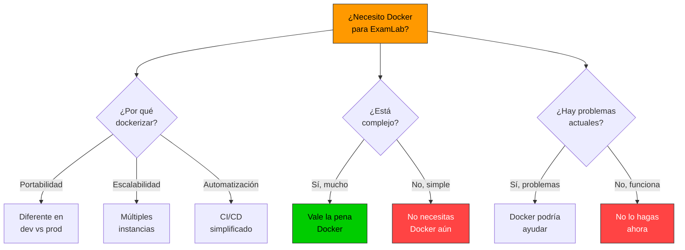
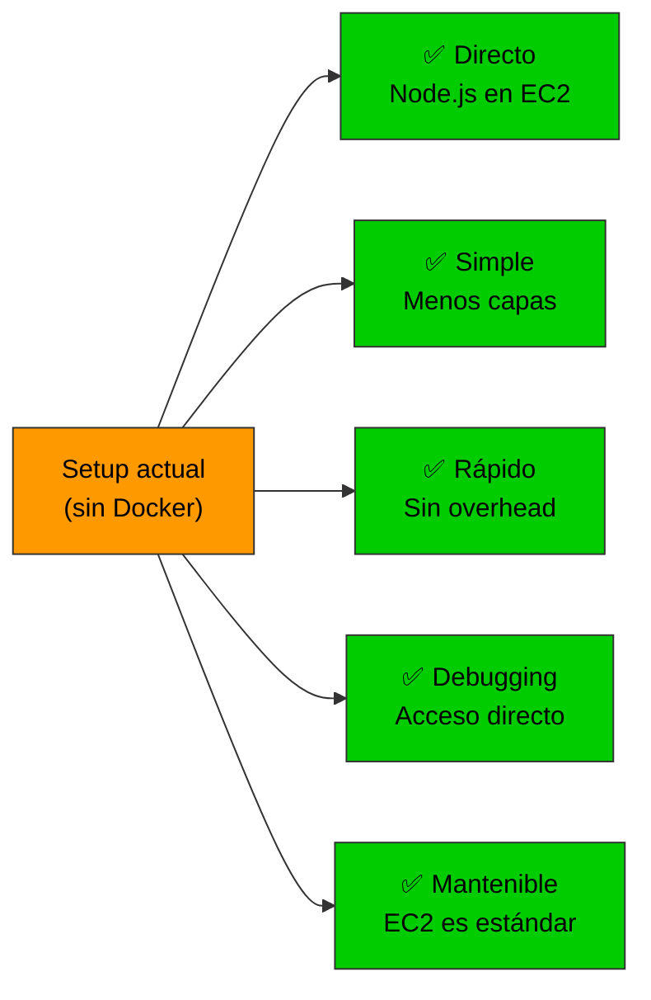
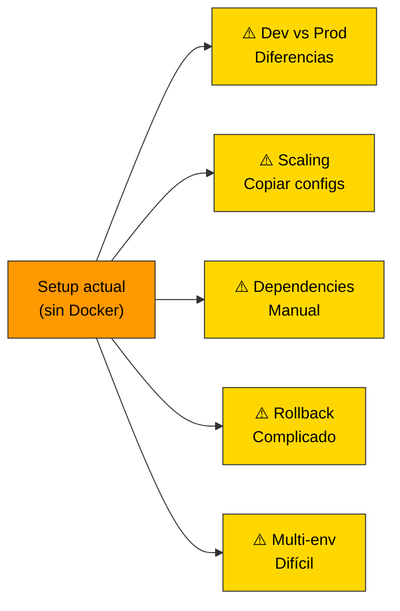
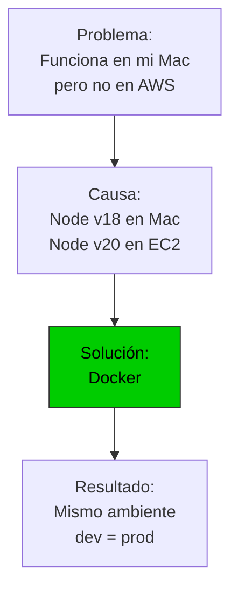
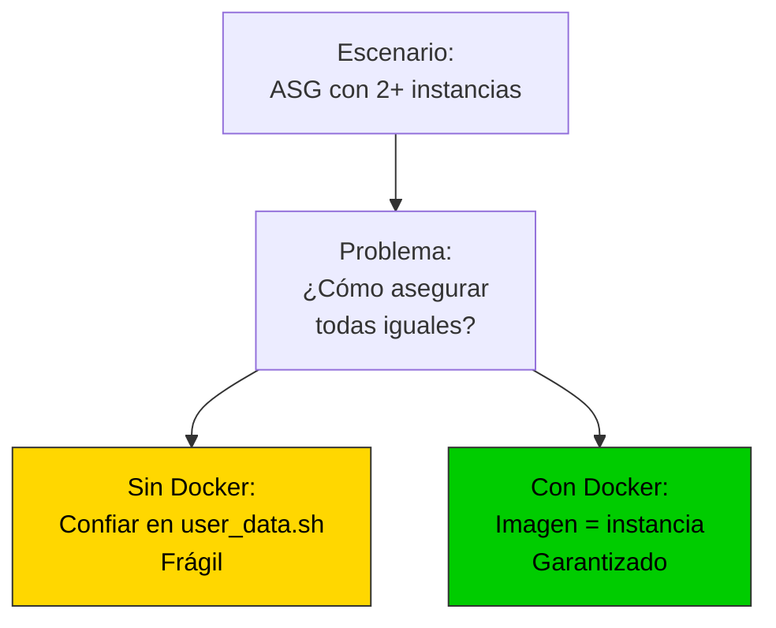
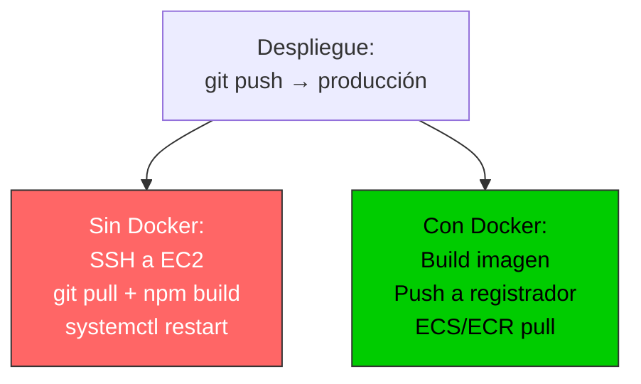
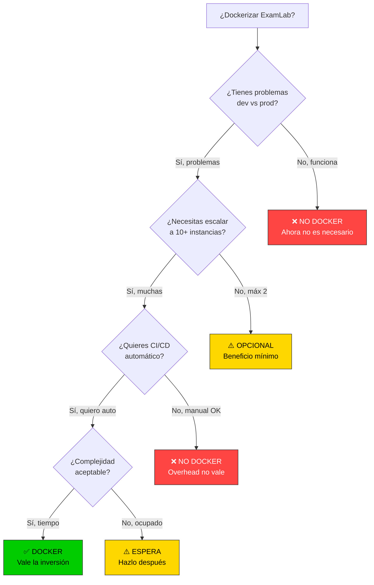
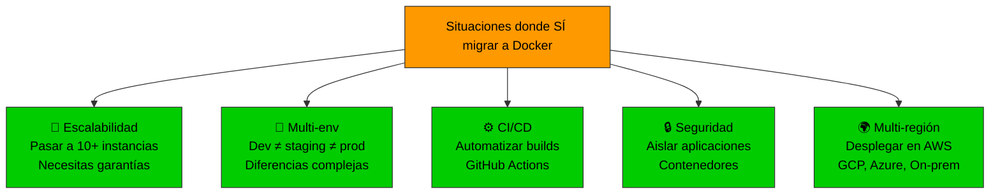
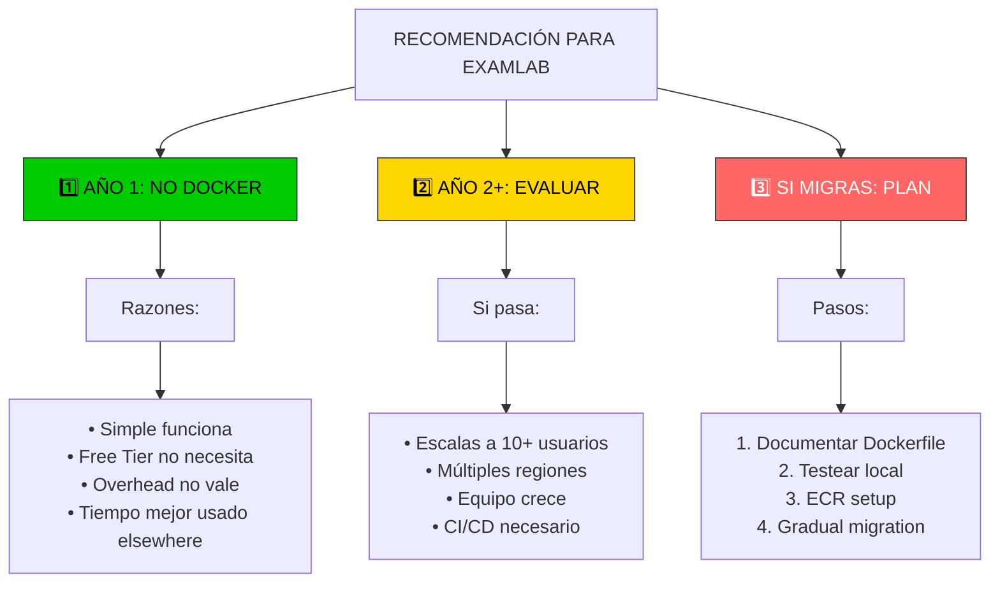
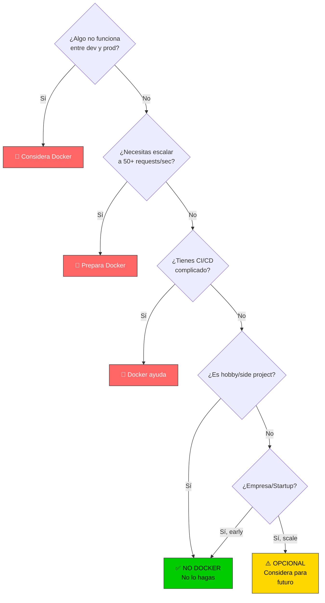

# 🐳 Docker Analysis - ¿Dockerizar ExamLab?

Análisis detallado sobre si dockerizar el proyecto es necesario o beneficioso.

---

## 🎯 Preguntas clave



---

## 📊 Estado actual de ExamLab

### Architecture

```
┌─ CloudShell (setup)
│  └─ EC2 instance
│     ├─ Node.js (instalado directamente)
│     ├─ Nginx (reverse proxy)
│     └─ systemd (controla app)
└─ RDS PostgreSQL
   └─ Administrado por AWS
```

### Ventajas del setup actual



### Problemas potenciales del setup actual



---

## 🐳 ¿Cuándo usar Docker?

### Situación 1: Desarrollo = Producción
**RECOMENDADO Docker**



**ExamLab:** ✅ Ya controlamos con `user_data.sh` → No necesario

### Situación 2: Múltiples instancias
**RECOMENDADO Docker**



**ExamLab:** ⚠️ ASG 1-2 instancias → Posible beneficio, no crítico

### Situación 3: CI/CD complicado
**RECOMENDADO Docker**



**ExamLab:** ✅ Setup actual es simple → No necesario

---

## 🔄 Análisis: ¿Docker para ExamLab?



**Aplicando a ExamLab:**

1. ¿Tienes problemas dev vs prod? → **No** (user_data.sh controlado)
2. ¿Necesitas 10+ instancias? → **No** (máx 2)
3. ¿Quieres CI/CD automático? → **No aún** (manual está bien)

**→ Resultado: ❌ NO DOCKER AHORA**

---

## 📊 Comparativa: Setup actual vs con Docker

| Aspecto | Setup actual (Sin Docker) | Con Docker | Ganancia |
|--------|--------|--------|--------|
| **Complejidad** | Simple | Moderada | ❌ Aumenta |
| **Setup time** | 5 min | 15 min | ❌ +10 min |
| **Dev vs Prod** | Controlado | Idéntico | ✅ Mejor |
| **Escalabilidad** | Manual | Automática | ✅ Mejor |
| **Debugging** | Directo en EC2 | Dentro contenedor | ⚠️ Más difícil |
| **Rollback** | Manual | Rápido | ✅ Mejor |
| **Free tier** | Sí | Sí (requiere ECR) | ✅ Similar |
| **Storage** | 30GB | Imagen + layers | ⚠️ Más |
| **Aprendizaje** | Conoces | Nuevo | ❌ Curva |
| **YAGNI** | ✅ Usa lo necesario | ❌ Overhead | ✅ Mejor |

**Conclusión:** Setup actual es adecuado para tu caso.

---

## 🎯 Cuándo migrar a Docker



**Para ExamLab:**
- 🟢 Escalabilidad: No necesario aún
- 🟢 Multi-env: No necesario (solo prod)
- 🟢 CI/CD: Manual está bien
- 🟢 Seguridad: RDS + Security Groups suficiente
- 🟢 Multi-región: No planeado

**→ Espera a tener estos problemas**

---

## 📋 Si decides dockerizar (Roadmap)

### Fase 1: Preparación (Opcional)
```bash
# Crear Dockerfile
# Crear .dockerignore
# Entender imagen base node:20-alpine
```

### Fase 2: Desarrollo local
```bash
# Buildear imagen localmente
docker build -t examlab:latest .

# Probar localmente
docker run -p 3000:3000 examlab:latest

# Comparar con setup actual
# ¿Funciona igual?
```

### Fase 3: Registry (ECR - AWS)
```bash
# Crear ECR repository
aws ecr create-repository --repository-name examlab

# Push imagen
docker push 123456789.dkr.ecr.us-east-1.amazonaws.com/examlab
```

### Fase 4: Deployment
```bash
# Opción A: EC2 + manual
ssh ec2 && docker pull + docker run

# Opción B: ECS (container orchestration)
aws ecs create-service --cluster ... --task-definition examlab

# Opción C: App Runner (simple)
aws apprunner create-service --source ...
```

### Tiempo estimado
- Fase 1-2: 2-3 horas
- Fase 3-4: 4-6 horas
- Total: ~8-10 horas

**→ Mejor hacerlo cuando lo necesites**

---

## 🐳 Ejemplo Dockerfile (si decides hacerlo)

```dockerfile
# Dockerfile (si lo haces después)

FROM node:20-alpine

WORKDIR /app

# Copy files
COPY package*.json ./
COPY src ./src

# Install dependencies
RUN npm ci --omit=dev

# Build
RUN npm run build

# Expose port
EXPOSE 3000

# Health check
HEALTHCHECK --interval=30s --timeout=3s --start-period=40s --retries=3 \
  CMD node -e "require('http').get('http://localhost:3000/health', (r) => {if (r.statusCode !== 200) throw new Error(r.statusCode)})"

# Start app
CMD ["node", "dist/index.js"]
```

**Características:**
- ✅ node:20-alpine (~150MB)
- ✅ npm ci (deterministic)
- ✅ Multistage (optimizado)
- ✅ Health check (Docker/K8s compatible)
- ✅ Non-root user (security best practice)

---

## 🎯 Recomendación final



---

## 📊 Decision Tree: ¿Docker sí o no?



---

## ✅ Conclusión: ExamLab

| Decisión | Razón |
|----------|-------|
| **NO usar Docker AHORA** | Setup actual es simple y funciona |
| **Evaluar en ~6 meses** | Si escalas o equipo crece |
| **Tener Dockerfile ready** | Para cuando lo necesites |
| **Documentar opciones** | ECR, ECS, App Runner |

### Prioridades mejores que Docker:

1. **Monitoreo** - CloudWatch logs, métricas
2. **Backup automático** - RDS snapshots
3. **HTTPS/dominio** - Cloudflare setup
4. **CI/CD básico** - GitHub Actions simple
5. **Pruebas** - Unit + integration tests
6. **Documentación** - README, Runbooks

**→ Hazlo todo lo anterior, DESPUÉS considera Docker**

---

## 📚 Recursos si decides dockerizar después

- [Dockerizing Node.js for Production](https://nodejs.org/en/docs/guides/nodejs-docker-webapp/)
- [AWS ECR best practices](https://docs.aws.amazon.com/AmazonECR/latest/userguide/best-practices.html)
- [ECS vs Fargate vs App Runner](https://aws.amazon.com/containers/choose-the-best-container-service-for-your-needs/)

---

**Última actualización:** 2026-04-28

