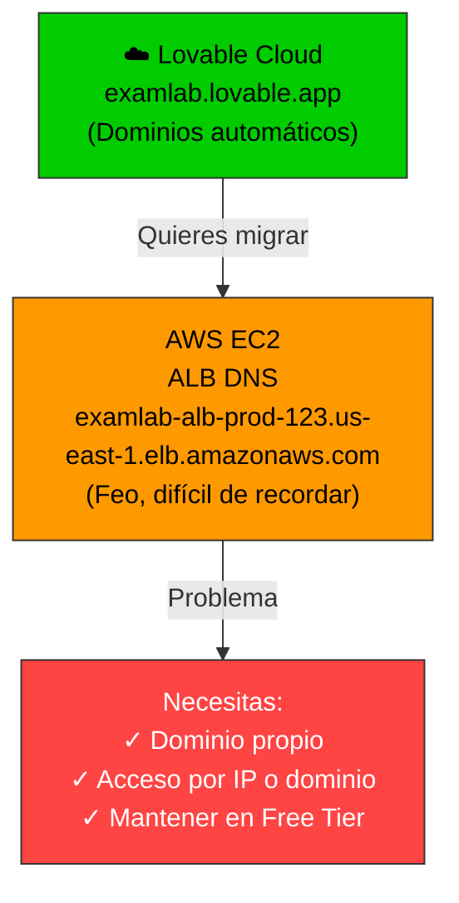
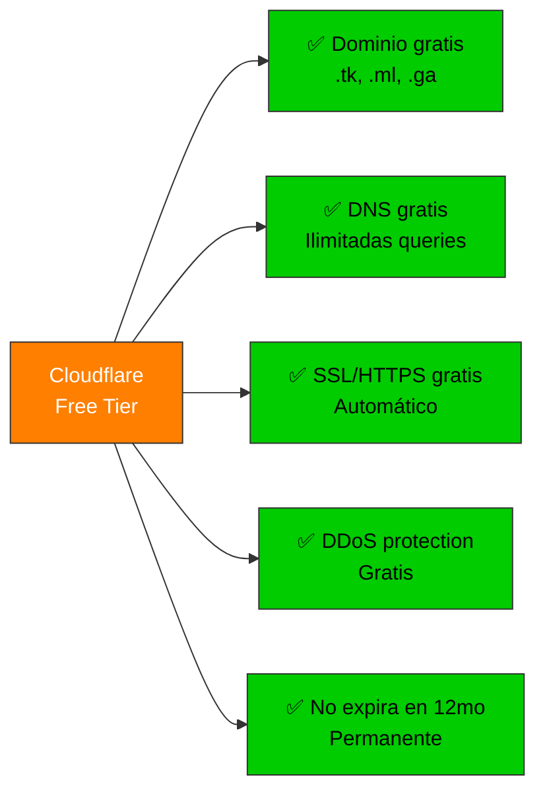
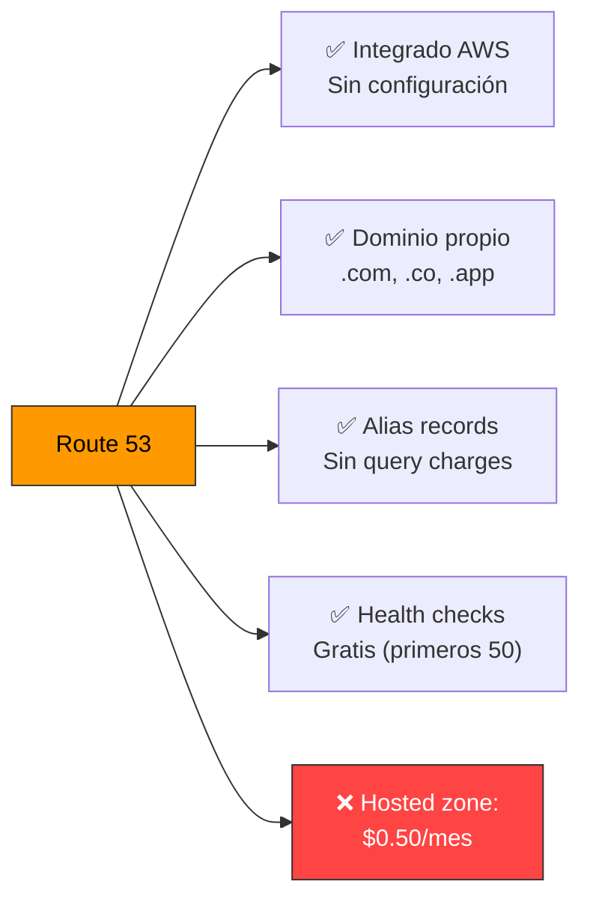
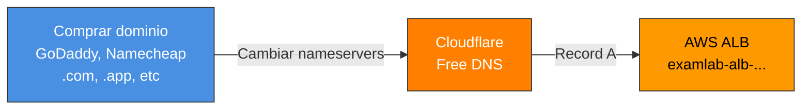
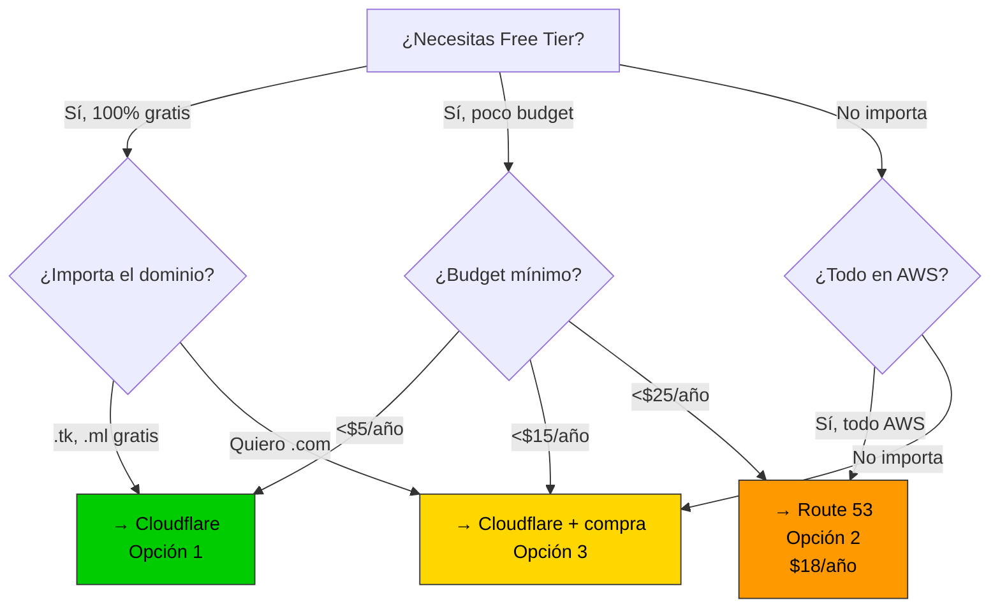
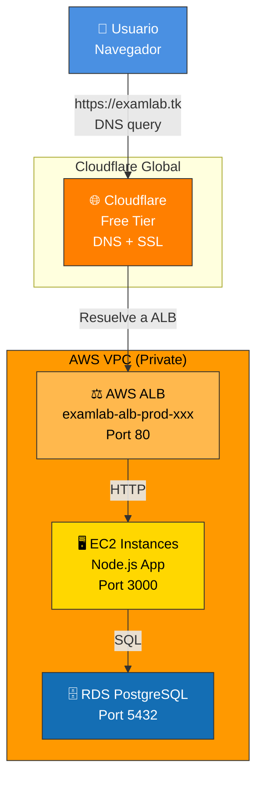
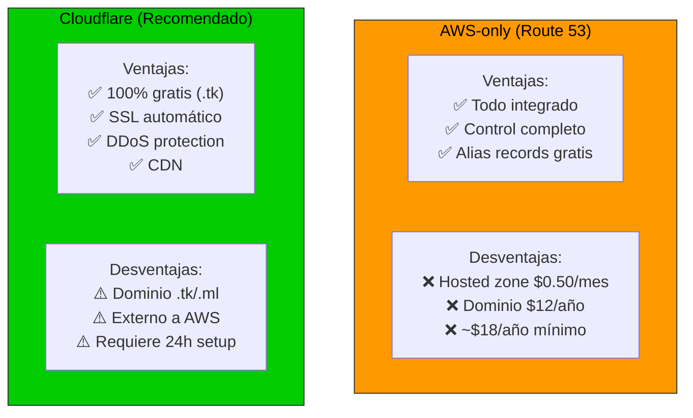
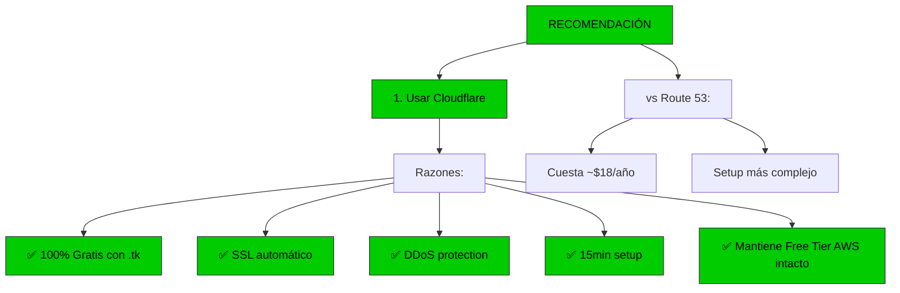

# 🌐 Dominios & Acceso Free Tier AWS - Análisis Completo

Opciones para acceder a tu proyecto ExamLab en AWS usando Free Tier y gestión de dominios.

---

## 📊 Situación actual



---

## ✅ Opción 1: Cloudflare (RECOMENDADO - 100% Gratis)

### Ventajas


### Setup (5 minutos)
```bash
# 1. Ir a: https://www.cloudflare.com/
# 2. Sign up (gratuito)
# 3. Agregar sitio (tu dominio)
# 4. Cambiar nameservers a Cloudflare
# 5. Crear record A:
#    Name: examlab
#    IPv4: <ALB-DNS de AWS>
#    Proxy: DNS only (no Cloudflare proxy)
```

### Record DNS en Cloudflare
```
Type    Name        Value
────────────────────────────────────────
A       examlab     examlab-alb-prod-123.us-east-1.elb.amazonaws.com
A       @           examlab-alb-prod-123.us-east-1.elb.amazonaws.com
CNAME   www         examlab.tk
```

### Acceso
```
✅ examlab.tk                    → ALB AWS
✅ www.examlab.tk               → ALB AWS
✅ examlab-alb-prod-123.us-...  → ALB AWS (legacy)
```

### Costos
| Servicio | Costo |
|----------|-------|
| Dominio .tk | Gratis |
| DNS | Gratis (ilimitadas) |
| SSL/HTTPS | Gratis |
| **Total** | **$0/mes** |

---

## ⚙️ Opción 2: AWS Route 53 (Bajo costo)

### Ventajas


### Setup (10 minutos)

```bash
# 1. AWS Console → Route 53
# 2. Create hosted zone
#    Domain: examlab.com (comprar)
# 3. Crear record:
#    Type: A (Alias)
#    Name: examlab.com
#    Alias Target: ALB DNS
# 4. Registrar dominio:
#    ~$12/año (.com)
```

### Costo anual
| Servicio | Costo |
|----------|-------|
| Dominio .com | $12/año |
| Hosted Zone | $6/año ($0.50/mes) |
| Alias records | Gratis |
| DNS queries | Primeros 1M gratis |
| **Total** | **~$18/año** |

---

## 🎯 Opción 3: Hybrid (Mejor balance)

**Usar Cloudflare para DNS + comprar dominio donde quieras**



### Costos anuales
| Opción | Dominio | DNS | Total/año |
|--------|---------|-----|-----------|
| Cloudflare (.tk) | Gratis | Gratis | **$0** |
| Namecheap + Cloudflare | $8.88 (.com) | Gratis | **$8.88** |
| Route 53 (.com) | $12 | $6 | **$18** |
| GoDaddy + Cloudflare | $10-15 (.com) | Gratis | **$10-15** |

---

## 📋 Comparativa: ¿Cuál elegir?



---

## 🚀 Setup paso a paso: Cloudflare (RECOMENDADO)

### Paso 1: Crear cuenta Cloudflare
```bash
# 1. Ir a https://dash.cloudflare.com/
# 2. Sign up (email + password)
# 3. Verify email
```

### Paso 2: Agregar sitio
```bash
# 1. Dashboard → "Add a site"
# 2. Escribe tu dominio (ej: examlab.tk)
# 3. Selecciona plan "Free"
# 4. Review plan features (todos gratis)
# 5. Continuar
```

### Paso 3: Cambiar nameservers (si dominio es externo)
```bash
# Si compraste en GoDaddy/Namecheap:
# 1. Cloudflare muestra nameservers
#    Example: sue.ns.cloudflare.com
#           aldo.ns.cloudflare.com
# 2. Ir a tu registrador (GoDaddy, etc)
# 3. Cambiar nameservers a los de Cloudflare
# 4. Esperar 24h para propagación
```

### Paso 4: Crear record DNS
```bash
# En Cloudflare Dashboard:
# 1. DNS → Records
# 2. Add record:
#    Type: A
#    Name: examlab (o @ para raíz)
#    IPv4 Address: <TU-ALB-DNS>
#       Ejemplo: examlab-alb-prod-123.us-east-1.elb.amazonaws.com
#    TTL: Auto
#    Proxy status: DNS only ← IMPORTANTE
#    Save

# Resultado:
# examlab.tk → ALB DNS → EC2 → App
```

### Paso 5: Verificar (2-5 minutos después)
```bash
# En CloudShell o local:
nslookup examlab.tk
# Debe resolver a tu ALB IP

# Probar HTTP
curl http://examlab.tk
# Debe responder con tu app
```

---

## 🔐 HTTPS automático con Cloudflare

**Cloudflare proporciona SSL gratis automáticamente:**

```bash
# 1. Cloudflare Dashboard → SSL/TLS
# 2. Encryption mode: "Full" (recomendado)
#    - Cloudflare ↔ Usuario: HTTPS (SSL Cloudflare)
#    - Cloudflare ↔ ALB: HTTP (va en VPC privada)
# 3. Guardar

# Resultado:
# https://examlab.tk → Cloudflare (HTTPS) → ALB (HTTP) → App
```

**Ventaja:** No necesitas certificado ACM en AWS

---

## 🌐 Acceso por IP directo (sin dominio)

Si prefieres acceder directo por IP:

```bash
# 1. Obtener IP pública del ALB
ALB_DNS=$(aws cloudformation describe-stacks \
  --stack-name examlab-ec2-production \
  --query 'Stacks[0].Outputs[?OutputKey==`ALBDNSName`].OutputValue' \
  --output text)

echo $ALB_DNS
# Ejemplo: examlab-alb-prod-123.us-east-1.elb.amazonaws.com

# 2. Convertir DNS a IP
nslookup $ALB_DNS | grep "Address"
# Resultado: 52.x.x.x

# 3. Acceso directo
curl http://52.x.x.x
# Funciona, pero:
# ❌ IP cambia si ALB se reinicia
# ❌ Sin HTTPS fácil
# ❌ Difícil de recordar
# ✅ Gratis
```

**NO RECOMENDADO** - Las IPs de ALB pueden cambiar. Usa dominio.

---

## 📊 Arquitectura final: Cloudflare + AWS



---

## 💰 Costo total mensual con Cloudflare

| Servicio | Free Tier | Costo |
|----------|-----------|-------|
| Dominio (.tk) | Sí | $0 |
| Cloudflare DNS | Sí | $0 |
| Cloudflare SSL | Sí | $0 |
| EC2 t3.small | 750h/año | $0 (primeros 12mo) o $15 después |
| ALB | No (pero necesario) | $16/mes |
| RDS db.t3.micro | Sí | $0 (primeros 12mo) o $13 después |
| Data transfer | Primeros 100GB/mes | $0-10 |
| **TOTAL (primer año)** | | **$16-26/mes** |
| **TOTAL (después)** | | **$44-54/mes** |

---

## ✅ Checklist: Cloudflare setup

- [ ] Crear cuenta Cloudflare (5 min)
- [ ] Agregar sitio (5 min)
- [ ] Crear record A (2 min)
- [ ] Esperar DNS propagación (24h)
- [ ] Verificar con nslookup (1 min)
- [ ] Probar en navegador (1 min)
- [ ] Habilitar SSL/TLS (2 min)
- [ ] Documentar en cloudshell-vars.env (2 min)

**Tiempo total: ~30-45 minutos**

---

## 🔄 Integración con CloudFormation

Actualizar `cloudshell-vars.env`:

```bash
# ═══════════════════════════════════════════════════════════
# 7️⃣  DOMINIO (Nuevo)
# ═══════════════════════════════════════════════════════════

DOMAIN_NAME="examlab.tk"           # Tu dominio (Cloudflare)
ENABLE_DOMAIN="true"               # true | false
DOMAIN_PROVIDER="cloudflare"       # cloudflare | route53 | none

# Si usas Route 53:
# DOMAIN_PROVIDER="route53"
# DOMAIN_COST="18"  # ~$18/año (.com)

# Si no usas dominio:
# DOMAIN_PROVIDER="none"
# ENABLE_DOMAIN="false"
```

---

## 🆚 AWS-only vs Cloudflare approach



---

## 📞 Troubleshooting DNS

### "DNS no resuelve"
```bash
# Verificar propagación
nslookup examlab.tk
# Si no funciona, esperar 24h

# Verificar nameservers
whois examlab.tk | grep "Name Server"
# Debe mostrar nameservers de Cloudflare
```

### "Acceso por IP funciona pero dominio no"
```bash
# 1. Verificar record Cloudflare
#    Dashboard → DNS → Buscar "examlab"
# 2. Verificar IP es correcta
#    Debe ser el ALB DNS o IP
# 3. Verificar TTL
#    Si lo cambiaste, esperar (TTL) para aplicar
# 4. Forzar flush DNS local
#    macOS: dscacheutil -flushcache
#    Windows: ipconfig /flushdns
#    Linux: sudo systemd-resolve --flush-caches
```

### "HTTPS tiene certificado inválido"
```bash
# Cloudflare proporciona SSL pero:
# 1. Primeros 5min puede mostrar advertencia
# 2. Esperar a que se propague
# 3. Verificar mode: "Full" en Cloudflare SSL/TLS
```

---

## 🎯 Recomendación final

Para **ExamLab migrado a AWS Free Tier**:



**→ Ir a:** [Setup Cloudflare paso a paso](#-setup-paso-a-paso-cloudflare-recomendado)

---

**Última actualización:** 2026-04-28

