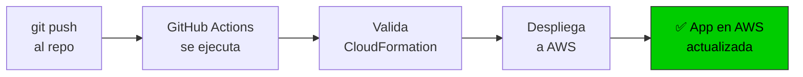
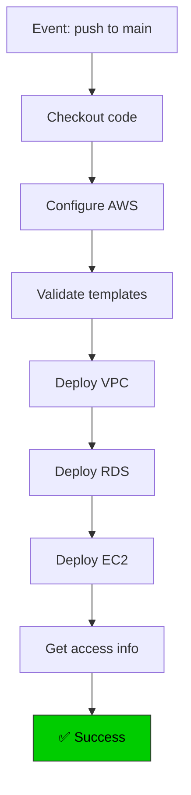

# 🚀 GitHub Actions - Despliegue automático a AWS

Configura despliegue automático a AWS cada vez que hagas push a GitHub.

---

## 🎯 ¿Qué hace?



**Flujo completo:**
1. 📝 Editas código localmente
2. 📤 `git push origin main`
3. ⚙️ GitHub Actions se ejecuta automáticamente
4. ☁️ Despliega a AWS CloudFormation
5. ✅ Tu app está actualizada en producción

---

## 📋 Requisitos previos

- ✅ Cuenta AWS con acceso administrativo
- ✅ Repositorio en GitHub
- ✅ Este folder en: `lovable-aws-deployment/.github/workflows/deploy-aws.yml`

---

## 🔧 Paso 1: Crear usuario IAM en AWS

### Opción A: Automático (recomendado)

```bash
# Ejecutar en CloudShell:
bash lovable-aws-deployment/scripts/create-github-iam-user.sh
```

**Resultado:**
- ✅ Usuario IAM creado: `github-actions`
- ✅ Access Key generado
- ✅ Permisos CloudFormation configurados

### Opción B: Manual

Si prefieres crear el usuario manualmente:

#### 1️⃣ Crear usuario IAM
```bash
# En AWS Console o CloudShell:
aws iam create-user --user-name github-actions
```

#### 2️⃣ Crear Access Key
```bash
aws iam create-access-key --user-name github-actions
```

**Guarda la salida:**
```json
{
  "AccessKeyId": "AKIA...",
  "SecretAccessKey": "wJal..."
}
```

#### 3️⃣ Adjuntar políticas

```bash
# Crear archivo policy.json:
cat > policy.json << 'EOF'
{
  "Version": "2012-10-17",
  "Statement": [
    {
      "Sid": "CloudFormationAccess",
      "Effect": "Allow",
      "Action": [
        "cloudformation:*",
        "s3:*",
        "ec2:*",
        "rds:*",
        "iam:*",
        "elasticloadbalancing:*",
        "autoscaling:*",
        "cloudwatch:*",
        "logs:*",
        "sts:GetCallerIdentity"
      ],
      "Resource": "*"
    }
  ]
}
EOF

# Aplicar política
aws iam put-user-policy \
  --user-name github-actions \
  --policy-name CloudFormationPolicy \
  --policy-document file://policy.json
```

---

## 🔐 Paso 2: Configurar secrets en GitHub

### 1️⃣ Ir a GitHub

```
Tu repositorio → Settings → Secrets and variables → Actions
```

### 2️⃣ Agregar secrets requeridos

| Secret | Valor | Ejemplo |
|--------|-------|---------|
| `AWS_ACCESS_KEY_ID` | Access Key del IAM user | `AKIA...` |
| `AWS_SECRET_ACCESS_KEY` | Secret Access Key | `wJal...` |
| `DB_PASSWORD` | Contraseña RDS | `MySecure123!` |

### 3️⃣ Agregar secrets opcionales

| Secret | Valor por defecto |
|--------|-------------------|
| `PROJECT_NAME` | `examlab` |
| `ENVIRONMENT` | `production` |
| `EC2_INSTANCE_TYPE` | `t3.small` |
| `DB_INSTANCE_TYPE` | `db.t3.micro` |
| `DB_STORAGE_SIZE` | `20` |
| `OWNER_NAME` | `GitHub Actions` |

**Ejemplo de cómo agregar:**
```
1. Click en "New repository secret"
2. Name: AWS_ACCESS_KEY_ID
3. Secret: AKIA... (pegar valor)
4. Click "Add secret"
5. Repetir para cada secret
```

---

## ✅ Paso 3: Verificar configuración

### Revisar el workflow

```bash
# Ver archivo del workflow:
cat .github/workflows/deploy-aws.yml
```

### Probar manualmente

```
GitHub → Actions → "Deploy to AWS" → "Run workflow" → "Run workflow"
```

---

## 🎯 Uso

### Trigger automático (al hacer push)

```bash
# Editar código localmente
nano src/pages/Home.tsx

# Hacer commit y push
git add src/pages/Home.tsx
git commit -m "feat: update home page"
git push origin main

# ⚙️ GitHub Actions se ejecuta automáticamente
# 📊 Ver progreso en: GitHub → Actions
```

### Trigger manual

```
GitHub → Actions → "Deploy to AWS" → "Run workflow" → "Run workflow"
```

---

## 📊 Monitorear despliegue

### En GitHub

```
Tu repositorio → Actions → Buscar el workflow
```

**Estados:**
- 🟡 **In progress** - Desplegando
- 🟢 **Success** - Completado exitosamente
- 🔴 **Failed** - Error (ver logs)

### Ver logs detallados

```
1. Click en el workflow
2. Click en el job "deploy"
3. Expandir cada paso para ver detalles
```

---

## 🔍 Troubleshooting

### ❌ "AWS credentials not found"

```bash
# Verificar secrets en GitHub:
# Settings → Secrets and variables → Actions
# Deben estar:
# ✓ AWS_ACCESS_KEY_ID
# ✓ AWS_SECRET_ACCESS_KEY
```

### ❌ "CloudFormation access denied"

```bash
# Verificar permisos del usuario IAM:
aws iam get-user-policy --user-name github-actions --policy-name CloudFormationPolicy
# Debe retornar la política completa
```

### ❌ "Stack creation failed"

```bash
# Ver errores en CloudFormation:
aws cloudformation describe-stack-events \
  --stack-name examlab-ec2-production \
  --query 'StackEvents[0:5]'
```

### ❌ "DB_PASSWORD secret not configured"

```bash
# El secret DB_PASSWORD es obligatorio
# Agregarlo en: GitHub Settings → Secrets
```

---

## 🏗️ Arquitectura del workflow



---

## 📈 Variables de ambiente del workflow

El workflow usa estas variables:

```bash
# Automáticamente del GitHub
GITHUB_OWNER          # Tu usuario GitHub
GITHUB_REPO          # Nombre del repo
GITHUB_BRANCH        # Branch (main, develop, etc)
GITHUB_SHA           # Commit hash
GITHUB_REF_NAME      # Nombre de rama

# Configurados en secrets
AWS_ACCESS_KEY_ID
AWS_SECRET_ACCESS_KEY
DB_PASSWORD
PROJECT_NAME         # (opcional)
ENVIRONMENT          # (opcional)
```

---

## 🔐 Seguridad

### ✅ Lo que hace el workflow de forma segura

```
✓ Credenciales AWS en secrets (encrypted)
✓ No imprime credenciales en logs
✓ Valida templates antes de desplegar
✓ Usa least-privilege IAM policy
✓ No guarda SSH keys en GitHub
✓ Logs se retienen solo 30 días
```

### ⚠️ Precauciones

```
❌ NUNCA commits secrets en código
❌ NUNCA compartas el Access Key
❌ NUNCA lo hagas público en los logs
✅ Revota keys si las expones accidentalmente
```

**Si accidentalmente exponés un secret:**
```bash
# 1. En AWS Console:
#    IAM → Users → github-actions → Delete Access Key

# 2. Crear nuevo Access Key
aws iam create-access-key --user-name github-actions

# 3. Actualizar en GitHub Secrets
```

---

## 📋 Checklist de setup

- [ ] Crear usuario IAM `github-actions`
- [ ] Generar Access Key
- [ ] Adjuntar política CloudFormation
- [ ] Agregar `AWS_ACCESS_KEY_ID` en GitHub Secrets
- [ ] Agregar `AWS_SECRET_ACCESS_KEY` en GitHub Secrets
- [ ] Agregar `DB_PASSWORD` en GitHub Secrets
- [ ] Verificar `.github/workflows/deploy-aws.yml` existe
- [ ] Hacer push a `main` branch
- [ ] Verificar que GitHub Actions se ejecutó
- [ ] Probar acceso a la app: `http://<ALB-DNS>`

---

## 🎯 Flujo de desarrollo local + AWS

```
┌─ Lovable Cloud (Producción)
│
└─ GitHub
   ├─ Branch: main
   │  └─ Trigger: GitHub Actions
   │     └─ Deploy a AWS
   │
   └─ Branch: develop (local)
      └─ Editar código
         └─ Test local
            └─ git push
               └─ GitHub Actions
                  └─ Deploy a AWS staging
```

**Configuración sugerida:**

```bash
# Branch main → AWS production
# Branch develop → AWS staging

# Cada push a main dispara:
# 1. Validación
# 2. Despliegue a CloudFormation
# 3. Actualización de EC2
```

---

## 💡 Tips avanzados

### 1️⃣ Desplegar a diferentes ambientes

```bash
# Crear branch develop para staging:
git checkout -b develop

# En GitHub, crear segundo workflow:
# .github/workflows/deploy-staging.yml
# Cambiar: ENVIRONMENT=staging
```

### 2️⃣ Notificaciones de despliegue

```bash
# Agregar en el workflow:
- name: Send Slack notification
  uses: slackapi/slack-github-action@v1
  with:
    webhook-url: ${{ secrets.SLACK_WEBHOOK }}
    payload: |
      {
        "text": "Deployment completed"
      }
```

### 3️⃣ Rollback automático

```bash
# En caso de error, volver a versión anterior:
git revert HEAD
git push origin main
# GitHub Actions automáticamente revierte el despliegue
```

---

## 📚 Recursos

- [GitHub Actions documentation](https://docs.github.com/en/actions)
- [AWS CloudFormation best practices](https://docs.aws.amazon.com/AWSCloudFormation/latest/UserGuide/best-practices.html)
- [AWS IAM security best practices](https://docs.aws.amazon.com/IAM/latest/UserGuide/best-practices.html)

---

**Última actualización:** 2026-04-28

