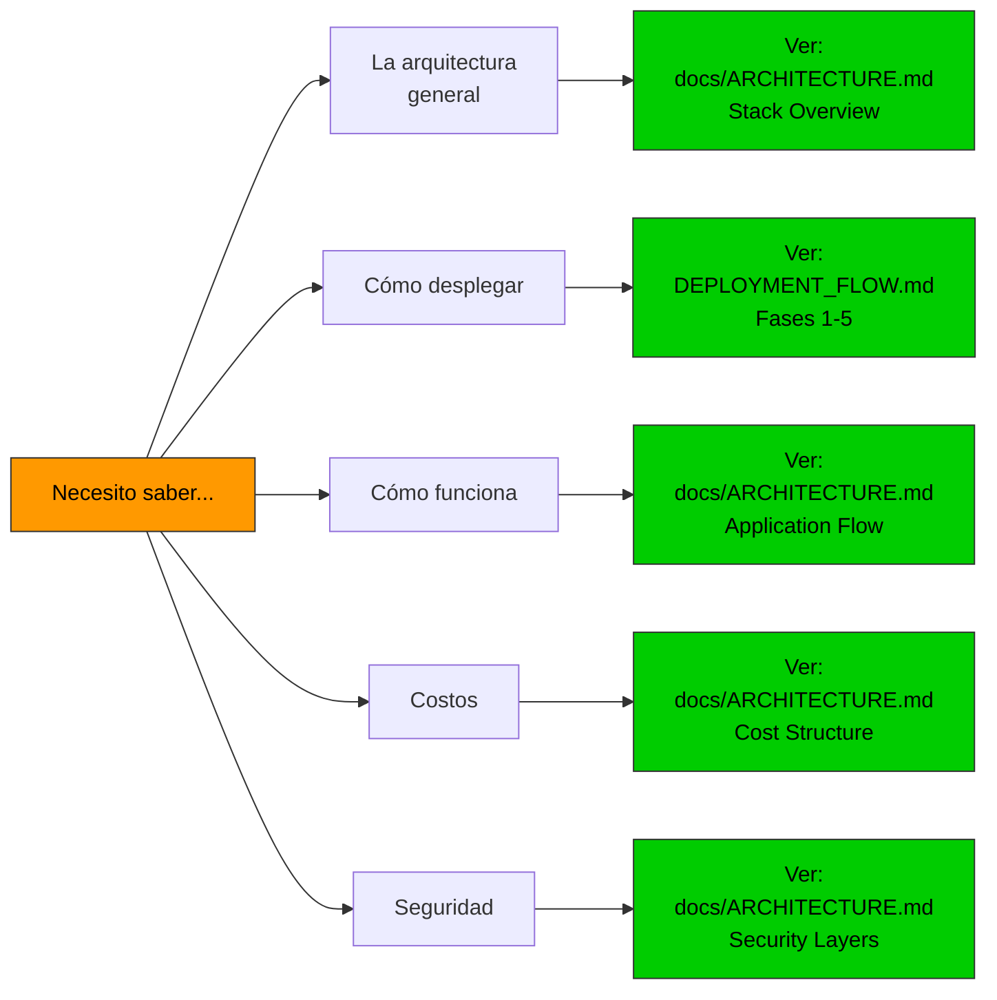

# 📚 Índice de Documentación - ExamLab AWS Deployment

Guía rápida para navegar toda la documentación.

## 🚀 Empieza aquí

**Nuevo usuario?** Sigue estos pasos:
1. Lee [README.md](../README.md) - Visión general
2. Mira [DEPLOYMENT_FLOW.md](../DEPLOYMENT_FLOW.md) - Fases de despliegue
3. Consulta [DIAGRAMS.md](DIAGRAMS.md) - Entiende la arquitectura visualmente
4. Ejecuta [cloudshell-setup.sh](../cloudshell-setup.sh) - Despliega

---

## 📁 Estructura de archivos

### 📋 Documentación principal

| Archivo | Propósito | Leer si... |
|---------|-----------|-----------|
| [README.md](../README.md) | Introducción y guía rápida | Quieres empezar |
| [DEPLOYMENT_FLOW.md](../DEPLOYMENT_FLOW.md) | Fases del despliegue con diagramas | Quieres entender el flujo |
| [CLOUDSHELL_GUIDE.md](CLOUDSHELL_GUIDE.md) | Paso a paso en CloudShell | Usas CloudShell |
| [TROUBLESHOOTING.md](TROUBLESHOOTING.md) | Problemas y soluciones | Algo no funciona |

### 🏗️ Arquitectura y diseño

| Archivo | Propósito | Leer si... |
|---------|-----------|-----------|
| [docs/ARCHITECTURE.md](ARCHITECTURE.md) | Diagramas detallados de arquitectura | Quieres entender el diseño |
| [docs/DIAGRAMS.md](DIAGRAMS.md) | Índice de todos los diagramas Mermaid | Buscas un diagrama específico |
| [docs/AI_SUPABASE_ONLY.md](AI_SUPABASE_ONLY.md) | IA con Supabase Edge Functions | Necesitas IA integrada |

### 🔧 Scripts y configuración

| Archivo | Propósito |
|---------|-----------|
| `cloudshell-vars.env` | Variables genéricas (editar aquí) |
| `cloudshell-setup.sh` | Setup inicial (ejecutar primero) |
| `scripts/deploy-cf.sh` | Despliegue CloudFormation (auto-generado) |
| `scripts/backup-lovable.sh` | Backup RDS/Supabase/CSV |
| `scripts/health-check.sh` | Verificar infraestructura |
| `configs/user_data.sh` | Script de inicialización EC2 |

### ☁️ Templates CloudFormation

| Archivo | Propósito |
|---------|-----------|
| `cloudformation/vpc-stack.yaml` | VPC, Subnets, IGW, NAT |
| `cloudformation/rds-stack.yaml` | PostgreSQL, Backups, Encryption |
| `cloudformation/ec2-stack.yaml` | ALB, ASG, Launch Template |
| `cloudformation/parameters.json` | Parámetros (auto-generado) |

---

## 🎯 Guías por rol

### 👨‍💻 Para Desarrolladores

**Objetivo:** Desplegar la aplicación

1. Lee: [README.md](../README.md) - Visión general
2. Lee: [DEPLOYMENT_FLOW.md](../DEPLOYMENT_FLOW.md#-fase-1-cloudshell-setup-5-minutos) - Fase 1-2
3. Ejecuta: `bash cloudshell-setup.sh`
4. Ejecuta: `bash scripts/deploy-cf.sh`
5. Lee: [TROUBLESHOOTING.md](TROUBLESHOOTING.md) si hay errores

**Tiempo:** ~30 minutos

### 👨‍🔧 Para DevOps/SRE

**Objetivo:** Entender y mantener la infraestructura

1. Lee: [docs/ARCHITECTURE.md](ARCHITECTURE.md) - Arquitectura completa
2. Lee: [DEPLOYMENT_FLOW.md](../DEPLOYMENT_FLOW.md) - Todas las fases
3. Lee: [docs/DIAGRAMS.md](DIAGRAMS.md) - Todos los diagramas
4. Ejecuta: `bash scripts/health-check.sh` - Verificación
5. Estudia: CloudFormation templates

**Tiempo:** ~2 horas

### 🔒 Para Security/Compliance

**Objetivo:** Validar seguridad

1. Lee: [docs/ARCHITECTURE.md#-security-architecture](ARCHITECTURE.md#-security-architecture) - Security Groups
2. Lee: [docs/ARCHITECTURE.md#-security-layers](ARCHITECTURE.md#-security-layers) - Capas de seguridad
3. Revisa: CloudFormation templates - Encryption, KMS
4. Verifica: `scripts/health-check.sh` - Puertos abiertos

**Tiempo:** ~1 hora

### 👔 Para Product/Project Managers

**Objetivo:** Entender costos y timeline

1. Lee: [README.md](../README.md#-costos-estimados-monthly) - Tabla de costos
2. Lee: [DEPLOYMENT_FLOW.md](../DEPLOYMENT_FLOW.md#-tiempos-estimados) - Timeline
3. Lee: [docs/ARCHITECTURE.md#-cost-structure](ARCHITECTURE.md#-cost-structure) - Desglose detallado
4. Revisa: [docs/DIAGRAMS.md](DIAGRAMS.md) - Diagramas para presentaciones

**Tiempo:** ~30 minutos

---

## 🔍 Buscar por tema

### 🌐 Networking
- VPC: [docs/ARCHITECTURE.md#-vpc-architecture](ARCHITECTURE.md#-vpc-architecture)
- Subnets: [DEPLOYMENT_FLOW.md](../DEPLOYMENT_FLOW.md#detalle-del-vpc-stack)
- Route Tables: [docs/ARCHITECTURE.md](ARCHITECTURE.md#route-tables)
- Security Groups: [docs/ARCHITECTURE.md#-security-architecture](ARCHITECTURE.md#-security-architecture)

### 💾 Database
- RDS Setup: [docs/ARCHITECTURE.md#-rds-architecture](ARCHITECTURE.md#-rds-architecture)
- Backups: [scripts/backup-lovable.sh](../scripts/backup-lovable.sh)
- Restauración: [DEPLOYMENT_FLOW.md](../DEPLOYMENT_FLOW.md#-fase-5-backup-en-cualquier-momento)

### 🖥️ Compute
- EC2: [docs/ARCHITECTURE.md#️-ec2--scaling-architecture](ARCHITECTURE.md#️-ec2--scaling-architecture)
- Load Balancer: [DEPLOYMENT_FLOW.md](../DEPLOYMENT_FLOW.md#detalle-del-ec2-stack)
- Auto Scaling: [DEPLOYMENT_FLOW.md](../DEPLOYMENT_FLOW.md#️-escalamiento-automático)

### 🔐 Seguridad
- Security Groups: [docs/ARCHITECTURE.md#-security-architecture](ARCHITECTURE.md#-security-architecture)
- Encryption: [docs/ARCHITECTURE.md#-rds-architecture](ARCHITECTURE.md#-rds-architecture)
- Capas de seguridad: [docs/ARCHITECTURE.md#-security-layers](ARCHITECTURE.md#-security-layers)

### 🤖 IA Integration
- Supabase: [docs/AI_SUPABASE_ONLY.md](AI_SUPABASE_ONLY.md)
- Edge Functions: [docs/AI_SUPABASE_ONLY.md#-setup-15-minutos](AI_SUPABASE_ONLY.md#-setup-15-minutos)
- Wrapper code: [docs/AI_SUPABASE_ONLY.md#-código-en-examlab](AI_SUPABASE_ONLY.md#-código-en-examlab)

### 📊 Monitoreo
- Health Checks: [DEPLOYMENT_FLOW.md](../DEPLOYMENT_FLOW.md#-fase-4-health-checks-1-minuto)
- CloudWatch: [docs/ARCHITECTURE.md#-performance-architecture](ARCHITECTURE.md#-performance-architecture)
- Logs: [scripts/health-check.sh](../scripts/health-check.sh)

### 💰 Costos
- Estimación: [README.md](../README.md#-costos-estimados-monthly)
- Desglose: [docs/ARCHITECTURE.md#-cost-structure](ARCHITECTURE.md#-cost-structure)
- Optimización: [docs/ARCHITECTURE.md#-performance-architecture](ARCHITECTURE.md#-performance-architecture)

### 🚀 Despliegue
- Quick start: [README.md](../README.md#-inicio-rápido-3-pasos)
- Step by step: [DEPLOYMENT_FLOW.md](../DEPLOYMENT_FLOW.md)
- CloudShell: [CLOUDSHELL_GUIDE.md](CLOUDSHELL_GUIDE.md)
- GitHub: [cloudshell-vars.env](../cloudshell-vars.env) (configurar)

---

## 📊 Diagramas por sección



---

## ✅ Checklist de lectura

### Despliegue inicial
- [ ] README.md - Introducción
- [ ] cloudshell-vars.env - Entender variables
- [ ] DEPLOYMENT_FLOW.md - Fases
- [ ] Ejecutar cloudshell-setup.sh
- [ ] Ejecutar scripts/deploy-cf.sh
- [ ] scripts/health-check.sh

### Después del despliegue
- [ ] docs/ARCHITECTURE.md - Entender que se desplegó
- [ ] docs/DIAGRAMS.md - Ver todos los diagramas
- [ ] scripts/backup-lovable.sh - Setup backup
- [ ] Documentar cambios personalizados

### Para operaciones
- [ ] TROUBLESHOOTING.md - Problemas comunes
- [ ] scripts/health-check.sh - Monitoreo
- [ ] docs/ARCHITECTURE.md#-monitoring - Entender CloudWatch
- [ ] Revisar logs regularmente

---

## 📞 Guía rápida de comandos

```bash
# Despliegue
bash cloudshell-setup.sh          # Paso 1: Setup
bash scripts/deploy-cf.sh         # Paso 2: CloudFormation
bash scripts/health-check.sh      # Paso 3: Verificar

# Backup
bash scripts/backup-lovable.sh    # Backup interactivo

# Monitoreo
aws cloudformation list-stacks --region us-east-1
aws cloudformation describe-stacks --stack-name examlab-ec2-production --region us-east-1

# Conectar a EC2
ssh -i ~/.ssh/examlab-production.pem ec2-user@<alb-dns>

# Ver logs
sudo tail -f /var/log/examlab/app.log
sudo systemctl status examlab
sudo systemctl restart examlab

# Configuración de variables
nano cloudshell-vars.env          # Editar
source cloudshell-vars.env        # Cargar
echo $PROJECT_NAME                # Verificar
```

---

## 🎓 Rutas de aprendizaje

### Ruta 1: DevOps (4 horas)
1. README.md (15 min)
2. DEPLOYMENT_FLOW.md (30 min)
3. docs/ARCHITECTURE.md (1 hora)
4. docs/DIAGRAMS.md - Estudiar cada diagrama (1 hora)
5. Desplegar y experimentar (1 hora 15 min)

### Ruta 2: Developer (2 horas)
1. README.md (10 min)
2. DEPLOYMENT_FLOW.md - Fases 1-2 (15 min)
3. Ejecutar despliegue (30 min)
4. TROUBLESHOOTING.md si es necesario (15 min)
5. Probar aplicación (50 min)

### Ruta 3: Quick Start (30 minutos)
1. README.md - Quick start section (5 min)
2. Ejecutar cloudshell-setup.sh (5 min)
3. Ejecutar deploy-cf.sh (15 min)
4. Esperar + health-check.sh (5 min)

---

## 🔄 Actualizar documentación

Cuando cambies la arquitectura:

1. Actualiza `cloudshell-vars.env` - Variables
2. Actualiza CloudFormation templates - Infra
3. Actualiza DEPLOYMENT_FLOW.md - Procesos
4. Actualiza docs/ARCHITECTURE.md - Diagramas
5. Actualiza este archivo (INDEX.md) - Referencias

---

## 📚 Referencias externas

### AWS
- [CloudFormation User Guide](https://docs.aws.amazon.com/cloudformation/)
- [EC2 Documentation](https://docs.aws.amazon.com/ec2/)
- [RDS PostgreSQL](https://docs.aws.amazon.com/rds/latest/userguide/CHAP_PostgreSQL.html)
- [CloudWatch Logs](https://docs.aws.amazon.com/AmazonCloudWatch/latest/logs/)

### Herramientas
- [Mermaid Diagram Syntax](https://mermaid.js.org)
- [AWS CLI Reference](https://docs.aws.amazon.com/cli/latest/reference/)
- [Git Documentation](https://git-scm.com/doc)

### Conceptos
- [VPC Networking](https://docs.aws.amazon.com/vpc/latest/userguide/)
- [Auto Scaling](https://docs.aws.amazon.com/autoscaling/ec2/userguide/)
- [RDS Security](https://docs.aws.amazon.com/rds/latest/userguide/security.html)

---

## 🏆 Pro Tips

1. **Ver información de acceso:** `bash scripts/print-access-info.sh`
2. **Guardar logs:** `bash scripts/health-check.sh > health-check.log 2>&1`
3. **Monitor en tiempo real:** `watch -n 5 'aws ec2 describe-instances'`
4. **Exportar diagramas:** `mmdc -i DEPLOYMENT_FLOW.md -o flow.png`
5. **Backup automático:** Agrega al crontab: `0 2 * * * bash /opt/examlab/scripts/backup-lovable.sh rds`
6. **Crear snapshots:** Usa AWS Snapshots para backup rápido de RDS

---

## ❓ Preguntas frecuentes

**P: ¿Por dónde empiezo?**
R: Lee [README.md](../README.md) y luego ejecuta los 3 pasos de despliegue.

**P: ¿Cuánto cuesta?**
R: Ver [README.md#-costos-estimados-monthly](../README.md#-costos-estimados-monthly) - Desde $30/mes.

**P: ¿Cuánto tiempo toma el despliegue?**
R: ~16 minutos totales. Ver [DEPLOYMENT_FLOW.md#-tiempos-estimados](../DEPLOYMENT_FLOW.md#-tiempos-estimados).

**P: ¿Cómo agregar HTTPS?**
R: [README.md#-próximos-pasos](../README.md#-próximos-pasos) - Obtén certificado ACM.

**P: ¿Necesito Terraform?**
R: No, usamos CloudFormation que es más simple en CloudShell.

---

**Última actualización:** 2026-04-28
**Versión:** 2.0 (Diagramas Mermaid)

