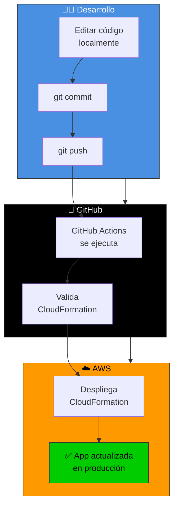

# 🔄 Flujo de desarrollo - Local → GitHub → AWS

Cómo mantener la app en Lovable, editarla localmente y desplegar a AWS automáticamente.

---

## 🎯 Arquitectura del flujo



---

## 📱 Mantener sincronizado con Lovable

### Opción 1: Lovable como fuente de verdad

```bash
# 1. Editar en Lovable Cloud
#    → Ir a lovable.dev
#    → Editar en el editor visual
#    → Publish (sube a GitHub automáticamente)

# 2. Sincronizar localmente
git pull origin main
```

### Opción 2: Local como fuente de verdad

```bash
# 1. Editar localmente
nano src/pages/Home.tsx

# 2. Hacer commit y push
git add src/pages/Home.tsx
git commit -m "feat: update home page"
git push origin main

# 3. GitHub Actions despliega a AWS automáticamente
# ⚙️ Ver progreso en: GitHub → Actions
```

### Opción 3: Híbrida (Recomendada)

```
┌─ Lovable Cloud
│  ├─ UI design & visual editing
│  └─ Publish → GitHub
│
├─ Local development
│  ├─ Backend logic
│  ├─ Database migrations
│  └─ Infrastructure code
│
└─ GitHub
   └─ Single source of truth
      └─ Triggers AWS deployment
```

**Patrón de trabajo:**
1. Editar UI en Lovable
2. Editar lógica localmente
3. Ambos hacen push a main
4. GitHub Actions automáticamente:
   - Valida
   - Despliega a AWS

---

## 🚀 Configuración inicial (Una vez)

### Paso 1: Crear usuario IAM para GitHub

```bash
# En CloudShell:
bash lovable-aws-deployment/scripts/create-github-iam-user.sh

# Resultado:
# ✓ Usuario: github-actions
# ✓ Access Key generado
# ✓ Archivo: github-actions-credentials.txt
```

### Paso 2: Agregar secrets en GitHub

```bash
# En GitHub:
1. Tu repo → Settings → Secrets and variables → Actions
2. New repository secret:
   - AWS_ACCESS_KEY_ID: (pegar valor)
   - AWS_SECRET_ACCESS_KEY: (pegar valor)
   - DB_PASSWORD: Tu contraseña RDS
```

### Paso 3: Verificar workflow

```bash
# En tu repo:
.github/workflows/deploy-aws.yml

# Debe existir en el repo
```

### Paso 4: Primer push

```bash
git add .github/workflows/deploy-aws.yml
git commit -m "Add GitHub Actions workflow for AWS deployment"
git push origin main

# ⚙️ GitHub Actions se ejecuta automáticamente
# 📊 Ver en: GitHub → Actions
```

---

## 📝 Flujo de trabajo diario

### Editar código

```bash
# 1. Traer últimos cambios
git pull origin main

# 2. Editar archivos
nano src/pages/Home.tsx
nano src/components/Button.tsx

# 3. Probar localmente
npm run dev

# Ver en: http://localhost:3000
```

### Hacer deploy a AWS

```bash
# 1. Verificar cambios
git status
git diff

# 2. Hacer commit
git add src/
git commit -m "feat: add new button component"

# 3. Hacer push a main
git push origin main

# ⚙️ GitHub Actions se ejecuta automáticamente
# 📊 Monitorear en: GitHub → Actions
```

### Ver en producción

```bash
# Esperar ~10 minutos

# Luego acceder a:
http://<ALB-DNS>

# O ver información:
bash lovable-aws-deployment/scripts/print-access-info.sh
```

---

## 🔄 Ciclo de desarrollo completo

```
┌─ Día 1: Feature A
│
├─ Lunes 9:00 AM
│  └─ Editar en Lovable
│     └─ Publish (→ GitHub)
│
├─ Lunes 10:00 AM
│  └─ git pull (traer cambios)
│     └─ Agregar backend logic
│     └─ git push (→ GitHub)
│        └─ GitHub Actions se ejecuta
│           └─ Despliega a AWS
│              └─ ~10 min después
│                 └─ ✅ En producción
│
└─ Lunes 10:15 AM
   └─ Verificar: http://ALB-DNS
      └─ Feature A funcionando ✓
```

---

## 📊 Estado del workflow en GitHub

### Verificar despliegue

```
Tu repositorio → Actions → "Deploy to AWS"
```

**Columna: Despliegues recientes**

| Fecha | Status | Detalles |
|-------|--------|----------|
| Hoy 10:15 AM | ✅ Success | Commit abc123 |
| Ayer 5:30 PM | ✅ Success | Commit def456 |
| Hace 2 días | ✅ Success | Commit ghi789 |

### Si hay error

```
1. Click en el workflow fallido
2. Ver logs del job "deploy"
3. Expandir el paso que falló
4. Leer el error
5. Fijar el problema localmente
6. git push → Re-ejecuta automáticamente
```

---

## 🔐 Secrets management

### Agregar nuevos secrets

Si necesitas más variables (ej: Supabase keys):

```bash
# 1. En GitHub:
#    Settings → Secrets and variables → Actions
#    New repository secret

# 2. Name: SUPABASE_URL
#    Secret: https://xxxxx.supabase.co

# 3. En el workflow:
#    .github/workflows/deploy-aws.yml
#    Agregar: SUPABASE_URL: ${{ secrets.SUPABASE_URL }}
```

### Rotación de credenciales

```bash
# Si expones accidentalmente un secret:

# 1. En AWS:
aws iam delete-access-key \
  --user-name github-actions \
  --access-key-id AKIA...

# 2. Crear nuevo:
aws iam create-access-key --user-name github-actions

# 3. Actualizar en GitHub Secrets
```

---

## 🚨 Troubleshooting

### ❌ "Workflow failed"

```bash
# 1. Ver logs en GitHub Actions
# 2. Buscar el error específico
# 3. Opciones comunes:

# A) DB_PASSWORD no configurado
#    → Agregar en GitHub Secrets

# B) CloudFormation error
#    → Ver logs de CloudFormation
#    → aws cloudformation describe-stack-events ...

# C) Credenciales expiradas
#    → Regenerar Access Key
#    → Actualizar en GitHub Secrets
```

### ❌ "Push but no deployment"

```bash
# El workflow se ejecuta solo si:
✓ Push a rama 'main'
✓ Cambios en: src/, package.json, tsconfig.json
✓ .github/workflows/deploy-aws.yml existe

# Si nada cambió en esos archivos:
→ El workflow no se ejecuta (optimización)

# Para forzar:
→ GitHub → Actions → "Deploy to AWS" → "Run workflow"
```

### ❌ "App en AWS pero no en Lovable"

```bash
# Esto es normal - son ambientes separados

# Sincronizar:
# 1. Editar en local
# 2. Hacer push a GitHub
# 3. GitHub Actions despliega a AWS
# 4. Si quieres en Lovable también:
#    → Importar cambios desde GitHub a Lovable
```

---

## 📈 Monitoreo en producción

### Logs de la aplicación

```bash
# SSH a EC2
ssh -i ~/.ssh/examlab-production.pem ec2-user@<ALB-DNS>

# Ver logs de la app
sudo tail -f /var/log/examlab/app.log

# Ver logs de Nginx
sudo tail -f /var/log/nginx/error.log
```

### CloudWatch Logs

```bash
# En AWS Console:
CloudWatch → Logs → examlab-logs

# O desde CLI:
aws logs tail /aws/ec2/examlab-production --follow
```

### Health checks

```bash
# Verificar que la app está respondiendo
curl -I http://<ALB-DNS>/health

# Debería retornar: HTTP 200 OK
```

---

## 🎯 Mejores prácticas

### 1️⃣ Commits frecuentes

```bash
# ✅ BIEN - Commits pequeños y frecuentes
git commit -m "feat: add login button"
git commit -m "fix: update styles"
git commit -m "refactor: extract component"

# ❌ MALO - Commits grandes
git commit -m "WIP: lots of changes"
```

### 2️⃣ Mensajes descriptivos

```bash
# ✅ BIEN
git commit -m "feat: add user authentication"
git commit -m "fix: resolve database connection issue"
git commit -m "docs: update README"

# ❌ MALO
git commit -m "changes"
git commit -m "update"
git commit -m "fix bug"
```

### 3️⃣ Pull antes de push

```bash
# Siempre traer cambios antes de hacer push
git pull origin main
# Resolver conflictos si los hay
git push origin main
```

### 4️⃣ Revisar cambios

```bash
# Ver qué vas a subir
git diff origin/main

# Probar localmente
npm run dev
# Probar en http://localhost:3000
```

---

## 📚 Documentación

- [Configuración de GitHub Actions](GITHUB_ACTIONS_SETUP.md)
- [Acceso a AWS](../docs/FREETIER_DOMAINS.md)
- [Scripts disponibles](../README.md#-archivos-importantes)

---

## ✅ Checklist - Setup completo

- [ ] Crear usuario IAM: `bash scripts/create-github-iam-user.sh`
- [ ] Guardar credenciales de forma segura
- [ ] Agregar AWS_ACCESS_KEY_ID en GitHub Secrets
- [ ] Agregar AWS_SECRET_ACCESS_KEY en GitHub Secrets
- [ ] Agregar DB_PASSWORD en GitHub Secrets
- [ ] Verificar `.github/workflows/deploy-aws.yml` existe
- [ ] Hacer push a main
- [ ] Verificar que GitHub Actions se ejecutó en Actions tab
- [ ] Esperar ~10 minutos
- [ ] Probar acceso: `http://<ALB-DNS>`
- [ ] ✅ Listo para desarrollo

---

**Última actualización:** 2026-04-28

