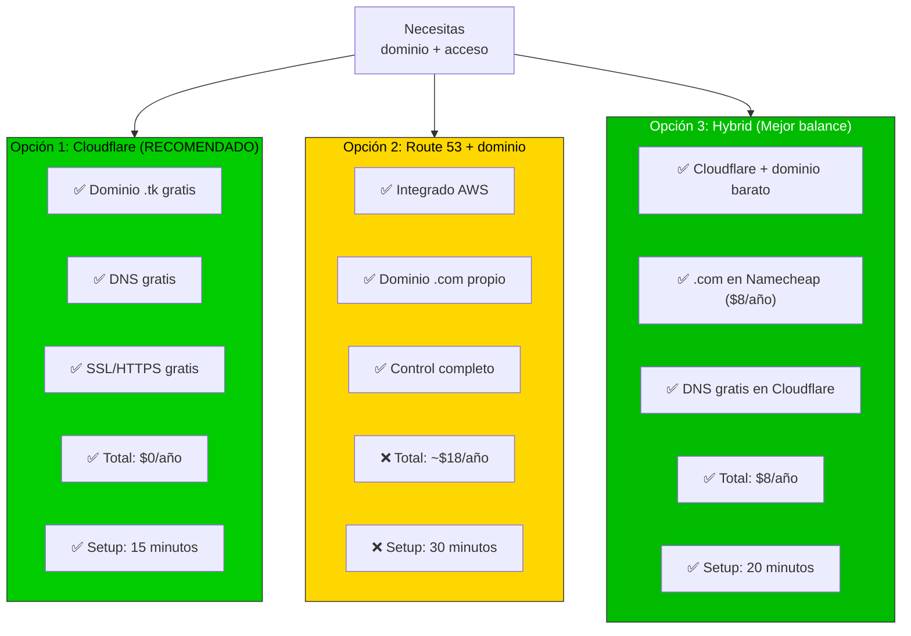
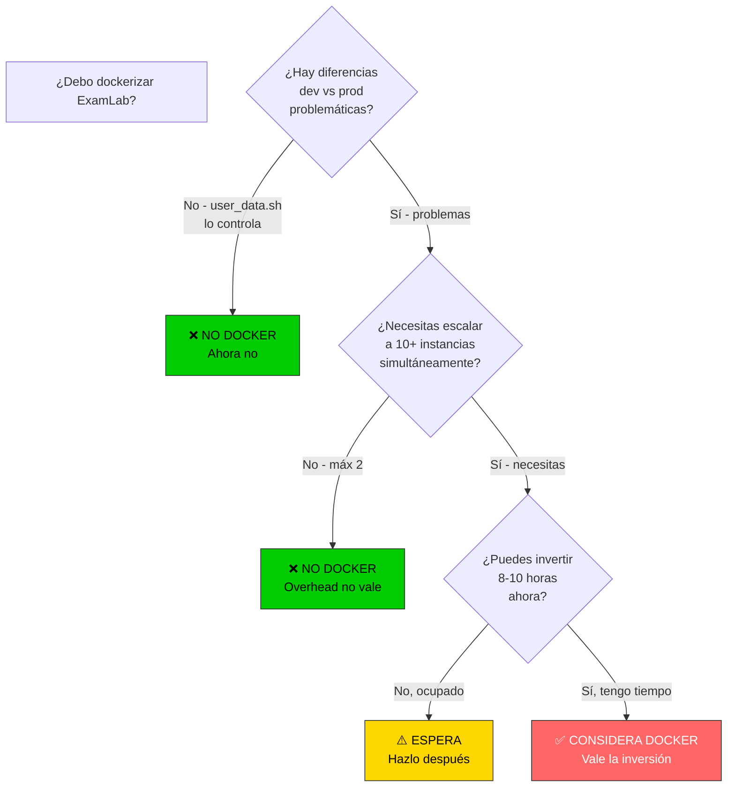
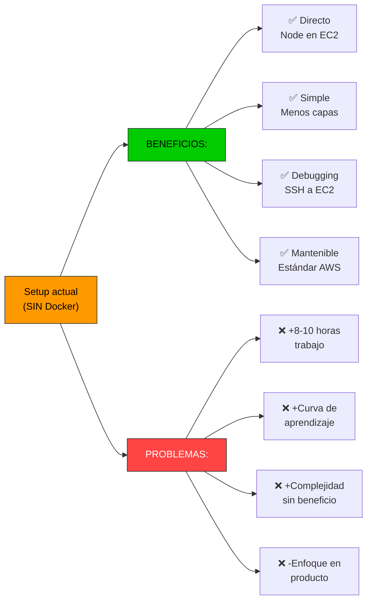
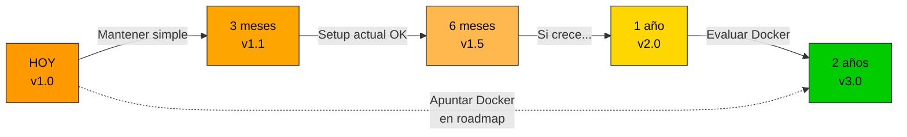
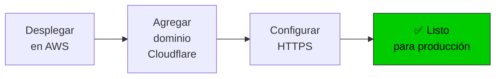
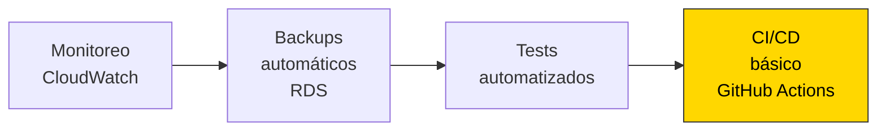
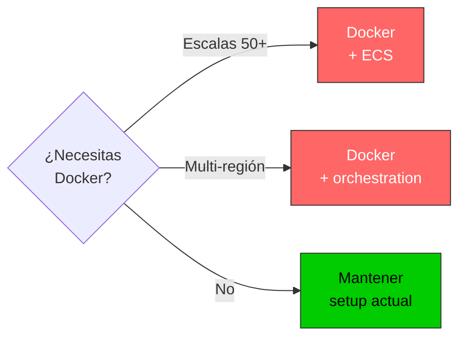
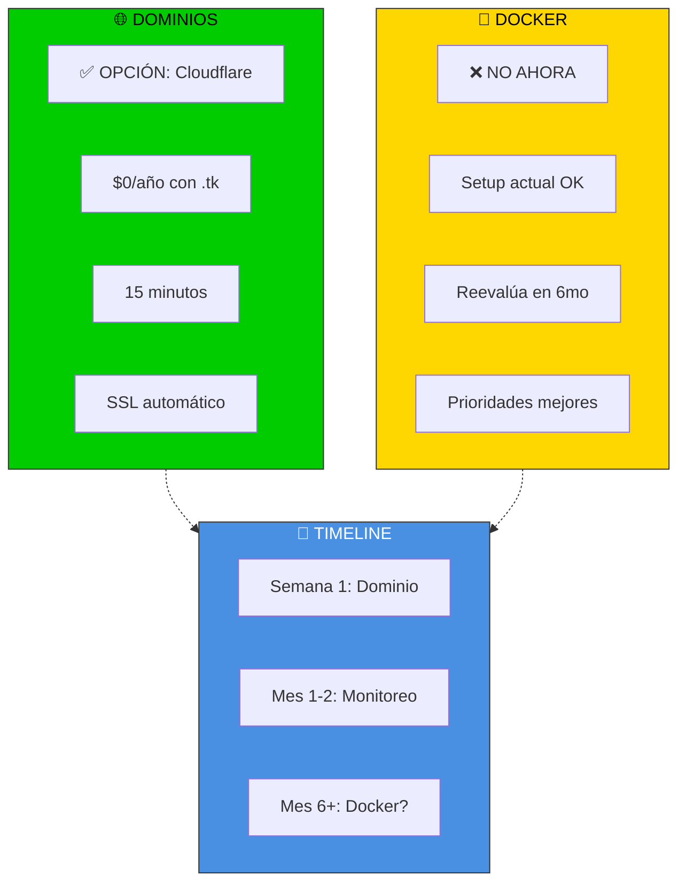

# 🎯 Recomendaciones Finales - Dominios y Docker

Análisis compilado de las dos preguntas principales del usuario.

---

## 📊 Pregunta 1: Dominio en Free Tier AWS

### Situación
Lovable cloud proporciona dominios automáticos. Al migrar a AWS, necesitas un dominio propio.

### Opciones disponibles



### Recomendación



```mermaid
graph TD
    Rec["🏆 OPCIÓN 1: CLOUDFLARE"]
    
    Why["POR QUE:"]
    W1["✅ $0/año (dominio .tk gratis)"]
    W2["✅ SSL automático"]
    W3["✅ DDoS protection gratis"]
    W4["✅ 15 minutos de setup"]
    W5["✅ No afecta Free Tier AWS"]
    W6["✅ Mejor para hobby/startup"]
    
    Setup["SETUP:"]
    S1["1. Sign up cloudflare.com"]
    S2["2. Add domain (examlab.tk)"]
    S3["3. Create A record → ALB DNS"]
    S4["4. Esperar 24h DNS"]
    S5["5. Habilitar SSL automático"]
    
    Result["RESULTADO:"]
    R1["examlab.tk → HTTPS"]
    R2["Automático SSL"]
    R3["DDoS protection"]
    R4["CDN global"]
    
    Rec --> Why
    Rec --> Setup
    Rec --> Result
    
    Why --> W1
    Why --> W2
    Why --> W3
    Why --> W4
    Why --> W5
    Why --> W6
    
    Setup --> S1
    Setup --> S2
    Setup --> S3
    Setup --> S4
    Setup --> S5
    
    Result --> R1
    Result --> R2
    Result --> R3
    Result --> R4
    
    style Rec fill:#00CC00,stroke:#333,color:#000
    style W1 fill:#00CC00,stroke:#333,color:#000
    style W2 fill:#00CC00,stroke:#333,color:#000
    style W3 fill:#00CC00,stroke:#333,color:#000
    style W4 fill:#00CC00,stroke:#333,color:#000
    style W5 fill:#00CC00,stroke:#333,color:#000
    style W6 fill:#00CC00,stroke:#333,color:#000
```

### ¿Pero y si quiero .com?

**Opción 3 es mejor que Route 53:**
```bash
# Comparativa
Cloudflare + Namecheap .com:   $8/año
Route 53 + .com:                $18/año

Ahorro: $10/año
Setup extra: 5 minutos
```

**Recomendación:** Usa Opción 3 si prefieres .com

### IP directo (sin dominio)

**Técnicamente posible pero NO RECOMENDADO:**
```bash
# ❌ Problemas:
- IP cambia si ALB se reinicia
- Sin HTTPS fácil
- Difícil de recordar
- Menos profesional

# ✅ Solo usar si:
- Testing temporal
- Acceso interno
```

---

## 🐳 Pregunta 2: ¿Dockerizar el proyecto?

### Análisis rápido



### Recomendación



```mermaid
graph TD
    Rec["❌ NO DOCKER... AHORA"]
    
    Why["RAZONES:"]
    W1["✅ Setup actual es simple"]
    W2["✅ user_data.sh controla ambiente"]
    W3["✅ Free Tier no lo requiere"]
    W4["✅ Escalabilidad: 1-2 instancias OK"]
    W5["✅ Tiempo mejor usado elsewhere"]
    W6["✅ YAGNI: no lo necesitas aún"]
    
    When["CUANDO CONSIDERAR DOCKER:"]
    WH1["• Escalas a 50+ usuarios concurrentes"]
    WH2["• Múltiples regiones o ambientes"]
    WH3["• Equipo crece (>5 devs)"]
    WH4["• CI/CD automático necesario"]
    WH5["• Multi-cloud (AWS + GCP + Azure)"]
    
    Better["PRIORIDADES MEJORES:"]
    B1["1️⃣ Monitoreo (CloudWatch)"]
    B2["2️⃣ Backups automáticos"]
    B3["3️⃣ HTTPS/dominio (Cloudflare)"]
    B4["4️⃣ CI/CD básico (GitHub Actions)"]
    B5["5️⃣ Tests automatizados"]
    
    Then["DESPUÉS, EVALUAR DOCKER"]
    
    Rec --> Why
    Rec --> When
    Rec --> Better
    Rec --> Then
    
    style Rec fill:#00CC00,stroke:#333,color:#000
    style W1 fill:#00CC00,stroke:#333,color:#000
    style W2 fill:#00CC00,stroke:#333,color:#000
    style W3 fill:#00CC00,stroke:#333,color:#000
    style W4 fill:#00CC00,stroke:#333,color:#000
    style W5 fill:#00CC00,stroke:#333,color:#000
    style W6 fill:#00CC00,stroke:#333,color:#000
    style Then fill:#FFD700,stroke:#333,color:#000
```

### ¿Por qué NO Docker ahora?



### Timeline: Cuándo reconsidering



**Recomendación:** Reevalúa en 6-12 meses si:
- Usuarios crecen significativamente
- Problemas de deployment aparecen
- Equipo técnico crece

---

## 🗺️ Roadmap de mejoras

### Ahora (Semana 1-2)



**Tiempo:** 1 hora total
**Costo:** $0-8/año (Cloudflare o Namecheap)

### Próximo (Mes 1-2)



**Tiempo:** 10-15 horas total
**Costo:** $0

### Futuro (Mes 6+)



---

## 📊 Resumen ejecutivo



---

## 🚀 Próximos pasos

### 1️⃣ Setup Cloudflare (HOY - 15 min)

```bash
# Ir a docs/FREETIER_DOMAINS.md
# Seguir sección: "Setup paso a paso: Cloudflare"

# Resultado: examlab.tk funcionando con HTTPS
```

### 2️⃣ Verificar despliegue (HOY - 5 min)

```bash
# Prueba en navegador
https://examlab.tk
# Debe cargar tu app

# Probar SSL
curl -I https://examlab.tk
# HTTP/2 200 OK
```

### 3️⃣ Documentar (MAÑANA - 10 min)

```bash
# Actualizar cloudshell-vars.env con dominio
DOMAIN_NAME="examlab.tk"
DOMAIN_PROVIDER="cloudflare"
```

### 4️⃣ No hacer Docker (DECISIÓN)

```bash
# ❌ NO agregar Dockerfile
# ❌ NO usar ECS/Fargate
# ✅ MANTENER setup actual

# Reevalúa en 6 meses con equipo
```

---

## 📚 Referencias

### Para dominios
- [Cloudflare setup completo](../docs/FREETIER_DOMAINS.md)
- [Comparativa Route 53 vs Cloudflare](../docs/FREETIER_DOMAINS.md#️-comparativa-cuál-elegir)

### Para Docker
- [Docker analysis completo](../docs/DOCKER_ANALYSIS.md)
- [Cuándo migrar a Docker](../docs/DOCKER_ANALYSIS.md#-cuándo-usar-docker)

---

## ✅ Checklist final

- [ ] Revisar docs/FREETIER_DOMAINS.md
- [ ] Revisar docs/DOCKER_ANALYSIS.md
- [ ] Crear cuenta Cloudflare (si quieres seguir recomendación)
- [ ] Configurar dominio (15 minutos)
- [ ] Probar HTTPS en navegador
- [ ] Documentar en cloudshell-vars.env
- [ ] Archivar Docker como "evaluar mes 6"

---

**Última actualización:** 2026-04-28

