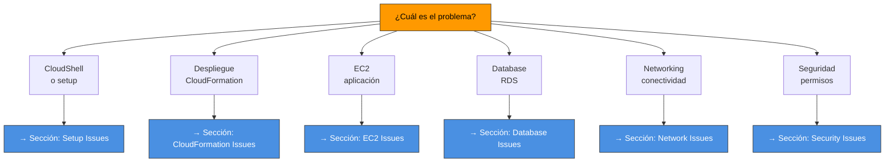
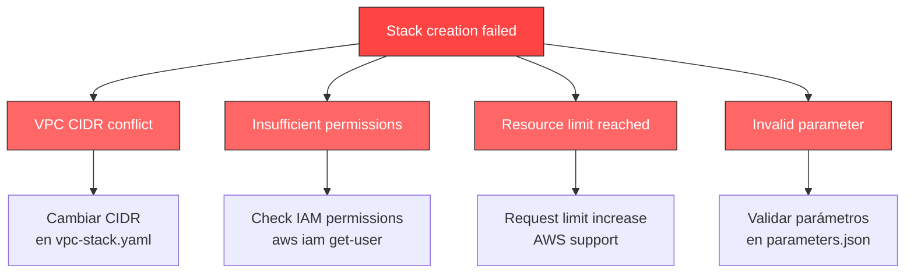
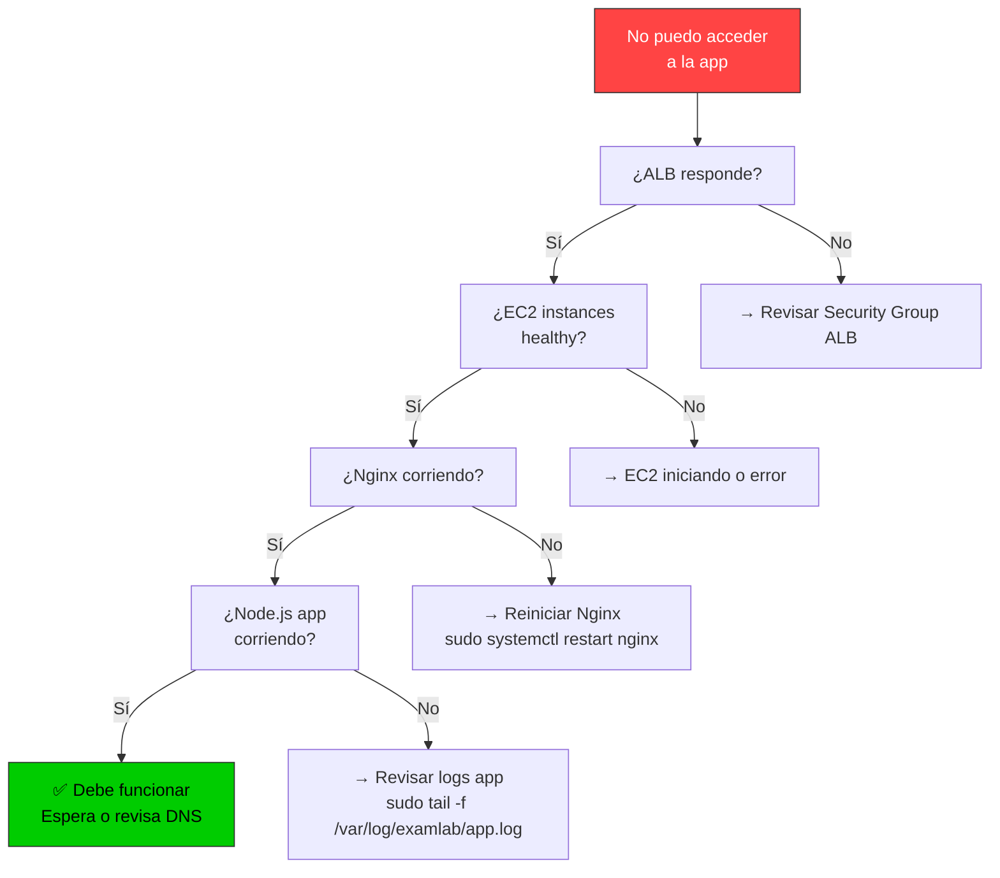

# 🔧 Troubleshooting - Solución de problemas

Guía para resolver problemas comunes durante despliegue y operación.

## 🎯 Árbol de decisión de problemas



---

## 🔨 CloudShell Setup Issues

### ❌ "git: command not found"

```bash
# Git debería estar pre-instalado en CloudShell
# Si no está:
yum install -y git

# Verificar
git --version
# Debe mostrar: git version 2.x.x
```

### ❌ "cloudshell-setup.sh: permission denied"

```bash
# Hacer executable
chmod +x cloudshell-setup.sh

# Ejecutar
bash cloudshell-setup.sh
```

### ❌ "Cannot add key to GitHub"

**Sin token (modo manual):**
```bash
# 1. Ver la clave pública
cat ~/.ssh/examlab-production.pub

# 2. Copiar output completo

# 3. Ir a: https://github.com/settings/keys

# 4. Click "New SSH key"

# 5. Pegar y guardar
```

**Con token (modo automático):**
```bash
# Necesitas un GitHub Personal Access Token
# Crear en: https://github.com/settings/tokens

# Cuando pida token durante setup, pegarlo
# O configurar como variable:
export GITHUB_TOKEN="ghp_..."
bash cloudshell-setup.sh
```

### ❌ "DB_PASSWORD validation failed"

```bash
# cloudshell-vars.env requiere:
# - Mínimo 8 caracteres
# - Letras y números

# ✅ Válidos:
DB_PASSWORD="ExamLab2024"
DB_PASSWORD="Test123456"

# ❌ Inválidos:
DB_PASSWORD="abc"              # Muy corto
DB_PASSWORD="OnlyLetters"      # Sin números
DB_PASSWORD="123456789"        # Solo números
```

### ❌ "SSH key already exists"

```bash
# Si el archivo ya existe:
rm ~/.ssh/examlab-production.pem
rm ~/.ssh/examlab-production.pub

# Luego ejecuta setup de nuevo
bash cloudshell-setup.sh
```

---

## 🏗️ CloudFormation Issues

### ❌ "Stack creation failed"

**Diagnóstico:**
```bash
# Ver eventos de error
aws cloudformation describe-stack-events \
  --stack-name examlab-vpc-production \
  --region us-east-1 \
  | jq '.StackEvents[] | select(.ResourceStatus=="CREATE_FAILED")'

# Ver por sección
aws cloudformation describe-stacks \
  --stack-name examlab-vpc-production \
  --region us-east-1 \
  --query 'Stacks[0].StackStatus'
```

**Causas comunes:**



### ❌ "VPC CIDR 10.0.0.0/16 already exists"

```bash
# Cambiar en cloudshell-vars.env
# O en vpc-stack.yaml, buscar:
CidrBlock: 10.0.0.0/16

# Cambiar a:
CidrBlock: 10.1.0.0/16

# Redeploy
bash scripts/deploy-cf.sh
```

### ❌ "Timeout waiting for stack"

```bash
# CloudFormation puede tardar hasta 15 min
# Esperar es normal para EC2 + RDS

# Ver progreso
aws cloudformation list-stacks \
  --stack-status-filter CREATE_IN_PROGRESS \
  --region us-east-1

# Cancelar si es necesario (último recurso)
aws cloudformation cancel-update-stack \
  --stack-name examlab-ec2-production \
  --region us-east-1
```

### ❌ "Stack rollback complete"

```bash
# Stack falló y hizo rollback
# Acciones:

# 1. Revisar qué falló
aws cloudformation describe-stack-events \
  --stack-name examlab-ec2-production \
  | jq '.StackEvents[] | select(.ResourceStatus | contains("FAILED"))'

# 2. Eliminar stack fallido
aws cloudformation delete-stack \
  --stack-name examlab-ec2-production \
  --region us-east-1

# 3. Esperar a que se elimine
aws cloudformation wait stack-delete-complete \
  --stack-name examlab-ec2-production

# 4. Fijar el problema y redeploy
nano cloudshell-vars.env        # Revisar variables
bash scripts/deploy-cf.sh       # Redeploy
```

---

## 🖥️ EC2 Issues

### ❌ "ALB responde 502 Bad Gateway"

**Normal durante primeros 3-5 minutos.** EC2 está iniciando.

```bash
# 1. Esperar 5 minutos
sleep 300

# 2. Verificar estado de EC2
aws ec2 describe-instances \
  --filters "Name=tag:aws:cloudformation:stack-name,Values=examlab-ec2-production" \
  --region us-east-1 \
  --query 'Reservations[0].Instances[0].State.Name'
# Debe mostrar: "running"

# 3. Conectar a EC2 y revisar logs
ssh -i ~/.ssh/examlab-production.pem ec2-user@<alb-dns>

# En EC2:
sudo tail -f /var/log/examlab/app.log
# O
sudo systemctl status examlab
```

### ❌ "502 Bad Gateway persiste después de 5 min"

```bash
# Conectar a EC2
ssh -i ~/.ssh/examlab-production.pem ec2-user@<alb-dns>

# Ver estado de servicios
sudo systemctl status nginx
sudo systemctl status examlab

# Ver logs
sudo tail -100 /var/log/examlab/app.log
sudo tail -100 /var/log/nginx/error.log

# Reiniciar si es necesario
sudo systemctl restart examlab
sudo systemctl restart nginx

# Ver si responde localmente
curl http://localhost:3000/health
# Debe responder: {"status":"ok"}
```

### ❌ "Cannot SSH to EC2"

```bash
# 1. Obtener DNS del ALB
ALB_DNS=$(aws cloudformation describe-stacks \
  --stack-name examlab-ec2-production \
  --region us-east-1 \
  --query 'Stacks[0].Outputs[?OutputKey==`ALBDNSName`].OutputValue' \
  --output text)

echo $ALB_DNS

# 2. Probar SSH
ssh -i ~/.ssh/examlab-production.pem ec2-user@$ALB_DNS

# 3. Si falla: verificar Security Group
aws ec2 describe-security-groups \
  --filters "Name=tag:aws:cloudformation:stack-name,Values=examlab-ec2-production" \
  --region us-east-1 \
  --query 'SecurityGroups[0].IpPermissions'
# Debe haber puerto 22 abierto desde 0.0.0.0/0
```

### ❌ "Application logs are empty"

```bash
# En EC2:
ls -la /var/log/examlab/

# Si el directorio no existe, crear
sudo mkdir -p /var/log/examlab
sudo chown -R ec2-user:ec2-user /var/log/examlab
sudo chmod 755 /var/log/examlab

# Reiniciar aplicación
sudo systemctl restart examlab

# Ver logs
sudo tail -f /var/log/examlab/app.log
```

### ❌ "Too many open files"

```bash
# En EC2, aumentar file descriptors
sudo sysctl -w fs.file-max=2097152
sudo sysctl -w net.ipv4.tcp_max_syn_backlog=4096

# Persistente (agregar a /etc/sysctl.conf):
fs.file-max=2097152
net.ipv4.tcp_max_syn_backlog=4096

# Aplicar
sudo sysctl -p

# Reiniciar aplicación
sudo systemctl restart examlab
```

---

## 💾 Database Issues

### ❌ "Cannot connect to RDS"

```bash
# 1. Obtener endpoint RDS
RDS_ENDPOINT=$(aws cloudformation describe-stacks \
  --stack-name examlab-rds-production \
  --region us-east-1 \
  --query 'Stacks[0].Outputs[?OutputKey==`RDSEndpoint`].OutputValue' \
  --output text)

echo $RDS_ENDPOINT

# 2. Desde CloudShell (directamente)
nc -zv $RDS_ENDPOINT 5432
# Debe mostrar: succeeded

# 3. Desde EC2 (via SSH)
ssh -i ~/.ssh/examlab-production.pem ec2-user@<alb-dns>
nc -zv $RDS_ENDPOINT 5432
```

### ❌ "Connection refused"

```bash
# Problema: Security Group no permite tráfico

# 1. Verificar que EC2 está en el SG correcto
aws ec2 describe-instances \
  --filters "Name=tag:aws:cloudformation:stack-name,Values=examlab-ec2-production" \
  --region us-east-1 \
  --query 'Reservations[0].Instances[0].SecurityGroups'

# 2. Obtener SG de RDS
aws ec2 describe-security-groups \
  --filters "Name=tag:aws:cloudformation:stack-name,Values=examlab-rds-production" \
  --region us-east-1

# 3. Editar RDS SG para permitir desde EC2 SG
aws ec2 authorize-security-group-ingress \
  --group-id sg-xxxxx \
  --protocol tcp \
  --port 5432 \
  --source-group sg-yyyyy
```

### ❌ "Database locked / deadlock"

```bash
# En RDS, ver conexiones activas
psql -h $RDS_ENDPOINT -U postgres -d examlab

# En la DB:
SELECT * FROM pg_stat_activity WHERE state != 'idle';

# Matar sesión problem
SELECT pg_terminate_backend(pid) 
FROM pg_stat_activity 
WHERE pid <> pg_backend_pid();
```

### ❌ "Disk space full"

```bash
# En RDS, ver tamaño
SELECT pg_size_pretty(pg_database_size(current_database()));

# RDS tiene auto-scaling, pero si llega al máximo:
# 1. Ir a AWS RDS Console
# 2. Modifier DB instance
# 3. Aumentar "Allocated storage"

# O reducir datos:
DELETE FROM table_name WHERE condition;
VACUUM FULL;
```

---

## 🌐 Network Issues

### ❌ "Cannot reach application from internet"

**Árbol de diagnóstico:**



**Verificación paso a paso:**

```bash
# 1. ¿ALB responde?
curl http://<alb-dns>/
# Si 502: EC2 no está ready
# Si timeout: Security Group no permite 80

# 2. ¿EC2 instances healthy?
aws elbv2 describe-target-health \
  --target-group-arn arn:aws:elasticloadbalancing:... \
  --region us-east-1

# 3. SSH y revisar
ssh -i ~/.ssh/examlab-production.pem ec2-user@<alb-dns>
curl http://localhost:3000/health

# 4. Ver logs
sudo tail -f /var/log/examlab/app.log
sudo tail -f /var/log/nginx/error.log
```

### ❌ "High latency / slow responses"

```bash
# 1. Ver CPU/Memory EC2
aws cloudwatch get-metric-statistics \
  --metric-name CPUUtilization \
  --namespace AWS/EC2 \
  --start-time 2024-04-28T00:00:00Z \
  --end-time 2024-04-28T23:59:59Z \
  --period 300 \
  --statistics Average \
  --dimensions Name=InstanceId,Value=i-xxxxx

# 2. Ver conexiones DB
# En EC2:
ssh -i ~/.ssh/examlab-production.pem ec2-user@<alb-dns>
psql -h $RDS_ENDPOINT -U postgres
SELECT count(*) FROM pg_stat_activity;

# 3. Slow queries
SELECT query, mean_time 
FROM pg_stat_statements 
ORDER BY mean_time DESC LIMIT 10;
```

---

## 🔐 Security Issues

### ❌ "Permission denied for AWS CLI commands"

```bash
# Problema: No tienes permisos IAM

# En CloudShell, verificar identidad
aws sts get-caller-identity

# Debe mostrar:
{
  "UserId": "AIDAI...",
  "Account": "123456789",
  "Arn": "arn:aws:iam::123456789:user/..."
}

# Si no tienes acceso:
# Pedir a admin que agregue permisos
```

### ❌ "SSH key rejected"

```bash
# 1. Verificar que tienes la clave privada
ls -la ~/.ssh/examlab-production.pem
# Debe existir y tener permisos 600

# 2. Si no existe, regenerar
chmod 600 ~/.ssh/examlab-production.pem

# 3. Verificar que key está en EC2
# En CloudShell:
aws ec2 describe-key-pairs \
  --key-names examlab-production \
  --region us-east-1

# 4. Si falta, reimportar
aws ec2 import-key-pair \
  --key-name examlab-production \
  --public-key-material fileb://~/.ssh/examlab-production.pub \
  --region us-east-1
```

### ❌ "Secrets Manager access denied"

```bash
# Si usas Secrets Manager para API keys

# 1. Verificar que secret existe
aws secretsmanager get-secret-value \
  --secret-id examlab/anthropic-key \
  --region us-east-1

# 2. Si no existe, crear
aws secretsmanager create-secret \
  --name examlab/anthropic-key \
  --secret-string '{"api_key":"sk-ant-..."}' \
  --region us-east-1

# 3. Verificar que EC2 puede acceder
# En EC2, ejecutar:
aws secretsmanager get-secret-value \
  --secret-id examlab/anthropic-key \
  --region us-east-1
```

---

## ✅ Health Check Workflow

**Uso recomendado:**

```bash
# Después de despliegue
bash scripts/health-check.sh

# Guardarlo en archivo
bash scripts/health-check.sh > health-check-$(date +%Y%m%d_%H%M%S).log

# Monitoreo periódico
watch -n 60 'bash scripts/health-check.sh'
```

---

## 🆘 Escalar el problema

Si nada funciona:

```bash
# 1. Recopilar información
bash scripts/health-check.sh > diagnosis.log 2>&1
aws cloudformation describe-stacks --region us-east-1 >> diagnosis.log 2>&1
aws ec2 describe-instances --region us-east-1 >> diagnosis.log 2>&1

# 2. Guardar logs EC2
ssh -i ~/.ssh/examlab-production.pem ec2-user@<alb-dns>
sudo journalctl -n 100 >> ~/ec2-logs.txt 2>&1
sudo tail -100 /var/log/examlab/app.log >> ~/ec2-logs.txt 2>&1

# 3. Contactar con soporte con:
# - diagnosis.log
# - ec2-logs.txt
# - cloudshell-vars.env (sin passwords)
# - Descripción del problema y pasos para reproducir
```

---

## 📋 Quick reference

| Problema | Comando | Resultado esperado |
|----------|---------|-------------------|
| ¿ALB responde? | `curl http://<alb-dns>/` | HTTP 200 o 502 (normal primeros 5min) |
| ¿EC2 running? | `aws ec2 describe-instances` | State: "running" |
| ¿RDS conectado? | `nc -zv <rds> 5432` | succeeded |
| ¿App corriendo? | `ssh ... curl localhost:3000/health` | {"status":"ok"} |
| ¿Logs disponibles? | `sudo tail -f /var/log/examlab/app.log` | Output actual |
| ¿Permisos OK? | `aws sts get-caller-identity` | Arn válido |
| ¿Stack status? | `aws cloudformation list-stacks` | CREATE_COMPLETE |

